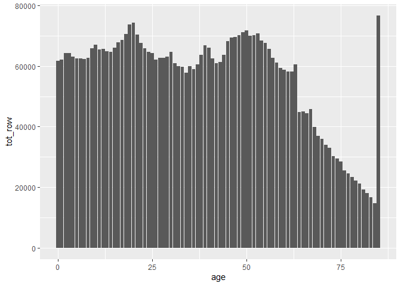
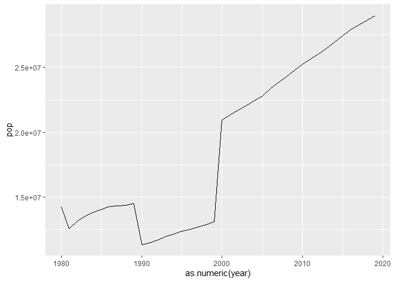
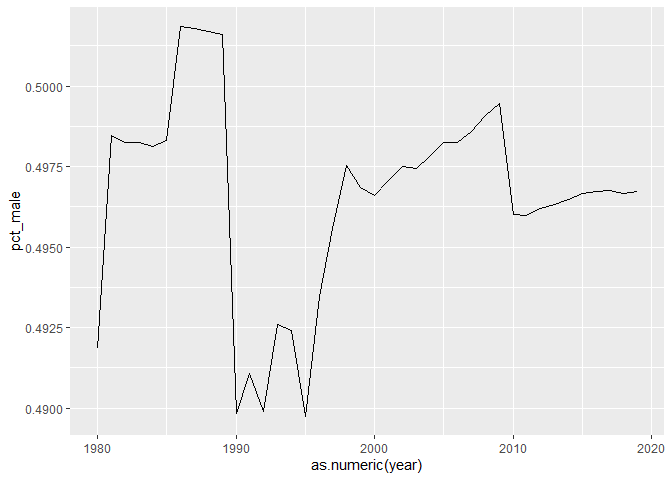
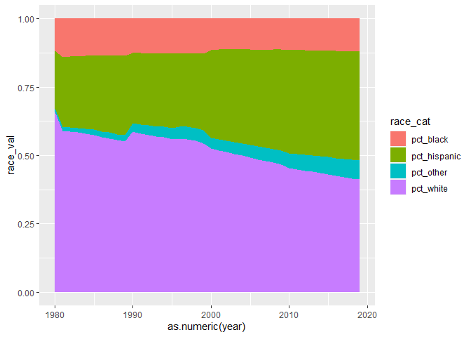
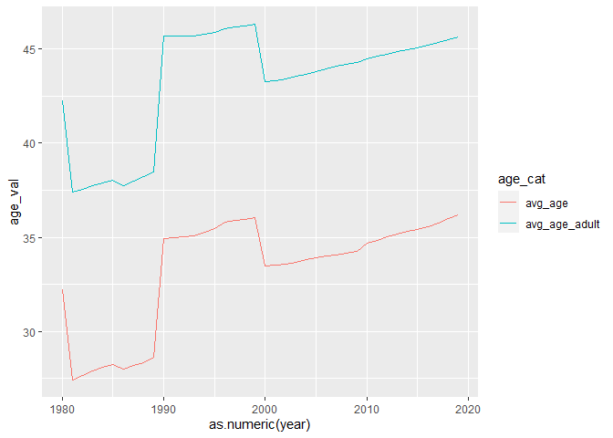
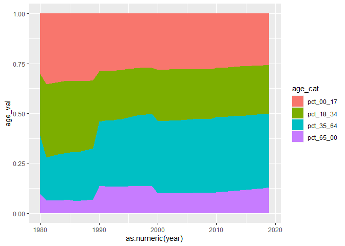

# Notepad

## Introduction

I’m starting to run through the process of predicting the midterms. I’d
like to use this markdown doc as a notepad to catalogue my process &
thoughts as I work on this project. This will be rambling long form
format with pretty much *no* editing, so forgive me for anything that
may be confusing. I’ll use this as a working document before
transferring code over to scripts.

``` r
library(tidyverse)
```

## Demographic Data

### 2010s

I’ll start by getting demographic data into the environment. I want it
in a tidy format, but the census bureau data is pretty unwieldy, so
it’ll need to be wrangled before being useful.

I want to get a handle on wrangling the data, so I’ll only load in one
decade of census bureau data, and only focus on one state for now.

``` r
# read in census bureau data
f_cb2010_2019 <- read_csv("https://www2.census.gov/programs-surveys/popest/tables/2010-2019/state/asrh/sc-est2019-alldata5.csv")

# initial wrangling
f_cb2010_2019 %>%
  filter(NAME == "Alabama") %>%
  select(-SUMLEV, -REGION, -DIVISION, -STATE, -CENSUS2010POP, -ESTIMATESBASE2010)
```

    ## # A tibble: 3,870 x 15
    ##    NAME      SEX ORIGIN  RACE   AGE POPESTIMATE2010 POPESTIMATE2011
    ##    <chr>   <dbl>  <dbl> <dbl> <dbl>           <dbl>           <dbl>
    ##  1 Alabama     0      0     1     0           39992           41121
    ##  2 Alabama     0      0     1     1           40096           39919
    ##  3 Alabama     0      0     1     2           41550           40232
    ##  4 Alabama     0      0     1     3           41716           41702
    ##  5 Alabama     0      0     1     4           41250           41722
    ##  6 Alabama     0      0     1     5           41282           41307
    ##  7 Alabama     0      0     1     6           41461           41435
    ##  8 Alabama     0      0     1     7           41277           41633
    ##  9 Alabama     0      0     1     8           41138           41392
    ## 10 Alabama     0      0     1     9           43072           41176
    ## # ... with 3,860 more rows, and 8 more variables: POPESTIMATE2012 <dbl>,
    ## #   POPESTIMATE2013 <dbl>, POPESTIMATE2014 <dbl>, POPESTIMATE2015 <dbl>,
    ## #   POPESTIMATE2016 <dbl>, POPESTIMATE2017 <dbl>, POPESTIMATE2018 <dbl>,
    ## #   POPESTIMATE2019 <dbl>

I want to have year be a variable as well, so I’ll reformat the table to
collect these into a column, year, and put all the values into a new
column, pop. I’ll also do some quality-of-life column renaming

``` r
f_cb2010_2019 %>%
  filter(NAME == "Alabama") %>%
  select(-SUMLEV, -REGION, -DIVISION, -STATE, -CENSUS2010POP, -ESTIMATESBASE2010) %>%
  pivot_longer(cols = starts_with("POPESTIMATE"),
               names_to = "year",
               names_prefix = "POPESTIMATE",
               values_to = "pop") %>%
  rename(state = NAME,
         sex = SEX,
         origin = ORIGIN,
         race = RACE,
         age = AGE)
```

    ## # A tibble: 38,700 x 7
    ##    state     sex origin  race   age year    pop
    ##    <chr>   <dbl>  <dbl> <dbl> <dbl> <chr> <dbl>
    ##  1 Alabama     0      0     1     0 2010  39992
    ##  2 Alabama     0      0     1     0 2011  41121
    ##  3 Alabama     0      0     1     0 2012  40263
    ##  4 Alabama     0      0     1     0 2013  39189
    ##  5 Alabama     0      0     1     0 2014  40105
    ##  6 Alabama     0      0     1     0 2015  40331
    ##  7 Alabama     0      0     1     0 2016  40231
    ##  8 Alabama     0      0     1     0 2017  40165
    ##  9 Alabama     0      0     1     0 2018  38838
    ## 10 Alabama     0      0     1     0 2019  37673
    ## # ... with 38,690 more rows

Now the fun gets to start - I want the following demographic variables
as their own columns:

  - **pct\_male : ** percentage of population that is male.
  - **pct\_hispanic : ** percentage of population that is hispanic.
    While the census data is there, I don’t plan on breaking this down
    by hispanic race.
  - **pct\_white : ** percentage of population that is non-hispanic
    white.
  - **pct\_black : ** percentage of population that is non-hispanic
    black.
  - **pct\_nat\_american : ** percentage of population that is
    non-hispanic native american.
  - **pct\_asian : ** percentage of population that is non-hispanic
    asian.
  - **pct\_pac\_island : ** percentage of population that is
    non-hispanic pacific-islander.

Source for category codes can be found
[here](https://www2.census.gov/programs-surveys/popest/technical-documentation/file-layouts/2010-2019/sc-est2019-alldata6.pdf)

Firstly, let’s check for population totals/errors.

I’ll start by putting gender into columns, and summing the totals to
verify that each year adds up correctly. The genders are denoted by a
numeric indicator, so I’ll change the column titles to strings for
clarity.

``` r
f_cb2010_2019 %>%
  filter(NAME == "Alabama") %>%
  select(-SUMLEV, -REGION, -DIVISION, -STATE, -CENSUS2010POP, -ESTIMATESBASE2010) %>%
  pivot_longer(cols = starts_with("POPESTIMATE"),
               names_to = "year",
               names_prefix = "POPESTIMATE",
               values_to = "pop") %>%
  rename(state = NAME,
         sex = SEX,
         origin = ORIGIN,
         race = RACE,
         age = AGE) %>%
  pivot_wider(names_from = sex,
              values_from = pop) %>%
  rename(total = "0",
         male = "1",
         female = "2")
```

    ## # A tibble: 12,900 x 8
    ##    state   origin  race   age year  total  male female
    ##    <chr>    <dbl> <dbl> <dbl> <chr> <dbl> <dbl>  <dbl>
    ##  1 Alabama      0     1     0 2010  39992 20374  19618
    ##  2 Alabama      0     1     0 2011  41121 21202  19919
    ##  3 Alabama      0     1     0 2012  40263 20567  19696
    ##  4 Alabama      0     1     0 2013  39189 20030  19159
    ##  5 Alabama      0     1     0 2014  40105 20526  19579
    ##  6 Alabama      0     1     0 2015  40331 20556  19775
    ##  7 Alabama      0     1     0 2016  40231 20549  19682
    ##  8 Alabama      0     1     0 2017  40165 20537  19628
    ##  9 Alabama      0     1     0 2018  38838 19866  18972
    ## 10 Alabama      0     1     0 2019  37673 19313  18360
    ## # ... with 12,890 more rows

Firstly, I need to check that the male + female columns equal the total
column for each row.

``` r
f_cb2010_2019 %>%
  filter(NAME == "Alabama") %>%
  select(-SUMLEV, -REGION, -DIVISION, -STATE, -CENSUS2010POP, -ESTIMATESBASE2010) %>%
  pivot_longer(cols = starts_with("POPESTIMATE"),
               names_to = "year",
               names_prefix = "POPESTIMATE",
               values_to = "pop") %>%
  rename(state = NAME,
         sex = SEX,
         origin = ORIGIN,
         race = RACE,
         age = AGE) %>%
  pivot_wider(names_from = sex,
              values_from = pop) %>%
  rename(total = "0",
         male = "1",
         female = "2") %>%
  mutate(check = total - male - female) %>%
  distinct(check, .keep_all = TRUE)
```

    ## # A tibble: 1 x 9
    ##   state   origin  race   age year  total  male female check
    ##   <chr>    <dbl> <dbl> <dbl> <chr> <dbl> <dbl>  <dbl> <dbl>
    ## 1 Alabama      0     1     0 2010  39992 20374  19618     0

Okay, this verifies that all the rows add up correctly. Now I’ll get a
quick check frame with the totals from each year

``` r
f_cb2010_2019 %>%
  filter(NAME == "Alabama") %>%
  select(-SUMLEV, -REGION, -DIVISION, -STATE, -CENSUS2010POP, -ESTIMATESBASE2010) %>%
  pivot_longer(cols = starts_with("POPESTIMATE"),
               names_to = "year",
               names_prefix = "POPESTIMATE",
               values_to = "pop") %>%
  rename(state = NAME,
         sex = SEX,
         origin = ORIGIN,
         race = RACE,
         age = AGE) %>%
  pivot_wider(names_from = sex,
              values_from = pop) %>%
  rename(total = "0",
         male = "1",
         female = "2") %>%
  group_by(year) %>%
  mutate(pop_year = sum(total)) %>%
  arrange(year)
```

    ## # A tibble: 12,900 x 9
    ## # Groups:   year [10]
    ##    state   origin  race   age year  total  male female pop_year
    ##    <chr>    <dbl> <dbl> <dbl> <chr> <dbl> <dbl>  <dbl>    <dbl>
    ##  1 Alabama      0     1     0 2010  39992 20374  19618  9708872
    ##  2 Alabama      0     1     1 2010  40096 20530  19566  9708872
    ##  3 Alabama      0     1     2 2010  41550 21105  20445  9708872
    ##  4 Alabama      0     1     3 2010  41716 21404  20312  9708872
    ##  5 Alabama      0     1     4 2010  41250 21210  20040  9708872
    ##  6 Alabama      0     1     5 2010  41282 21208  20074  9708872
    ##  7 Alabama      0     1     6 2010  41461 21243  20218  9708872
    ##  8 Alabama      0     1     7 2010  41277 21126  20151  9708872
    ##  9 Alabama      0     1     8 2010  41138 20955  20183  9708872
    ## 10 Alabama      0     1     9 2010  43072 22057  21015  9708872
    ## # ... with 12,890 more rows

Ah okay, I just realized something. The “total” rows (0s in sex/origin)
are throwing things off quite a bit (essentially doubling total
population). I need to filter these out first.

``` r
f_cb2010_2019 %>%
  filter(NAME == "Alabama") %>%
  select(-SUMLEV, -REGION, -DIVISION, -STATE, -CENSUS2010POP, -ESTIMATESBASE2010) %>%
  pivot_longer(cols = starts_with("POPESTIMATE"),
               names_to = "year",
               names_prefix = "POPESTIMATE",
               values_to = "pop") %>%
  rename(state = NAME,
         sex = SEX,
         origin = ORIGIN,
         race = RACE,
         age = AGE) %>%
  filter(sex != 0,
         origin != 0)
```

    ## # A tibble: 17,200 x 7
    ##    state     sex origin  race   age year    pop
    ##    <chr>   <dbl>  <dbl> <dbl> <dbl> <chr> <dbl>
    ##  1 Alabama     1      1     1     0 2010  17998
    ##  2 Alabama     1      1     1     0 2011  18552
    ##  3 Alabama     1      1     1     0 2012  18172
    ##  4 Alabama     1      1     1     0 2013  17847
    ##  5 Alabama     1      1     1     0 2014  18282
    ##  6 Alabama     1      1     1     0 2015  18262
    ##  7 Alabama     1      1     1     0 2016  18133
    ##  8 Alabama     1      1     1     0 2017  18163
    ##  9 Alabama     1      1     1     0 2018  17550
    ## 10 Alabama     1      1     1     0 2019  17045
    ## # ... with 17,190 more rows

Now I’ll create the totals frame for checking.

``` r
f_cb2010_2019 %>%
  filter(NAME == "Alabama") %>%
  select(-SUMLEV, -REGION, -DIVISION, -STATE, -CENSUS2010POP, -ESTIMATESBASE2010) %>%
  pivot_longer(cols = starts_with("POPESTIMATE"),
               names_to = "year",
               names_prefix = "POPESTIMATE",
               values_to = "pop") %>%
  rename(state = NAME,
         sex = SEX,
         origin = ORIGIN,
         race = RACE,
         age = AGE) %>%
  filter(sex != 0,
         origin != 0) %>%
  pivot_wider(names_from = sex,
              values_from = pop) %>%
  rename(male = "1",
         female = "2") %>%
  mutate(total = male + female) %>%
  group_by(year) %>%
  mutate(total_yr = sum(total)) %>%
  arrange(year) %>%
  distinct(total_yr, .keep_all = TRUE) %>%
  select(state, year, total_yr)
```

    ## # A tibble: 10 x 3
    ## # Groups:   year [10]
    ##    state   year  total_yr
    ##    <chr>   <chr>    <dbl>
    ##  1 Alabama 2010   4854436
    ##  2 Alabama 2011   4870846
    ##  3 Alabama 2012   4890337
    ##  4 Alabama 2013   4907431
    ##  5 Alabama 2014   4921508
    ##  6 Alabama 2015   4934574
    ##  7 Alabama 2016   4948408
    ##  8 Alabama 2017   4962085
    ##  9 Alabama 2018   4977968
    ## 10 Alabama 2019   4995720

This frame will be what I use to check that the population totals for
other categories add up correctly.

Now to calculate the pct\_male for each year

``` r
f_cb2010_2019 %>%
  filter(NAME == "Alabama") %>%
  select(-SUMLEV, -REGION, -DIVISION, -STATE, -CENSUS2010POP, -ESTIMATESBASE2010) %>%
  pivot_longer(cols = starts_with("POPESTIMATE"),
               names_to = "year",
               names_prefix = "POPESTIMATE",
               values_to = "pop") %>%
  rename(state = NAME,
         sex = SEX,
         origin = ORIGIN,
         race = RACE,
         age = AGE) %>%
  filter(sex != 0,
         origin != 0) %>%
  pivot_wider(names_from = sex,
              values_from = pop) %>%
  rename(male = "1",
         female = "2") %>%
  group_by(year) %>%
  mutate(tot_male = sum(male),
         tot_female = sum(female)) %>%
  ungroup() %>%
  mutate(tot_pop = tot_male + tot_female,
         pct_male = tot_male/tot_pop) %>%
  select(-tot_male, -tot_female, -tot_pop) %>%
  mutate(tot_row = male + female) %>%
  select(-male, -female) %>%
  relocate(tot_row, .after = year) %>%
  arrange(year)
```

    ## # A tibble: 8,600 x 7
    ##    state   origin  race   age year  tot_row pct_male
    ##    <chr>    <dbl> <dbl> <dbl> <chr>   <dbl>    <dbl>
    ##  1 Alabama      1     1     0 2010    35295    0.485
    ##  2 Alabama      1     1     1 2010    35714    0.485
    ##  3 Alabama      1     1     2 2010    37114    0.485
    ##  4 Alabama      1     1     3 2010    37294    0.485
    ##  5 Alabama      1     1     4 2010    37166    0.485
    ##  6 Alabama      1     1     5 2010    37524    0.485
    ##  7 Alabama      1     1     6 2010    37892    0.485
    ##  8 Alabama      1     1     7 2010    37903    0.485
    ##  9 Alabama      1     1     8 2010    37975    0.485
    ## 10 Alabama      1     1     9 2010    39956    0.485
    ## # ... with 8,590 more rows

Cool, one down, several to go. The tot\_row column now shows the total
(male and female) population for each row, given the origin
(hispanic/non-hispanic), race, and age categories.

I can repeate a similar process for the hispanic/non-hispanic
qualifiers, but first I need to verify that the population totals add
up.

``` r
f_cb2010_2019 %>%
  filter(NAME == "Alabama") %>%
  select(-SUMLEV, -REGION, -DIVISION, -STATE, -CENSUS2010POP, -ESTIMATESBASE2010) %>%
  pivot_longer(cols = starts_with("POPESTIMATE"),
               names_to = "year",
               names_prefix = "POPESTIMATE",
               values_to = "pop") %>%
  rename(state = NAME,
         sex = SEX,
         origin = ORIGIN,
         race = RACE,
         age = AGE) %>%
  filter(sex != 0,
         origin != 0) %>%
  pivot_wider(names_from = sex,
              values_from = pop) %>%
  rename(male = "1",
         female = "2") %>%
  group_by(year) %>%
  mutate(tot_male = sum(male),
         tot_female = sum(female)) %>%
  ungroup() %>%
  mutate(tot_pop = tot_male + tot_female,
         pct_male = tot_male/tot_pop) %>%
  select(-tot_male, -tot_female, -tot_pop) %>%
  mutate(tot_row = male + female) %>%
  select(-male, -female) %>%
  relocate(tot_row, .after = year) %>%
  arrange(year) %>%
  pivot_wider(names_from = origin,
              values_from = tot_row) %>%
  rename(non_hispanic = "1",
         hispanic = "2") %>%
  mutate(tot_row = non_hispanic + hispanic) %>%
  group_by(year) %>%
  mutate(check = sum(tot_row)) %>%
  ungroup() %>%
  distinct(year, .keep_all = TRUE) %>%
  select(state, year, check)
```

    ## # A tibble: 10 x 3
    ##    state   year    check
    ##    <chr>   <chr>   <dbl>
    ##  1 Alabama 2010  4854436
    ##  2 Alabama 2011  4870846
    ##  3 Alabama 2012  4890337
    ##  4 Alabama 2013  4907431
    ##  5 Alabama 2014  4921508
    ##  6 Alabama 2015  4934574
    ##  7 Alabama 2016  4948408
    ##  8 Alabama 2017  4962085
    ##  9 Alabama 2018  4977968
    ## 10 Alabama 2019  4995720

Coolio, checks out. I’m going to pivot a bit and do all the races at
once, rather than the one-two step between hispanic/nonhipanic then all
other races. I’ll write over the race column with a “6” for hispanic
where applicable.

``` r
f_cb2010_2019 %>%
  filter(NAME == "Alabama") %>%
  select(-SUMLEV, -REGION, -DIVISION, -STATE, -CENSUS2010POP, -ESTIMATESBASE2010) %>%
  pivot_longer(cols = starts_with("POPESTIMATE"),
               names_to = "year",
               names_prefix = "POPESTIMATE",
               values_to = "pop") %>%
  rename(state = NAME,
         sex = SEX,
         origin = ORIGIN,
         race = RACE,
         age = AGE) %>%
  filter(sex != 0,
         origin != 0) %>%
  pivot_wider(names_from = sex,
              values_from = pop) %>%
  rename(male = "1",
         female = "2") %>%
  group_by(year) %>%
  mutate(tot_male = sum(male),
         tot_female = sum(female)) %>%
  ungroup() %>%
  mutate(tot_pop = tot_male + tot_female,
         pct_male = tot_male/tot_pop) %>%
  select(-tot_male, -tot_female, -tot_pop) %>%
  mutate(tot_row = male + female) %>%
  select(-male, -female) %>%
  relocate(tot_row, .after = year) %>%
  arrange(year) %>%
  mutate(race = if_else(origin == 1, race, 6)) %>%
  select(-origin)
```

    ## # A tibble: 8,600 x 6
    ##    state    race   age year  tot_row pct_male
    ##    <chr>   <dbl> <dbl> <chr>   <dbl>    <dbl>
    ##  1 Alabama     1     0 2010    35295    0.485
    ##  2 Alabama     1     1 2010    35714    0.485
    ##  3 Alabama     1     2 2010    37114    0.485
    ##  4 Alabama     1     3 2010    37294    0.485
    ##  5 Alabama     1     4 2010    37166    0.485
    ##  6 Alabama     1     5 2010    37524    0.485
    ##  7 Alabama     1     6 2010    37892    0.485
    ##  8 Alabama     1     7 2010    37903    0.485
    ##  9 Alabama     1     8 2010    37975    0.485
    ## 10 Alabama     1     9 2010    39956    0.485
    ## # ... with 8,590 more rows

With that cleaned up, I can repeat the steps taken to get the pct\_male
population for each race. Firstly, I’ll rearrange the data frame & check
the population totals.

``` r
f_cb2010_2019 %>%
  filter(NAME == "Alabama") %>%
  select(-SUMLEV, -REGION, -DIVISION, -STATE, -CENSUS2010POP, -ESTIMATESBASE2010) %>%
  pivot_longer(cols = starts_with("POPESTIMATE"),
               names_to = "year",
               names_prefix = "POPESTIMATE",
               values_to = "pop") %>%
  rename(state = NAME,
         sex = SEX,
         origin = ORIGIN,
         race = RACE,
         age = AGE) %>%
  filter(sex != 0,
         origin != 0) %>%
  pivot_wider(names_from = sex,
              values_from = pop) %>%
  rename(male = "1",
         female = "2") %>%
  group_by(year) %>%
  mutate(tot_male = sum(male),
         tot_female = sum(female)) %>%
  ungroup() %>%
  mutate(tot_pop = tot_male + tot_female,
         pct_male = tot_male/tot_pop) %>%
  select(-tot_male, -tot_female, -tot_pop) %>%
  mutate(tot_row = male + female) %>%
  select(-male, -female) %>%
  relocate(tot_row, .after = year) %>%
  arrange(year) %>%
  mutate(race = if_else(origin == 1, race, 6)) %>%
  select(-origin) %>%
  group_by(race, age, year) %>%
  mutate(tot_row = sum(tot_row)) %>%
  distinct(tot_row, .keep_all = TRUE) %>%
  ungroup(race, age, year) %>%
  pivot_wider(names_from = race,
              values_from = tot_row) %>%
  rename(white = "1",
         black = "2",
         nat_american = "3",
         asian = "4",
         pac_island = "5",
         hispanic = "6") %>%
  mutate(tot_row = white + black + nat_american + asian + pac_island + hispanic) %>%
  group_by(year) %>%
  mutate(check = sum(tot_row)) %>%
  ungroup() %>%
  distinct(year, .keep_all = TRUE) %>%
  select(state, year, check)
```

    ## # A tibble: 10 x 3
    ##    state   year    check
    ##    <chr>   <chr>   <dbl>
    ##  1 Alabama 2010  4854436
    ##  2 Alabama 2011  4870846
    ##  3 Alabama 2012  4890337
    ##  4 Alabama 2013  4907431
    ##  5 Alabama 2014  4921508
    ##  6 Alabama 2015  4934574
    ##  7 Alabama 2016  4948408
    ##  8 Alabama 2017  4962085
    ##  9 Alabama 2018  4977968
    ## 10 Alabama 2019  4995720

Awesome, everything here checks out\! I was getting something weird last
night wehre there was a bit of double counting - I think that it was
because hispanic/non-hispanic is its own category.

Now here’s the percentages for each race:

``` r
f_cb2010_2019 %>%
  filter(NAME == "Alabama") %>%
  select(-SUMLEV, -REGION, -DIVISION, -STATE, -CENSUS2010POP, -ESTIMATESBASE2010) %>%
  pivot_longer(cols = starts_with("POPESTIMATE"),
               names_to = "year",
               names_prefix = "POPESTIMATE",
               values_to = "pop") %>%
  rename(state = NAME,
         sex = SEX,
         origin = ORIGIN,
         race = RACE,
         age = AGE) %>%
  filter(sex != 0,
         origin != 0) %>%
  pivot_wider(names_from = sex,
              values_from = pop) %>%
  rename(male = "1",
         female = "2") %>%
  group_by(year) %>%
  mutate(tot_male = sum(male),
         tot_female = sum(female)) %>%
  ungroup() %>%
  mutate(tot_pop = tot_male + tot_female,
         pct_male = tot_male/tot_pop) %>%
  select(-tot_male, -tot_female, -tot_pop) %>%
  mutate(tot_row = male + female) %>%
  select(-male, -female) %>%
  relocate(tot_row, .after = year) %>%
  arrange(year) %>%
  mutate(race = if_else(origin == 1, race, 6)) %>%
  select(-origin) %>%
  group_by(race, age, year) %>%
  mutate(tot_row = sum(tot_row)) %>%
  distinct(tot_row, .keep_all = TRUE) %>%
  ungroup(race, age, year) %>%
  pivot_wider(names_from = race,
              values_from = tot_row) %>%
  rename(white = "1",
         black = "2",
         nat_american = "3",
         asian = "4",
         pac_island = "5",
         hispanic = "6") %>%
  mutate(tot_row = white + black + nat_american + asian + pac_island + hispanic) %>%
  group_by(year) %>%
  mutate(pct_white = sum(white)/sum(tot_row),
         pct_black = sum(black)/sum(tot_row), 
         pct_nat_american = sum(nat_american)/sum(tot_row),
         pct_asian = sum(asian)/sum(tot_row),
         pct_pac_island = sum(pac_island)/sum(tot_row),
         pct_hispanic = sum(hispanic)/sum(tot_row),
         check = pct_white + pct_black + pct_nat_american + pct_asian + pct_pac_island + pct_hispanic) %>%
  distinct(check, .keep_all = TRUE)
```

    ## # A tibble: 10 x 18
    ## # Groups:   year [10]
    ##    state   age year  pct_male white black nat_american asian pac_island hispanic
    ##    <chr> <dbl> <chr>    <dbl> <dbl> <dbl>        <dbl> <dbl>      <dbl>    <dbl>
    ##  1 Alab~     0 2010     0.485 35295 19203          594  1044         84     5487
    ##  2 Alab~     0 2011     0.485 35862 18540          592  1064         88     5749
    ##  3 Alab~     0 2012     0.485 35598 18697          603  1131         86     5127
    ##  4 Alab~     0 2013     0.485 34757 18581          568  1146         87     4914
    ##  5 Alab~     0 2014     0.485 35699 18599          612  1105         90     5040
    ##  6 Alab~     0 2015     0.485 35860 18984          568  1199         87     5365
    ##  7 Alab~     0 2016     0.484 35523 18807          577  1230         93     5516
    ##  8 Alab~     0 2017     0.484 35498 18576          598  1170         97     5472
    ##  9 Alab~     0 2018     0.484 34324 18913          616  1161         94     5509
    ## 10 Alab~     0 2019     0.483 33246 18801          599  1066         91     5427
    ## # ... with 8 more variables: tot_row <dbl>, pct_white <dbl>, pct_black <dbl>,
    ## #   pct_nat_american <dbl>, pct_asian <dbl>, pct_pac_island <dbl>,
    ## #   pct_hispanic <dbl>, check <dbl>

I did a quick check of the totals to ensure they add to one (they do).
With that (finally) checked, I can clean this up and start to look at
age.

``` r
f_cb2010_2019 %>%
  filter(NAME == "Alabama") %>%
  select(-SUMLEV, -REGION, -DIVISION, -STATE, -CENSUS2010POP, -ESTIMATESBASE2010) %>%
  pivot_longer(cols = starts_with("POPESTIMATE"),
               names_to = "year",
               names_prefix = "POPESTIMATE",
               values_to = "pop") %>%
  rename(state = NAME,
         sex = SEX,
         origin = ORIGIN,
         race = RACE,
         age = AGE) %>%
  filter(sex != 0,
         origin != 0) %>%
  pivot_wider(names_from = sex,
              values_from = pop) %>%
  rename(male = "1",
         female = "2") %>%
  group_by(year) %>%
  mutate(tot_male = sum(male),
         tot_female = sum(female)) %>%
  ungroup() %>%
  mutate(tot_pop = tot_male + tot_female,
         pct_male = tot_male/tot_pop) %>%
  select(-tot_male, -tot_female, -tot_pop) %>%
  mutate(tot_row = male + female) %>%
  select(-male, -female) %>%
  relocate(tot_row, .after = year) %>%
  arrange(year) %>%
  mutate(race = if_else(origin == 1, race, 6)) %>%
  select(-origin) %>%
  group_by(race, age, year) %>%
  mutate(tot_row = sum(tot_row)) %>%
  distinct(tot_row, .keep_all = TRUE) %>%
  ungroup(race, age, year) %>%
  pivot_wider(names_from = race,
              values_from = tot_row) %>%
  rename(white = "1",
         black = "2",
         nat_american = "3",
         asian = "4",
         pac_island = "5",
         hispanic = "6") %>%
  mutate(tot_row = white + black + nat_american + asian + pac_island + hispanic) %>%
  group_by(year) %>%
  mutate(pct_white = sum(white)/sum(tot_row),
         pct_black = sum(black)/sum(tot_row), 
         pct_nat_american = sum(nat_american)/sum(tot_row),
         pct_asian = sum(asian)/sum(tot_row),
         pct_pac_island = sum(pac_island)/sum(tot_row),
         pct_hispanic = sum(hispanic)/sum(tot_row)) %>%
  select(-white, -black, -nat_american, -asian, -pac_island, -hispanic)
```

    ## # A tibble: 860 x 11
    ## # Groups:   year [10]
    ##    state     age year  pct_male tot_row pct_white pct_black pct_nat_american
    ##    <chr>   <dbl> <chr>    <dbl>   <dbl>     <dbl>     <dbl>            <dbl>
    ##  1 Alabama     0 2010     0.485   61707     0.672     0.263           0.0110
    ##  2 Alabama     1 2010     0.485   62085     0.672     0.263           0.0110
    ##  3 Alabama     2 2010     0.485   64312     0.672     0.263           0.0110
    ##  4 Alabama     3 2010     0.485   64212     0.672     0.263           0.0110
    ##  5 Alabama     4 2010     0.485   63113     0.672     0.263           0.0110
    ##  6 Alabama     5 2010     0.485   62605     0.672     0.263           0.0110
    ##  7 Alabama     6 2010     0.485   62569     0.672     0.263           0.0110
    ##  8 Alabama     7 2010     0.485   62280     0.672     0.263           0.0110
    ##  9 Alabama     8 2010     0.485   62676     0.672     0.263           0.0110
    ## 10 Alabama     9 2010     0.485   65888     0.672     0.263           0.0110
    ## # ... with 850 more rows, and 3 more variables: pct_asian <dbl>,
    ## #   pct_pac_island <dbl>, pct_hispanic <dbl>

Hmm. I’m noticing that the `pct_pac_island` is pretty small (and I
imagine this will be the case for pretty much everywhere but Hawaii).
I’ll merge this with `pct_asian` to a new col, `pct_aapi` (Asian
American/Pacific Islander).

``` r
f_cb2010_2019 %>%
  filter(NAME == "Alabama") %>%
  select(-SUMLEV, -REGION, -DIVISION, -STATE, -CENSUS2010POP, -ESTIMATESBASE2010) %>%
  pivot_longer(cols = starts_with("POPESTIMATE"),
               names_to = "year",
               names_prefix = "POPESTIMATE",
               values_to = "pop") %>%
  rename(state = NAME,
         sex = SEX,
         origin = ORIGIN,
         race = RACE,
         age = AGE) %>%
  filter(sex != 0,
         origin != 0) %>%
  pivot_wider(names_from = sex,
              values_from = pop) %>%
  rename(male = "1",
         female = "2") %>%
  group_by(year) %>%
  mutate(tot_male = sum(male),
         tot_female = sum(female)) %>%
  ungroup() %>%
  mutate(tot_pop = tot_male + tot_female,
         pct_male = tot_male/tot_pop) %>%
  select(-tot_male, -tot_female, -tot_pop) %>%
  mutate(tot_row = male + female) %>%
  select(-male, -female) %>%
  relocate(tot_row, .after = year) %>%
  arrange(year) %>%
  mutate(race = if_else(origin == 1, race, 6)) %>%
  select(-origin) %>%
  group_by(race, age, year) %>%
  mutate(tot_row = sum(tot_row)) %>%
  distinct(tot_row, .keep_all = TRUE) %>%
  ungroup(race, age, year) %>%
  pivot_wider(names_from = race,
              values_from = tot_row) %>%
  rename(white = "1",
         black = "2",
         nat_american = "3",
         asian = "4",
         pac_island = "5",
         hispanic = "6") %>%
  mutate(tot_row = white + black + nat_american + asian + pac_island + hispanic) %>%
  group_by(year) %>%
  mutate(pct_white = sum(white)/sum(tot_row),
         pct_black = sum(black)/sum(tot_row), 
         pct_nat_american = sum(nat_american)/sum(tot_row),
         pct_asian = sum(asian)/sum(tot_row),
         pct_pac_island = sum(pac_island)/sum(tot_row),
         pct_hispanic = sum(hispanic)/sum(tot_row)) %>%
  ungroup() %>%
  select(-white, -black, -nat_american, -asian, -pac_island, -hispanic) %>%
  mutate(pct_aapi = pct_asian + pct_pac_island) %>%
  select(-pct_asian, -pct_pac_island)
```

    ## # A tibble: 860 x 10
    ##    state     age year  pct_male tot_row pct_white pct_black pct_nat_american
    ##    <chr>   <dbl> <chr>    <dbl>   <dbl>     <dbl>     <dbl>            <dbl>
    ##  1 Alabama     0 2010     0.485   61707     0.672     0.263           0.0110
    ##  2 Alabama     1 2010     0.485   62085     0.672     0.263           0.0110
    ##  3 Alabama     2 2010     0.485   64312     0.672     0.263           0.0110
    ##  4 Alabama     3 2010     0.485   64212     0.672     0.263           0.0110
    ##  5 Alabama     4 2010     0.485   63113     0.672     0.263           0.0110
    ##  6 Alabama     5 2010     0.485   62605     0.672     0.263           0.0110
    ##  7 Alabama     6 2010     0.485   62569     0.672     0.263           0.0110
    ##  8 Alabama     7 2010     0.485   62280     0.672     0.263           0.0110
    ##  9 Alabama     8 2010     0.485   62676     0.672     0.263           0.0110
    ## 10 Alabama     9 2010     0.485   65888     0.672     0.263           0.0110
    ## # ... with 850 more rows, and 2 more variables: pct_hispanic <dbl>,
    ## #   pct_aapi <dbl>

Coolio jones. Now I need to figure out a way to get the population
percentage for age groups. I’m thinking of utilizing the following
groups:

  - Under 18 (up to and including 17)
  - 18 - 34
  - 35 - 64
  - 65 +

I also want to get the mean age (and maybe mean age of 18+), which I
think will be *slightly* easier, so let’s start with that.

``` r
f_cb2010_2019 %>%
  filter(NAME == "Alabama") %>%
  select(-SUMLEV, -REGION, -DIVISION, -STATE, -CENSUS2010POP, -ESTIMATESBASE2010) %>%
  pivot_longer(cols = starts_with("POPESTIMATE"),
               names_to = "year",
               names_prefix = "POPESTIMATE",
               values_to = "pop") %>%
  rename(state = NAME,
         sex = SEX,
         origin = ORIGIN,
         race = RACE,
         age = AGE) %>%
  filter(sex != 0,
         origin != 0) %>%
  pivot_wider(names_from = sex,
              values_from = pop) %>%
  rename(male = "1",
         female = "2") %>%
  group_by(year) %>%
  mutate(tot_male = sum(male),
         tot_female = sum(female)) %>%
  ungroup() %>%
  mutate(tot_pop = tot_male + tot_female,
         pct_male = tot_male/tot_pop) %>%
  select(-tot_male, -tot_female, -tot_pop) %>%
  mutate(tot_row = male + female) %>%
  select(-male, -female) %>%
  relocate(tot_row, .after = year) %>%
  arrange(year) %>%
  mutate(race = if_else(origin == 1, race, 6)) %>%
  select(-origin) %>%
  group_by(race, age, year) %>%
  mutate(tot_row = sum(tot_row)) %>%
  distinct(tot_row, .keep_all = TRUE) %>%
  ungroup(race, age, year) %>%
  pivot_wider(names_from = race,
              values_from = tot_row) %>%
  rename(white = "1",
         black = "2",
         nat_american = "3",
         asian = "4",
         pac_island = "5",
         hispanic = "6") %>%
  mutate(tot_row = white + black + nat_american + asian + pac_island + hispanic) %>%
  group_by(year) %>%
  mutate(pct_white = sum(white)/sum(tot_row),
         pct_black = sum(black)/sum(tot_row), 
         pct_nat_american = sum(nat_american)/sum(tot_row),
         pct_asian = sum(asian)/sum(tot_row),
         pct_pac_island = sum(pac_island)/sum(tot_row),
         pct_hispanic = sum(hispanic)/sum(tot_row)) %>%
  ungroup() %>%
  select(-white, -black, -nat_american, -asian, -pac_island, -hispanic) %>%
  mutate(pct_aapi = pct_asian + pct_pac_island) %>%
  select(-pct_asian, -pct_pac_island) %>%
  mutate(age_score = age * tot_row) %>%
  group_by(year) %>%
  mutate(avg_age = sum(age_score)/sum(tot_row)) %>%
  distinct(year, .keep_all = TRUE) %>%
  select(state, year, avg_age)
```

    ## # A tibble: 10 x 3
    ## # Groups:   year [10]
    ##    state   year  avg_age
    ##    <chr>   <chr>   <dbl>
    ##  1 Alabama 2010     37.6
    ##  2 Alabama 2011     37.8
    ##  3 Alabama 2012     38.0
    ##  4 Alabama 2013     38.1
    ##  5 Alabama 2014     38.3
    ##  6 Alabama 2015     38.5
    ##  7 Alabama 2016     38.7
    ##  8 Alabama 2017     38.9
    ##  9 Alabama 2018     39.1
    ## 10 Alabama 2019     39.2

I think I did that right, but let me do a quick sanity check w/a
histogram for 2010 just to be sure.

``` r
f_cb2010_2019 %>%
  filter(NAME == "Alabama") %>%
  select(-SUMLEV, -REGION, -DIVISION, -STATE, -CENSUS2010POP, -ESTIMATESBASE2010) %>%
  pivot_longer(cols = starts_with("POPESTIMATE"),
               names_to = "year",
               names_prefix = "POPESTIMATE",
               values_to = "pop") %>%
  rename(state = NAME,
         sex = SEX,
         origin = ORIGIN,
         race = RACE,
         age = AGE) %>%
  filter(sex != 0,
         origin != 0) %>%
  pivot_wider(names_from = sex,
              values_from = pop) %>%
  rename(male = "1",
         female = "2") %>%
  group_by(year) %>%
  mutate(tot_male = sum(male),
         tot_female = sum(female)) %>%
  ungroup() %>%
  mutate(tot_pop = tot_male + tot_female,
         pct_male = tot_male/tot_pop) %>%
  select(-tot_male, -tot_female, -tot_pop) %>%
  mutate(tot_row = male + female) %>%
  select(-male, -female) %>%
  relocate(tot_row, .after = year) %>%
  arrange(year) %>%
  mutate(race = if_else(origin == 1, race, 6)) %>%
  select(-origin) %>%
  group_by(race, age, year) %>%
  mutate(tot_row = sum(tot_row)) %>%
  distinct(tot_row, .keep_all = TRUE) %>%
  ungroup(race, age, year) %>%
  pivot_wider(names_from = race,
              values_from = tot_row) %>%
  rename(white = "1",
         black = "2",
         nat_american = "3",
         asian = "4",
         pac_island = "5",
         hispanic = "6") %>%
  mutate(tot_row = white + black + nat_american + asian + pac_island + hispanic) %>%
  group_by(year) %>%
  mutate(pct_white = sum(white)/sum(tot_row),
         pct_black = sum(black)/sum(tot_row), 
         pct_nat_american = sum(nat_american)/sum(tot_row),
         pct_asian = sum(asian)/sum(tot_row),
         pct_pac_island = sum(pac_island)/sum(tot_row),
         pct_hispanic = sum(hispanic)/sum(tot_row)) %>%
  ungroup() %>%
  select(-white, -black, -nat_american, -asian, -pac_island, -hispanic) %>%
  mutate(pct_aapi = pct_asian + pct_pac_island) %>%
  select(-pct_asian, -pct_pac_island) %>%
  select(age, year, tot_row) %>%
  filter(year == "2010") %>%
  ggplot(aes(x = age,
             y = tot_row)) +
  geom_col()
```

<!-- -->

Okay, I suppose that would check out. I’ll note that the census bins
everyone *over* the age of 85 into one category, 85+, so this may be
*slightly* off, but considering that the population drops off
considerably at this age bracket, I’m okay with just treating it as 85
years old.

Now I got to figure out the mean age 18+, which may be a bit harder.

``` r
f_cb2010_2019 %>%
  filter(NAME == "Alabama") %>%
  select(-SUMLEV, -REGION, -DIVISION, -STATE, -CENSUS2010POP, -ESTIMATESBASE2010) %>%
  pivot_longer(cols = starts_with("POPESTIMATE"),
               names_to = "year",
               names_prefix = "POPESTIMATE",
               values_to = "pop") %>%
  rename(state = NAME,
         sex = SEX,
         origin = ORIGIN,
         race = RACE,
         age = AGE) %>%
  filter(sex != 0,
         origin != 0) %>%
  pivot_wider(names_from = sex,
              values_from = pop) %>%
  rename(male = "1",
         female = "2") %>%
  group_by(year) %>%
  mutate(tot_male = sum(male),
         tot_female = sum(female)) %>%
  ungroup() %>%
  mutate(tot_pop = tot_male + tot_female,
         pct_male = tot_male/tot_pop) %>%
  select(-tot_male, -tot_female, -tot_pop) %>%
  mutate(tot_row = male + female) %>%
  select(-male, -female) %>%
  relocate(tot_row, .after = year) %>%
  arrange(year) %>%
  mutate(race = if_else(origin == 1, race, 6)) %>%
  select(-origin) %>%
  group_by(race, age, year) %>%
  mutate(tot_row = sum(tot_row)) %>%
  distinct(tot_row, .keep_all = TRUE) %>%
  ungroup(race, age, year) %>%
  pivot_wider(names_from = race,
              values_from = tot_row) %>%
  rename(white = "1",
         black = "2",
         nat_american = "3",
         asian = "4",
         pac_island = "5",
         hispanic = "6") %>%
  mutate(tot_row = white + black + nat_american + asian + pac_island + hispanic) %>%
  group_by(year) %>%
  mutate(pct_white = sum(white)/sum(tot_row),
         pct_black = sum(black)/sum(tot_row), 
         pct_nat_american = sum(nat_american)/sum(tot_row),
         pct_asian = sum(asian)/sum(tot_row),
         pct_pac_island = sum(pac_island)/sum(tot_row),
         pct_hispanic = sum(hispanic)/sum(tot_row)) %>%
  ungroup() %>%
  select(-white, -black, -nat_american, -asian, -pac_island, -hispanic) %>%
  mutate(pct_aapi = pct_asian + pct_pac_island) %>%
  select(-pct_asian, -pct_pac_island) %>%
  mutate(age_score = age * tot_row) %>%
  group_by(year) %>%
  mutate(avg_age = sum(age_score)/sum(tot_row)) %>%
  ungroup() %>%
  mutate(age_score = if_else(age < 18, 0, age * tot_row),
         age_total = if_else(age < 18, 0, tot_row)) %>%
  group_by(year) %>%
  mutate(avg_age_adult = sum(age_score)/sum(age_total)) %>%
  ungroup() %>%
  distinct(year, .keep_all = TRUE) %>%
  select(year, avg_age, avg_age_adult)
```

    ## # A tibble: 10 x 3
    ##    year  avg_age avg_age_adult
    ##    <chr>   <dbl>         <dbl>
    ##  1 2010     37.6          46.7
    ##  2 2011     37.8          46.8
    ##  3 2012     38.0          47.0
    ##  4 2013     38.1          47.1
    ##  5 2014     38.3          47.3
    ##  6 2015     38.5          47.5
    ##  7 2016     38.7          47.7
    ##  8 2017     38.9          47.9
    ##  9 2018     39.1          48.0
    ## 10 2019     39.2          48.2

Dope dope, with `avg_age` and `avg_age_adult` done, I can move on to the
age groups.

``` r
f_cb2010_2019 %>%
  filter(NAME == "Alabama") %>%
  select(-SUMLEV, -REGION, -DIVISION, -STATE, -CENSUS2010POP, -ESTIMATESBASE2010) %>%
  pivot_longer(cols = starts_with("POPESTIMATE"),
               names_to = "year",
               names_prefix = "POPESTIMATE",
               values_to = "pop") %>%
  rename(state = NAME,
         sex = SEX,
         origin = ORIGIN,
         race = RACE,
         age = AGE) %>%
  filter(sex != 0,
         origin != 0) %>%
  pivot_wider(names_from = sex,
              values_from = pop) %>%
  rename(male = "1",
         female = "2") %>%
  group_by(year) %>%
  mutate(tot_male = sum(male),
         tot_female = sum(female)) %>%
  ungroup() %>%
  mutate(tot_pop = tot_male + tot_female,
         pct_male = tot_male/tot_pop) %>%
  select(-tot_male, -tot_female, -tot_pop) %>%
  mutate(tot_row = male + female) %>%
  select(-male, -female) %>%
  relocate(tot_row, .after = year) %>%
  arrange(year) %>%
  mutate(race = if_else(origin == 1, race, 6)) %>%
  select(-origin) %>%
  group_by(race, age, year) %>%
  mutate(tot_row = sum(tot_row)) %>%
  distinct(tot_row, .keep_all = TRUE) %>%
  ungroup(race, age, year) %>%
  pivot_wider(names_from = race,
              values_from = tot_row) %>%
  rename(white = "1",
         black = "2",
         nat_american = "3",
         asian = "4",
         pac_island = "5",
         hispanic = "6") %>%
  mutate(tot_row = white + black + nat_american + asian + pac_island + hispanic) %>%
  group_by(year) %>%
  mutate(pct_white = sum(white)/sum(tot_row),
         pct_black = sum(black)/sum(tot_row), 
         pct_nat_american = sum(nat_american)/sum(tot_row),
         pct_asian = sum(asian)/sum(tot_row),
         pct_pac_island = sum(pac_island)/sum(tot_row),
         pct_hispanic = sum(hispanic)/sum(tot_row)) %>%
  ungroup() %>%
  select(-white, -black, -nat_american, -asian, -pac_island, -hispanic) %>%
  mutate(pct_aapi = pct_asian + pct_pac_island) %>%
  select(-pct_asian, -pct_pac_island) %>%
  mutate(age_score = age * tot_row) %>%
  group_by(year) %>%
  mutate(avg_age = sum(age_score)/sum(tot_row)) %>%
  ungroup() %>%
  mutate(age_score = if_else(age < 18, 0, age * tot_row),
         age_total = if_else(age < 18, 0, tot_row)) %>%
  group_by(year) %>%
  mutate(avg_age_adult = sum(age_score)/sum(age_total)) %>%
  ungroup() %>%
  select(-age_score, -age_total) %>%
  mutate(age_00_17 = if_else(age < 18, tot_row, 0),
         age_18_34 = if_else(age >= 18 & age < 35, tot_row, 0),
         age_35_64 = if_else(age >= 35 & age < 65, tot_row, 0),
         age_65_00 = if_else(age >= 65, tot_row, 0)) %>%
  group_by(year) %>%
  mutate(pct_00_17 = sum(age_00_17)/sum(tot_row),
         pct_18_34 = sum(age_18_34)/sum(tot_row),
         pct_35_64 = sum(age_35_64)/sum(tot_row),
         pct_65_00 = sum(age_65_00)/sum(tot_row),
         pop = sum(tot_row)) %>%
  ungroup() %>%
  distinct(year, .keep_all = TRUE) %>%
  select(-age_00_17, -age_18_34, -age_35_64, -age_65_00, -age, -tot_row) %>%
  relocate(pop, .after = year)
```

    ## # A tibble: 10 x 15
    ##    state year     pop pct_male pct_white pct_black pct_nat_american pct_hispanic
    ##    <chr> <chr>  <dbl>    <dbl>     <dbl>     <dbl>            <dbl>        <dbl>
    ##  1 Alab~ 2010  4.85e6    0.485     0.672     0.263           0.0110       0.0398
    ##  2 Alab~ 2011  4.87e6    0.485     0.670     0.263           0.0110       0.0404
    ##  3 Alab~ 2012  4.89e6    0.485     0.668     0.264           0.0111       0.0405
    ##  4 Alab~ 2013  4.91e6    0.485     0.666     0.265           0.0112       0.0409
    ##  5 Alab~ 2014  4.92e6    0.485     0.664     0.266           0.0113       0.0413
    ##  6 Alab~ 2015  4.93e6    0.485     0.662     0.267           0.0114       0.0420
    ##  7 Alab~ 2016  4.95e6    0.484     0.660     0.267           0.0115       0.0431
    ##  8 Alab~ 2017  4.96e6    0.484     0.658     0.268           0.0115       0.0441
    ##  9 Alab~ 2018  4.98e6    0.484     0.657     0.268           0.0116       0.0454
    ## 10 Alab~ 2019  5.00e6    0.483     0.655     0.268           0.0117       0.0465
    ## # ... with 7 more variables: pct_aapi <dbl>, avg_age <dbl>,
    ## #   avg_age_adult <dbl>, pct_00_17 <dbl>, pct_18_34 <dbl>, pct_35_64 <dbl>,
    ## #   pct_65_00 <dbl>

And with that, a 197,370 row by 21 col data frame was reduced to a much
more useful 10 row by 16 col frame. Now I’ll need to extend this out to
the other states for this decade, then wrangle in other decades worth of
census bureau data (hopefully using the exact same process).

I’ll start with just this initial import, & see if there’s anything
funky going on. I expect this to run pretty smoothly, since it’s
formatted the same for each state/district, but it’s always good to
double check. Let’s see what states/districts we’re working with.

``` r
f_cb2010_2019 %>%
  distinct(NAME, .keep_all = TRUE) %>%
  select(STATE, NAME)
```

    ## # A tibble: 51 x 2
    ##    STATE NAME                
    ##    <chr> <chr>               
    ##  1 01    Alabama             
    ##  2 02    Alaska              
    ##  3 04    Arizona             
    ##  4 05    Arkansas            
    ##  5 06    California          
    ##  6 08    Colorado            
    ##  7 09    Connecticut         
    ##  8 10    Delaware            
    ##  9 11    District of Columbia
    ## 10 12    Florida             
    ## # ... with 41 more rows

``` r
f_cb2010_2019 %>%
  distinct(STATE, .keep_all = TRUE) %>%
  select(STATE, NAME)
```

    ## # A tibble: 51 x 2
    ##    STATE NAME                
    ##    <chr> <chr>               
    ##  1 01    Alabama             
    ##  2 02    Alaska              
    ##  3 04    Arizona             
    ##  4 05    Arkansas            
    ##  5 06    California          
    ##  6 08    Colorado            
    ##  7 09    Connecticut         
    ##  8 10    Delaware            
    ##  9 11    District of Columbia
    ## 10 12    Florida             
    ## # ... with 41 more rows

Okay, so it looks like all the states plus DC are represented, but
there’s no US category. That’s okay, I’m not sure if a US category is
needed. I’ll need to add `name` to any `group_by` call, but other than
that, I think I can leave the code as-is. Let’s see…

``` r
f_cb2010_2019 %>% 
  select(-SUMLEV, -REGION, -DIVISION, -STATE, -CENSUS2010POP, -ESTIMATESBASE2010) %>% 
  pivot_longer(cols = starts_with("POPESTIMATE"),
               names_to = "year",
               names_prefix = "POPESTIMATE",
               values_to = "pop") %>%
  rename(state = NAME,
         sex = SEX,
         origin = ORIGIN,
         race = RACE,
         age = AGE) %>%
  filter(sex != 0,
         origin != 0) %>%
  pivot_wider(names_from = sex,
              values_from = pop) %>%
  rename(male = "1",
         female = "2") %>%
  group_by(state, year) %>%
  mutate(tot_male = sum(male),
         tot_female = sum(female)) %>%
  ungroup(state, year) %>%
  mutate(tot_pop = tot_male + tot_female,
         pct_male = tot_male/tot_pop) %>%
  select(-tot_male, -tot_female, -tot_pop) %>%
  mutate(tot_row = male + female) %>%
  select(-male, -female) %>%
  relocate(tot_row, .after = year) %>%
  arrange(year) %>%
  mutate(race = if_else(origin == 1, race, 6)) %>%
  select(-origin) %>%
  group_by(state, race, age, year) %>%
  mutate(tot_row = sum(tot_row)) %>%
  distinct(tot_row, .keep_all = TRUE) %>%
  ungroup(state, race, age, year) %>%
  pivot_wider(names_from = race,
              values_from = tot_row) %>%
  rename(white = "1",
         black = "2",
         nat_american = "3",
         asian = "4",
         pac_island = "5",
         hispanic = "6") %>%
  mutate(tot_row = white + black + nat_american + asian + pac_island + hispanic) %>%
  group_by(state, year) %>%
  mutate(pct_white = sum(white)/sum(tot_row),
         pct_black = sum(black)/sum(tot_row), 
         pct_nat_american = sum(nat_american)/sum(tot_row),
         pct_asian = sum(asian)/sum(tot_row),
         pct_pac_island = sum(pac_island)/sum(tot_row),
         pct_hispanic = sum(hispanic)/sum(tot_row)) %>%
  ungroup(state, year) %>%
  select(-white, -black, -nat_american, -asian, -pac_island, -hispanic) %>%
  mutate(pct_aapi = pct_asian + pct_pac_island) %>%
  select(-pct_asian, -pct_pac_island) %>%
  mutate(age_score = age * tot_row) %>%
  group_by(state, year) %>%
  mutate(avg_age = sum(age_score)/sum(tot_row)) %>%
  ungroup(state, year) %>%
  mutate(age_score = if_else(age < 18, 0, age * tot_row),
         age_total = if_else(age < 18, 0, tot_row)) %>%
  group_by(state, year) %>%
  mutate(avg_age_adult = sum(age_score)/sum(age_total)) %>%
  ungroup(state, year) %>%
  select(-age_score, -age_total) %>%
  mutate(age_00_17 = if_else(age < 18, tot_row, 0),
         age_18_34 = if_else(age >= 18 & age < 35, tot_row, 0),
         age_35_64 = if_else(age >= 35 & age < 65, tot_row, 0),
         age_65_00 = if_else(age >= 65, tot_row, 0)) %>%
  group_by(state, year) %>%
  mutate(pct_00_17 = sum(age_00_17)/sum(tot_row),
         pct_18_34 = sum(age_18_34)/sum(tot_row),
         pct_35_64 = sum(age_35_64)/sum(tot_row),
         pct_65_00 = sum(age_65_00)/sum(tot_row),
         pop = sum(tot_row)) %>%
  ungroup(state, year) %>%
  group_by(state) %>%
  distinct(year, .keep_all = TRUE) %>%
  ungroup() %>%
  select(-age_00_17, -age_18_34, -age_35_64, -age_65_00, -age, -tot_row) %>%
  relocate(pop, .after = year)
```

    ## # A tibble: 510 x 15
    ##    state year     pop pct_male pct_white pct_black pct_nat_american pct_hispanic
    ##    <chr> <chr>  <dbl>    <dbl>     <dbl>     <dbl>            <dbl>        <dbl>
    ##  1 Alab~ 2010  4.85e6    0.485     0.672    0.263           0.0110        0.0398
    ##  2 Alas~ 2010  7.68e5    0.519     0.649    0.0401          0.175         0.0590
    ##  3 Ariz~ 2010  6.57e6    0.497     0.579    0.0435          0.0449        0.297 
    ##  4 Arka~ 2010  2.97e6    0.491     0.746    0.157           0.0147        0.0649
    ##  5 Cali~ 2010  3.87e7    0.497     0.408    0.0633          0.00997       0.374 
    ##  6 Colo~ 2010  5.19e6    0.501     0.699    0.0438          0.0124        0.209 
    ##  7 Conn~ 2010  3.66e6    0.487     0.712    0.101           0.00613       0.137 
    ##  8 Dela~ 2010  9.21e5    0.484     0.654    0.217           0.00839       0.0832
    ##  9 Dist~ 2010  6.22e5    0.472     0.355    0.498           0.00796       0.0949
    ## 10 Flor~ 2010  1.92e7    0.489     0.580    0.157           0.00623       0.225 
    ## # ... with 500 more rows, and 7 more variables: pct_aapi <dbl>, avg_age <dbl>,
    ## #   avg_age_adult <dbl>, pct_00_17 <dbl>, pct_18_34 <dbl>, pct_35_64 <dbl>,
    ## #   pct_65_00 <dbl>

Coolio bo-boolio. Now the bigger test of checking that the other decades
on the census bureau’s site don’t have any data formatting issues.

### 2000s

``` r
f_cb2000_2009 <- read_csv("https://www2.census.gov/programs-surveys/popest/datasets/2000-2009/state/asrh/sc-est2009-alldata5-all.csv")

f_cb2000_2009
```

    ## # A tibble: 197,370 x 20
    ##    SUMLEV REGION DIVISION STATE   SEX ORIGIN  RACE   AGE CENSUS2000POP
    ##    <chr>   <dbl>    <dbl> <chr> <dbl>  <dbl> <dbl> <dbl>         <dbl>
    ##  1 040         3        6 01        0      0     1     0         39967
    ##  2 040         3        6 01        0      0     1     1         39983
    ##  3 040         3        6 01        0      0     1     2         39491
    ##  4 040         3        6 01        0      0     1     3         39699
    ##  5 040         3        6 01        0      0     1     4         40004
    ##  6 040         3        6 01        0      0     1     5         40238
    ##  7 040         3        6 01        0      0     1     6         40722
    ##  8 040         3        6 01        0      0     1     7         41456
    ##  9 040         3        6 01        0      0     1     8         41909
    ## 10 040         3        6 01        0      0     1     9         43116
    ## # ... with 197,360 more rows, and 11 more variables: ESTIMATESBASE2000 <dbl>,
    ## #   POPESTIMATE2000 <dbl>, POPESTIMATE2001 <dbl>, POPESTIMATE2002 <dbl>,
    ## #   POPESTIMATE2003 <dbl>, POPESTIMATE2004 <dbl>, POPESTIMATE2005 <dbl>,
    ## #   POPESTIMATE2006 <dbl>, POPESTIMATE2007 <dbl>, POPESTIMATE2008 <dbl>,
    ## #   POPESTIMATE2009 <dbl>

Okay so that looks like that is formatted consistently, now I need to
double check the 90’s and the 80’s (that’s all the census data that
exists online):

### 1990s

``` r
fwf_empty(file = "C:/Users/z003ynch/Desktop/Personal/site_projects/thedatadiary_repo/electionsimulator/data/raw/comp8090.txt")
```

    ## $begin
    ##  [1]   0   2   8  40  48  80  88 112 120 128 136 144 152 160
    ## 
    ## $end
    ##  [1]   1   7  39  47  79  87 111 119 127 135 143 151 159  NA
    ## 
    ## $skip
    ## [1] 0
    ## 
    ## $col_names
    ##  [1] "X1"  "X2"  "X3"  "X4"  "X5"  "X6"  "X7"  "X8"  "X9"  "X10" "X11" "X12"
    ## [13] "X13" "X14"

Sucks… Took me a bit to get this even read (and not sure that it’s done
correctly?)

``` r
# read_fwf(file = "C:/Users/z003ynch/Desktop/Personal/site_projects/thedatadiary_repo/electionsimulator/data/raw/comp8090.txt",
#          col_positions = fwf_width(c(1, 5, 31, 7, 31, 7, 23, 7, 7, 7, 7, 7)))
```

Okay so this is getting a bit tedious. I need to find something in a
better format…

Scratch that briefly, Here’s some important ish tables that I found on
the census bureau website.
[This](https://www2.census.gov/programs-surveys/decennial/tables/time-series/historical-income-states/state1.csv)
is a median household income by state dataset from 1969-1999 (evaluated
each decade). I can extract the years inbetween using this dataset,
though I need to get something more complete overall.
[This](https://www2.census.gov/programs-surveys/cps/tables/time-series/historical-income-households/h08.xlsx)
covers the remaining years in the 2000s.

Also just in general, [this interactive
table](https://data.census.gov/cedsci/table?q=educational%20attainment&g=0100000US,.04000.001_0400000US72&tid=ACSST1Y2018.S1501&tp=true&hidePreview=true)
is super helpful, helps drill down to what is needed with relative ease,
though the .csv output is pretty jank. Something to look into if there’s
not a lot of great pre-formatted options…

Okay
[here’s](https://www2.census.gov/programs-surveys/demo/tables/educational-attainment/time-series/educational-attainment-1940-2000/table6a.xls)
the percentage of the population 25 years or older with a bachelor’s
degree or higher, evaluated on the decade up to 2000.

As a side bar - it looks like a lot of these will need some light
reformatting prior to loading into my environment (census bureau likes
to use excel as a word processor).

I’m looking for something that gives the religious affiliation (or even
just religiosity) by state by year and I’m not really finding any
annualized datasets. I might just start digging into the above datasets
just to keep being productive.

[This](https://www.census.gov/data/datasets/time-series/demo/popest/intercensal-1990-2000-state-and-county-characteristics.html)
gives state/county info each year for age group, race-sex, and ethnic
origin. The file structure is weird (fwf) but I may just be able to
manually drag/drop into a .csv. Let’s try reading it in first.

``` r
read_fwf("https://www2.census.gov/programs-surveys/popest/tables/1990-2000/intercensal/st-co/stch-icen1990.txt",
         fwf_empty("https://www2.census.gov/programs-surveys/popest/tables/1990-2000/intercensal/st-co/stch-icen1990.txt",
                   col_names = c("year", "state-county_FIPS", "age_group", "race-sex", "origin", "pop")))
```

    ## # A tibble: 954,864 x 6
    ##     year `state-county_FIPS` age_group `race-sex` origin   pop
    ##    <dbl> <chr>                   <dbl>      <dbl>  <dbl> <dbl>
    ##  1    90 01001                       0          1      1   239
    ##  2    90 01001                       0          2      1   203
    ##  3    90 01001                       1          1      1   821
    ##  4    90 01001                       1          2      1   769
    ##  5    90 01001                       2          1      1  1089
    ##  6    90 01001                       2          2      1   961
    ##  7    90 01001                       3          1      1  1144
    ##  8    90 01001                       3          2      1   974
    ##  9    90 01001                       4          1      1  1046
    ## 10    90 01001                       4          2      1  1018
    ## # ... with 954,854 more rows

Holy moley it worked\!\! Okay, now I have to do a lot of transformations
similar to what was done above, then repeat for each of the years 91-99.
Maybe I’ll try my hand at writing a function for this.

``` r
f_cb1990 <- read_fwf("https://www2.census.gov/programs-surveys/popest/tables/1990-2000/intercensal/st-co/stch-icen1990.txt",
                     fwf_empty("https://www2.census.gov/programs-surveys/popest/tables/1990-2000/intercensal/st-co/stch-icen1990.txt",
                               col_names = c("year", "state-county_FIPS", "age_group", "race-sex", "origin", "pop")))

f_cb1990
```

    ## # A tibble: 954,864 x 6
    ##     year `state-county_FIPS` age_group `race-sex` origin   pop
    ##    <dbl> <chr>                   <dbl>      <dbl>  <dbl> <dbl>
    ##  1    90 01001                       0          1      1   239
    ##  2    90 01001                       0          2      1   203
    ##  3    90 01001                       1          1      1   821
    ##  4    90 01001                       1          2      1   769
    ##  5    90 01001                       2          1      1  1089
    ##  6    90 01001                       2          2      1   961
    ##  7    90 01001                       3          1      1  1144
    ##  8    90 01001                       3          2      1   974
    ##  9    90 01001                       4          1      1  1046
    ## 10    90 01001                       4          2      1  1018
    ## # ... with 954,854 more rows

The first thing to do is to summarize all this into state info. The
state-county\_FIPS gives the county names, so I’ll just need to do a
quick `left_join` to get these to states. I’m pulling the FIPS codes
from [this USDA
site](https://www.nrcs.usda.gov/wps/portal/nrcs/detail/national/home/?cid=nrcs143_013697)

``` r
f_fips <- read_csv("C:/Users/z003ynch/Desktop/Personal/site_projects/thedatadiary_repo/electionsimulator/data/raw/county_FIPS.csv")

# add 0 to FIPS code to make left_join work
f_fips <- f_fips %>%
  mutate(FIPS = if_else(FIPS < 10000, 
                        paste("0", as.character(FIPS), sep = ""),
                        as.character(FIPS)))

f_cb1990 %>%
  left_join(f_fips, by = c("state-county_FIPS" = "FIPS")) %>%
  select(-`state-county_FIPS`, -Name) %>%
  relocate(State, .after = year) %>%
  rename(state = State) %>%
  mutate(year = as.character(year))
```

    ## # A tibble: 954,864 x 6
    ##    year  state age_group `race-sex` origin   pop
    ##    <chr> <chr>     <dbl>      <dbl>  <dbl> <dbl>
    ##  1 90    AL            0          1      1   239
    ##  2 90    AL            0          2      1   203
    ##  3 90    AL            1          1      1   821
    ##  4 90    AL            1          2      1   769
    ##  5 90    AL            2          1      1  1089
    ##  6 90    AL            2          2      1   961
    ##  7 90    AL            3          1      1  1144
    ##  8 90    AL            3          2      1   974
    ##  9 90    AL            4          1      1  1046
    ## 10 90    AL            4          2      1  1018
    ## # ... with 954,854 more rows

Excelente. With that edited, now I need to summarize each row by state;
let me ckeck that each of demographic groups is getting counted multiple
times (aka, once per county).

``` r
# f_cb1990 %>%
#   left_join(f_fips, by = c("state-county_FIPS" = "FIPS")) %>%
#   select(-`state-county_FIPS`, -Name) %>%
#   relocate(State, .after = year) %>%
#   rename(state = State) %>%
#   mutate(year = as.character(year)) %>%
#   filter(state == "AL",
#          age_group == 1,
#          race-sex == 1,
#          origin == 1)
```

Okay it didn’t like that I need to rename one of the columns to be more
workable.

``` r
f_cb1990 %>%
  left_join(f_fips, by = c("state-county_FIPS" = "FIPS")) %>%
  select(-`state-county_FIPS`, -Name) %>%
  relocate(State, .after = year) %>%
  rename(state = State,
         race_sex = `race-sex`) %>%
  mutate(year = as.character(year)) %>%
  filter(state == "AL",
         age_group == 1,
         race_sex == 1,
         origin == 1)
```

    ## # A tibble: 67 x 6
    ##    year  state age_group race_sex origin   pop
    ##    <chr> <chr>     <dbl>    <dbl>  <dbl> <dbl>
    ##  1 90    AL            1        1      1   821
    ##  2 90    AL            1        1      1  2217
    ##  3 90    AL            1        1      1   352
    ##  4 90    AL            1        1      1   328
    ##  5 90    AL            1        1      1  1041
    ##  6 90    AL            1        1      1    55
    ##  7 90    AL            1        1      1   339
    ##  8 90    AL            1        1      1  2253
    ##  9 90    AL            1        1      1   554
    ## 10 90    AL            1        1      1   426
    ## # ... with 57 more rows

And yeah, that confirms it. Now to condense this frame a bit.

``` r
f_cb1990 %>%
  left_join(f_fips, by = c("state-county_FIPS" = "FIPS")) %>%
  select(-`state-county_FIPS`, -Name) %>%
  relocate(State, .after = year) %>%
  rename(state = State,
         race_sex = `race-sex`) %>%
  mutate(year = as.character(year)) %>%
  group_by(state, age_group, race_sex, origin) %>%
  mutate(pop = sum(pop)) %>%
  ungroup(state, age_group, race_sex, origin) %>%
  mutate(identity = paste(state, age_group, race_sex, origin, sep = "-")) %>%
  distinct(identity, .keep_all = TRUE)
```

    ## # A tibble: 15,808 x 7
    ##    year  state age_group race_sex origin   pop identity
    ##    <chr> <chr>     <dbl>    <dbl>  <dbl> <dbl> <chr>   
    ##  1 90    AL            0        1      1 20396 AL-0-1-1
    ##  2 90    AL            0        2      1 19095 AL-0-2-1
    ##  3 90    AL            1        1      1 67126 AL-1-1-1
    ##  4 90    AL            1        2      1 72316 AL-1-2-1
    ##  5 90    AL            2        1      1 87434 AL-2-1-1
    ##  6 90    AL            2        2      1 81787 AL-2-2-1
    ##  7 90    AL            3        1      1 89061 AL-3-1-1
    ##  8 90    AL            3        2      1 83857 AL-3-2-1
    ##  9 90    AL            4        1      1 98702 AL-4-1-1
    ## 10 90    AL            4        2      1 93796 AL-4-2-1
    ## # ... with 15,798 more rows

I had to add an `identity` column to be able to get rid of all the
county variables. I left it above for viewership sake, but will remove
it shortly. Now I can start getting into the meat of the demographics
calculations.

``` r
f_cb1990 %>%
  left_join(f_fips, by = c("state-county_FIPS" = "FIPS")) %>%
  select(-`state-county_FIPS`, -Name) %>%
  relocate(State, .after = year) %>%
  rename(state = State,
         race_sex = `race-sex`) %>%
  mutate(year = as.character(year)) %>%
  group_by(state, age_group, race_sex, origin) %>%
  mutate(pop = sum(pop)) %>%
  ungroup(state, age_group, race_sex, origin) %>%
  mutate(identity = paste(state, age_group, race_sex, origin, sep = "-")) %>%
  distinct(identity, .keep_all = TRUE) %>%
  select(-identity) %>%
  pivot_wider(names_from = race_sex,
              values_from = pop) %>%
  rename(white_male = "1",
         white_female = "2",
         black_male = "3",
         black_female = "4",
         nat_amer_male = "5",
         nat_amer_female = "6",
         aapi_male = "7",
         aapi_female = "8") %>%
  mutate(tot_male = white_male + black_male + nat_amer_male + aapi_male,
         tot_pop = white_male + white_female + black_male + black_female +
           nat_amer_male + nat_amer_female + aapi_male + aapi_female) %>%
  group_by(state) %>%
  mutate(pct_male = sum(tot_male)/sum(tot_pop))
```

    ## # A tibble: 1,976 x 15
    ## # Groups:   state [52]
    ##    year  state age_group origin white_male white_female black_male black_female
    ##    <chr> <chr>     <dbl>  <dbl>      <dbl>        <dbl>      <dbl>        <dbl>
    ##  1 90    AL            0      1      20396        19095       9802         9431
    ##  2 90    AL            1      1      67126        72316      36712        35852
    ##  3 90    AL            2      1      87434        81787      46857        46018
    ##  4 90    AL            3      1      89061        83857      39082        38411
    ##  5 90    AL            4      1      98702        93796      49790        50778
    ##  6 90    AL            5      1     102227        99779      38080        44460
    ##  7 90    AL            6      1     107979        95612      36145        34082
    ##  8 90    AL            7      1     100731       100864      37278        36294
    ##  9 90    AL            8      1      93131       103972      34276        31768
    ## 10 90    AL            9      1      98666        99793      26946        32053
    ## # ... with 1,966 more rows, and 7 more variables: nat_amer_male <dbl>,
    ## #   nat_amer_female <dbl>, aapi_male <dbl>, aapi_female <dbl>, tot_male <dbl>,
    ## #   tot_pop <dbl>, pct_male <dbl>

That gets the `pct_male` but I’m in a bit of a pickle with the race
category. I think if I pull the origin column out, I should be able to
add hispanic as its own category, though I need to do something pretty
funky (pivoting longer to put the race/genders back into a col, then
pulling out hispanics, then pulling out race based on the non-hispanic
section).

``` r
f_cb1990 %>%
  left_join(f_fips, by = c("state-county_FIPS" = "FIPS")) %>%
  select(-`state-county_FIPS`, -Name) %>%
  relocate(State, .after = year) %>%
  rename(state = State,
         race_sex = `race-sex`) %>%
  mutate(year = as.character(year)) %>%
  group_by(state, age_group, race_sex, origin) %>%
  mutate(pop = sum(pop)) %>%
  ungroup(state, age_group, race_sex, origin) %>%
  mutate(identity = paste(state, age_group, race_sex, origin, sep = "-")) %>%
  distinct(identity, .keep_all = TRUE) %>%
  select(-identity) %>%
  pivot_wider(names_from = race_sex,
              values_from = pop) %>%
  rename(white_male = "1",
         white_female = "2",
         black_male = "3",
         black_female = "4",
         nat_amer_male = "5",
         nat_amer_female = "6",
         aapi_male = "7",
         aapi_female = "8") %>%
  mutate(tot_male = white_male + black_male + nat_amer_male + aapi_male,
         tot_pop = white_male + white_female + black_male + black_female +
           nat_amer_male + nat_amer_female + aapi_male + aapi_female) %>%
  group_by(state) %>%
  mutate(pct_male = sum(tot_male)/sum(tot_pop)) %>%
  ungroup() %>%
  select(-tot_male) %>%
  pivot_longer(cols = c("white_male", "white_female", "black_male", "black_female",
                        "nat_amer_male", "nat_amer_female", "aapi_male", "aapi_female"),
               names_to = "race_sex",
               values_to = "pop") %>%
  pivot_wider(names_from = origin,
              values_from = pop) %>%
  rename(non_hispanic = "1",
         hispanic = "2") %>%
  replace_na(list(hispanic = 0)) %>%
  pivot_wider(names_from = race_sex,
              values_from = non_hispanic)
```

    ## # A tibble: 7,984 x 14
    ##    year  state age_group tot_pop pct_male hispanic white_male white_female
    ##    <chr> <chr>     <dbl>   <dbl>    <dbl>    <dbl>      <dbl>        <dbl>
    ##  1 90    AL            0   59245    0.484        0      20396        19095
    ##  2 90    AL            1  214110    0.484        0      67126        72316
    ##  3 90    AL            2  265363    0.484        0      87434        81787
    ##  4 90    AL            3  253904    0.484        0      89061        83857
    ##  5 90    AL            4  296521    0.484        0      98702        93796
    ##  6 90    AL            5  287926    0.484        0     102227        99779
    ##  7 90    AL            6  277435    0.484        0     107979        95612
    ##  8 90    AL            7  279010    0.484        0     100731       100864
    ##  9 90    AL            8  266665    0.484        0      93131       103972
    ## 10 90    AL            9  260566    0.484        0      98666        99793
    ## # ... with 7,974 more rows, and 6 more variables: black_male <dbl>,
    ## #   black_female <dbl>, nat_amer_male <dbl>, nat_amer_female <dbl>,
    ## #   aapi_male <dbl>, aapi_female <dbl>

This doesn’t seem right - I’m getting `NA` for hispanics when any other
race is filled in and `NA` for other races when hispanics is filled in…
It shouldn’t be mutually exclusive.

Let me try starting with origin.

``` r
f_cb1990 %>%
  left_join(f_fips, by = c("state-county_FIPS" = "FIPS")) %>%
  select(-`state-county_FIPS`, -Name) %>%
  relocate(State, .after = year) %>%
  rename(state = State,
         race_sex = `race-sex`) %>%
  mutate(year = as.character(year)) %>%
  group_by(state, age_group, race_sex, origin) %>%
  mutate(pop = sum(pop)) %>%
  ungroup(state, age_group, race_sex, origin) %>%
  mutate(identity = paste(state, age_group, race_sex, origin, sep = "-")) %>%
  distinct(identity, .keep_all = TRUE) %>%
  select(-identity) %>%
  pivot_wider(names_from = race_sex,
              values_from = pop) %>%
  rename(white_male = "1",
         white_female = "2",
         black_male = "3",
         black_female = "4",
         nat_amer_male = "5",
         nat_amer_female = "6",
         aapi_male = "7",
         aapi_female = "8") %>%
  mutate(male = white_male + black_male + nat_amer_male + aapi_male,
         female = white_female + black_female + nat_amer_female + aapi_female,
         white = white_male + white_female,
         black = black_male + black_female,
         nat_amer = nat_amer_male + nat_amer_female,
         aapi = aapi_male + aapi_female) %>%
  select(-white_male, -black_male, -nat_amer_male, -aapi_male, 
         -white_female, -black_female, -nat_amer_female, -aapi_female) %>%
  mutate(check = male + female - white - black - nat_amer - aapi) %>%
  distinct(check)
```

    ## # A tibble: 1 x 1
    ##   check
    ##   <dbl>
    ## 1     0

That was a long way of checking that I had separated out the race/sexes.
Now to get hispanic as a race…

``` r
f_cb1990 %>%
  left_join(f_fips, by = c("state-county_FIPS" = "FIPS")) %>%
  select(-`state-county_FIPS`, -Name) %>%
  relocate(State, .after = year) %>%
  rename(state = State,
         race_sex = `race-sex`) %>%
  mutate(year = as.character(year)) %>%
  group_by(state, age_group, race_sex, origin) %>%
  mutate(pop = sum(pop)) %>%
  ungroup(state, age_group, race_sex, origin) %>%
  mutate(identity = paste(state, age_group, race_sex, origin, sep = "-")) %>%
  distinct(identity, .keep_all = TRUE) %>%
  select(-identity) %>%
  pivot_wider(names_from = race_sex,
              values_from = pop) %>%
  rename(white_male = "1",
         white_female = "2",
         black_male = "3",
         black_female = "4",
         nat_amer_male = "5",
         nat_amer_female = "6",
         aapi_male = "7",
         aapi_female = "8") %>%
  mutate(male = white_male + black_male + nat_amer_male + aapi_male,
         female = white_female + black_female + nat_amer_female + aapi_female,
         white = white_male + white_female,
         black = black_male + black_female,
         nat_amer = nat_amer_male + nat_amer_female,
         aapi = aapi_male + aapi_female) %>%
  select(-white_male, -black_male, -nat_amer_male, -aapi_male, 
         -white_female, -black_female, -nat_amer_female, -aapi_female) %>%
  pivot_longer(cols = c("white", "black", "nat_amer", "aapi"),
               names_to = "race",
               values_to = "pop") %>%
  mutate(race = if_else(origin == 2, "hispanic", race)) %>%
  pivot_wider(names_from = race,
              values_from = pop)
```

    ## # A tibble: 1,976 x 11
    ##    year  state age_group origin   male female white    black    nat_amer aapi   
    ##    <chr> <chr>     <dbl>  <dbl>  <dbl>  <dbl> <list>   <list>   <list>   <list> 
    ##  1 90    AL            0      1  30472  28773 <dbl [1~ <dbl [1~ <dbl [1~ <dbl [~
    ##  2 90    AL            1      1 104853 109257 <dbl [1~ <dbl [1~ <dbl [1~ <dbl [~
    ##  3 90    AL            2      1 135928 129435 <dbl [1~ <dbl [1~ <dbl [1~ <dbl [~
    ##  4 90    AL            3      1 129883 124021 <dbl [1~ <dbl [1~ <dbl [1~ <dbl [~
    ##  5 90    AL            4      1 150338 146183 <dbl [1~ <dbl [1~ <dbl [1~ <dbl [~
    ##  6 90    AL            5      1 142164 145762 <dbl [1~ <dbl [1~ <dbl [1~ <dbl [~
    ##  7 90    AL            6      1 145938 131497 <dbl [1~ <dbl [1~ <dbl [1~ <dbl [~
    ##  8 90    AL            7      1 139740 139270 <dbl [1~ <dbl [1~ <dbl [1~ <dbl [~
    ##  9 90    AL            8      1 128920 137745 <dbl [1~ <dbl [1~ <dbl [1~ <dbl [~
    ## 10 90    AL            9      1 126965 133601 <dbl [1~ <dbl [1~ <dbl [1~ <dbl [~
    ## # ... with 1,966 more rows, and 1 more variable: hispanic <list>

Ah, that weird list issue again. I think I recall how to fix this, need
to create a summarized group row.

``` r
f_cb1990 %>%
  left_join(f_fips, by = c("state-county_FIPS" = "FIPS")) %>%
  select(-`state-county_FIPS`, -Name) %>%
  relocate(State, .after = year) %>%
  rename(state = State,
         race_sex = `race-sex`) %>%
  mutate(year = as.character(year)) %>%
  group_by(state, age_group, race_sex, origin) %>%
  mutate(pop = sum(pop)) %>%
  ungroup(state, age_group, race_sex, origin) %>%
  mutate(identity = paste(state, age_group, race_sex, origin, sep = "-")) %>%
  distinct(identity, .keep_all = TRUE) %>%
  select(-identity) %>%
  pivot_wider(names_from = race_sex,
              values_from = pop) %>%
  rename(white_male = "1",
         white_female = "2",
         black_male = "3",
         black_female = "4",
         nat_amer_male = "5",
         nat_amer_female = "6",
         aapi_male = "7",
         aapi_female = "8") %>%
  mutate(male = white_male + black_male + nat_amer_male + aapi_male,
         female = white_female + black_female + nat_amer_female + aapi_female,
         white = white_male + white_female,
         black = black_male + black_female,
         nat_amer = nat_amer_male + nat_amer_female,
         aapi = aapi_male + aapi_female) %>%
  select(-white_male, -black_male, -nat_amer_male, -aapi_male, 
         -white_female, -black_female, -nat_amer_female, -aapi_female) %>%
  pivot_longer(cols = c("white", "black", "nat_amer", "aapi"),
               names_to = "race",
               values_to = "pop") %>%
  mutate(race = if_else(origin == 2, "hispanic", race)) %>%
  select(-origin) %>%
  group_by(state, age_group, race) %>%
  mutate(tot_pop = sum(pop),
         identity = paste(state, age_group, race, sep = "-")) %>%
  ungroup(state, age_group, race) %>%
  distinct(identity, .keep_all = TRUE) %>%
  select(-identity, -pop) %>%
  pivot_wider(names_from = race,
              values_from = tot_pop)
```

    ## # A tibble: 1,960 x 10
    ##    year  state age_group   male female  white  black nat_amer  aapi hispanic
    ##    <chr> <chr>     <dbl>  <dbl>  <dbl>  <dbl>  <dbl>    <dbl> <dbl>    <dbl>
    ##  1 90    AL            0  30472  28773  39491  19233      174   347       NA
    ##  2 90    AL            1 104853 109257 139442  72564      800  1304       NA
    ##  3 90    AL            2 135928 129435 169221  92875     1574  1693       NA
    ##  4 90    AL            3 129883 124021 172918  77493     1849  1644       NA
    ##  5 90    AL            4 150338 146183 192498 100568     1591  1864       NA
    ##  6 90    AL            5 142164 145762 202006  82540     1103  2277       NA
    ##  7 90    AL            6 145938 131497 203591  70227     1184  2433       NA
    ##  8 90    AL            7 139740 139270 201595  73572     1453  2390       NA
    ##  9 90    AL            8 128920 137745 197103  66044     1504  2014       NA
    ## 10 90    AL            9 126965 133601 198459  58999     1283  1825       NA
    ## # ... with 1,950 more rows

This is still giving me that weird `NA` error, but I think I’ve figured
out why - I need to just calculate out the `pct_male` per state prior to
digging into race, otherwise it’ll create a new row variable for each
unique male/female population (aka, it won’t change row numbers).

``` r
f_cb1990 %>%
  left_join(f_fips, by = c("state-county_FIPS" = "FIPS")) %>%
  select(-`state-county_FIPS`, -Name) %>%
  relocate(State, .after = year) %>%
  rename(state = State,
         race_sex = `race-sex`) %>%
  mutate(year = as.character(year)) %>%
  group_by(state, age_group, race_sex, origin) %>%
  mutate(pop = sum(pop)) %>%
  ungroup(state, age_group, race_sex, origin) %>%
  mutate(identity = paste(state, age_group, race_sex, origin, sep = "-")) %>%
  distinct(identity, .keep_all = TRUE) %>%
  select(-identity) %>%
  pivot_wider(names_from = race_sex,
              values_from = pop) %>%
  rename(white_male = "1",
         white_female = "2",
         black_male = "3",
         black_female = "4",
         nat_amer_male = "5",
         nat_amer_female = "6",
         aapi_male = "7",
         aapi_female = "8") %>%
  mutate(male = white_male + black_male + nat_amer_male + aapi_male,
         female = white_female + black_female + nat_amer_female + aapi_female,
         white = white_male + white_female,
         black = black_male + black_female,
         nat_amer = nat_amer_male + nat_amer_female,
         aapi = aapi_male + aapi_female) %>%
  select(-white_male, -black_male, -nat_amer_male, -aapi_male, 
         -white_female, -black_female, -nat_amer_female, -aapi_female) %>%
  group_by(state) %>%
  mutate(pct_male = sum(male)/(sum(male) + sum(female))) %>%
  select(-male, -female) %>%
  pivot_longer(cols = c("white", "black", "nat_amer", "aapi"),
               names_to = "race",
               values_to = "pop") %>%
  mutate(race = if_else(origin == 2, "hispanic", race)) %>%
  select(-origin) %>%
  group_by(state, age_group, race) %>%
  mutate(tot_pop = sum(pop),
         identity = paste(state, age_group, race, sep = "-")) %>%
  ungroup(state, age_group, race) %>%
  distinct(identity, .keep_all = TRUE) %>%
  select(-identity, -pop) %>%
  pivot_wider(names_from = race,
              values_from = tot_pop)
```

    ## # A tibble: 988 x 9
    ##    year  state age_group pct_male  white  black nat_amer  aapi hispanic
    ##    <chr> <chr>     <dbl>    <dbl>  <dbl>  <dbl>    <dbl> <dbl>    <dbl>
    ##  1 90    AL            0    0.484  39491  19233      174   347      532
    ##  2 90    AL            1    0.484 139442  72564      800  1304     1836
    ##  3 90    AL            2    0.484 169221  92875     1574  1693     2223
    ##  4 90    AL            3    0.484 172918  77493     1849  1644     1964
    ##  5 90    AL            4    0.484 192498 100568     1591  1864     2152
    ##  6 90    AL            5    0.484 202006  82540     1103  2277     2425
    ##  7 90    AL            6    0.484 203591  70227     1184  2433     2657
    ##  8 90    AL            7    0.484 201595  73572     1453  2390     2370
    ##  9 90    AL            8    0.484 197103  66044     1504  2014     1904
    ## 10 90    AL            9    0.484 198459  58999     1283  1825     1471
    ## # ... with 978 more rows

That’s seemed to *mostly* work, but I’ve just noticed that there are a
whole bunch of `NA` states (this is an independent problem of the
hispanic thing, I think it’s a mismatch with the FIPS frame). Let’s see
if any states are missing.

``` r
f_cb1990 %>%
  left_join(f_fips, by = c("state-county_FIPS" = "FIPS")) %>%
  select(-`state-county_FIPS`, -Name) %>%
  relocate(State, .after = year) %>%
  rename(state = State,
         race_sex = `race-sex`) %>%
  mutate(year = as.character(year)) %>%
  group_by(state, age_group, race_sex, origin) %>%
  mutate(pop = sum(pop)) %>%
  ungroup(state, age_group, race_sex, origin) %>%
  mutate(identity = paste(state, age_group, race_sex, origin, sep = "-")) %>%
  distinct(identity, .keep_all = TRUE) %>%
  select(-identity) %>%
  pivot_wider(names_from = race_sex,
              values_from = pop) %>%
  rename(white_male = "1",
         white_female = "2",
         black_male = "3",
         black_female = "4",
         nat_amer_male = "5",
         nat_amer_female = "6",
         aapi_male = "7",
         aapi_female = "8") %>%
  mutate(male = white_male + black_male + nat_amer_male + aapi_male,
         female = white_female + black_female + nat_amer_female + aapi_female,
         white = white_male + white_female,
         black = black_male + black_female,
         nat_amer = nat_amer_male + nat_amer_female,
         aapi = aapi_male + aapi_female) %>%
  select(-white_male, -black_male, -nat_amer_male, -aapi_male, 
         -white_female, -black_female, -nat_amer_female, -aapi_female) %>%
  group_by(state) %>%
  mutate(pct_male = sum(male)/(sum(male) + sum(female))) %>%
  select(-male, -female) %>%
  pivot_longer(cols = c("white", "black", "nat_amer", "aapi"),
               names_to = "race",
               values_to = "pop") %>%
  mutate(race = if_else(origin == 2, "hispanic", race)) %>%
  select(-origin) %>%
  group_by(state, age_group, race) %>%
  mutate(tot_pop = sum(pop),
         identity = paste(state, age_group, race, sep = "-")) %>%
  ungroup(state, age_group, race) %>%
  distinct(identity, .keep_all = TRUE) %>%
  select(-identity, -pop) %>%
  pivot_wider(names_from = race,
              values_from = tot_pop) %>%
  distinct(state)
```

    ## # A tibble: 52 x 1
    ##    state
    ##    <chr>
    ##  1 AL   
    ##  2 AK   
    ##  3 AZ   
    ##  4 AR   
    ##  5 CA   
    ##  6 CO   
    ##  7 CT   
    ##  8 DE   
    ##  9 DC   
    ## 10 FL   
    ## # ... with 42 more rows

Huh. Strange. Every state is represented (as well as DC), there’s just
an extra `NA` - maybe this was used for US in the original dataset.
Either way, I think I can safely remove this from the frame.

``` r
f_cb1990 %>%
  left_join(f_fips, by = c("state-county_FIPS" = "FIPS")) %>%
  select(-`state-county_FIPS`, -Name) %>%
  relocate(State, .after = year) %>%
  rename(state = State,
         race_sex = `race-sex`) %>%
  mutate(year = as.character(year)) %>%
  group_by(state, age_group, race_sex, origin) %>%
  mutate(pop = sum(pop)) %>%
  ungroup(state, age_group, race_sex, origin) %>%
  mutate(identity = paste(state, age_group, race_sex, origin, sep = "-")) %>%
  distinct(identity, .keep_all = TRUE) %>%
  select(-identity) %>%
  pivot_wider(names_from = race_sex,
              values_from = pop) %>%
  rename(white_male = "1",
         white_female = "2",
         black_male = "3",
         black_female = "4",
         nat_amer_male = "5",
         nat_amer_female = "6",
         aapi_male = "7",
         aapi_female = "8") %>%
  mutate(male = white_male + black_male + nat_amer_male + aapi_male,
         female = white_female + black_female + nat_amer_female + aapi_female,
         white = white_male + white_female,
         black = black_male + black_female,
         nat_amer = nat_amer_male + nat_amer_female,
         aapi = aapi_male + aapi_female) %>%
  select(-white_male, -black_male, -nat_amer_male, -aapi_male, 
         -white_female, -black_female, -nat_amer_female, -aapi_female) %>%
  group_by(state) %>%
  mutate(pct_male = sum(male)/(sum(male) + sum(female))) %>%
  select(-male, -female) %>%
  pivot_longer(cols = c("white", "black", "nat_amer", "aapi"),
               names_to = "race",
               values_to = "pop") %>%
  mutate(race = if_else(origin == 2, "hispanic", race)) %>%
  select(-origin) %>%
  group_by(state, age_group, race) %>%
  mutate(tot_pop = sum(pop),
         identity = paste(state, age_group, race, sep = "-")) %>%
  ungroup(state, age_group, race) %>%
  distinct(identity, .keep_all = TRUE) %>%
  select(-identity, -pop) %>%
  pivot_wider(names_from = race,
              values_from = tot_pop) %>%
  drop_na()
```

    ## # A tibble: 969 x 9
    ##    year  state age_group pct_male  white  black nat_amer  aapi hispanic
    ##    <chr> <chr>     <dbl>    <dbl>  <dbl>  <dbl>    <dbl> <dbl>    <dbl>
    ##  1 90    AL            0    0.484  39491  19233      174   347      532
    ##  2 90    AL            1    0.484 139442  72564      800  1304     1836
    ##  3 90    AL            2    0.484 169221  92875     1574  1693     2223
    ##  4 90    AL            3    0.484 172918  77493     1849  1644     1964
    ##  5 90    AL            4    0.484 192498 100568     1591  1864     2152
    ##  6 90    AL            5    0.484 202006  82540     1103  2277     2425
    ##  7 90    AL            6    0.484 203591  70227     1184  2433     2657
    ##  8 90    AL            7    0.484 201595  73572     1453  2390     2370
    ##  9 90    AL            8    0.484 197103  66044     1504  2014     1904
    ## 10 90    AL            9    0.484 198459  58999     1283  1825     1471
    ## # ... with 959 more rows

That get’s me where I need to be, so now I can *finally* calculate the
race percentages for each state.

``` r
f_cb1990 %>%
  left_join(f_fips, by = c("state-county_FIPS" = "FIPS")) %>%
  select(-`state-county_FIPS`, -Name) %>%
  relocate(State, .after = year) %>%
  rename(state = State,
         race_sex = `race-sex`) %>%
  mutate(year = as.character(year)) %>%
  group_by(state, age_group, race_sex, origin) %>%
  mutate(pop = sum(pop)) %>%
  ungroup(state, age_group, race_sex, origin) %>%
  mutate(identity = paste(state, age_group, race_sex, origin, sep = "-")) %>%
  distinct(identity, .keep_all = TRUE) %>%
  select(-identity) %>%
  pivot_wider(names_from = race_sex,
              values_from = pop) %>%
  rename(white_male = "1",
         white_female = "2",
         black_male = "3",
         black_female = "4",
         nat_amer_male = "5",
         nat_amer_female = "6",
         aapi_male = "7",
         aapi_female = "8") %>%
  mutate(male = white_male + black_male + nat_amer_male + aapi_male,
         female = white_female + black_female + nat_amer_female + aapi_female,
         white = white_male + white_female,
         black = black_male + black_female,
         nat_amer = nat_amer_male + nat_amer_female,
         aapi = aapi_male + aapi_female) %>%
  select(-white_male, -black_male, -nat_amer_male, -aapi_male, 
         -white_female, -black_female, -nat_amer_female, -aapi_female) %>%
  group_by(state) %>%
  mutate(pct_male = sum(male)/(sum(male) + sum(female))) %>%
  select(-male, -female) %>%
  pivot_longer(cols = c("white", "black", "nat_amer", "aapi"),
               names_to = "race",
               values_to = "pop") %>%
  mutate(race = if_else(origin == 2, "hispanic", race)) %>%
  select(-origin) %>%
  group_by(state, age_group, race) %>%
  mutate(tot_pop = sum(pop),
         identity = paste(state, age_group, race, sep = "-")) %>%
  ungroup(state, age_group, race) %>%
  distinct(identity, .keep_all = TRUE) %>%
  select(-identity, -pop) %>%
  pivot_wider(names_from = race,
              values_from = tot_pop) %>%
  drop_na() %>%
  mutate(tot_row = white + black + nat_amer + aapi + hispanic) %>%
  group_by(state) %>%
  mutate(pct_white = sum(white)/sum(tot_row),
         pct_black = sum(black)/sum(tot_row),
         pct_nat_american = sum(nat_amer)/sum(tot_row),
         pct_hispanic = sum(hispanic)/sum(tot_row),
         pct_aapi = sum(aapi)/sum(tot_row)) %>%
  ungroup() %>%
  mutate(check = pct_white + pct_black + pct_nat_american + pct_hispanic + pct_aapi) %>%
  distinct(check)
```

    ## # A tibble: 3 x 1
    ##   check
    ##   <dbl>
    ## 1  1.00
    ## 2  1   
    ## 3  1.

I’m not quite sure why I got 3 rows, but since they’re all 1, I think
this check is okay (perhaps it’s a rounding issue where one is off by
0.0000000…1 in one direction and another is off by 0.0000000…1 in
another). Not going to worry about it too much - now I can clean this
up.

``` r
f_cb1990 %>%
  left_join(f_fips, by = c("state-county_FIPS" = "FIPS")) %>%
  select(-`state-county_FIPS`, -Name) %>%
  relocate(State, .after = year) %>%
  rename(state = State,
         race_sex = `race-sex`) %>%
  mutate(year = as.character(year)) %>%
  group_by(state, age_group, race_sex, origin) %>%
  mutate(pop = sum(pop)) %>%
  ungroup(state, age_group, race_sex, origin) %>%
  mutate(identity = paste(state, age_group, race_sex, origin, sep = "-")) %>%
  distinct(identity, .keep_all = TRUE) %>%
  select(-identity) %>%
  pivot_wider(names_from = race_sex,
              values_from = pop) %>%
  rename(white_male = "1",
         white_female = "2",
         black_male = "3",
         black_female = "4",
         nat_amer_male = "5",
         nat_amer_female = "6",
         aapi_male = "7",
         aapi_female = "8") %>%
  mutate(male = white_male + black_male + nat_amer_male + aapi_male,
         female = white_female + black_female + nat_amer_female + aapi_female,
         white = white_male + white_female,
         black = black_male + black_female,
         nat_amer = nat_amer_male + nat_amer_female,
         aapi = aapi_male + aapi_female) %>%
  select(-white_male, -black_male, -nat_amer_male, -aapi_male, 
         -white_female, -black_female, -nat_amer_female, -aapi_female) %>%
  group_by(state) %>%
  mutate(pct_male = sum(male)/(sum(male) + sum(female))) %>%
  select(-male, -female) %>%
  pivot_longer(cols = c("white", "black", "nat_amer", "aapi"),
               names_to = "race",
               values_to = "pop") %>%
  mutate(race = if_else(origin == 2, "hispanic", race)) %>%
  select(-origin) %>%
  group_by(state, age_group, race) %>%
  mutate(tot_pop = sum(pop),
         identity = paste(state, age_group, race, sep = "-")) %>%
  ungroup(state, age_group, race) %>%
  distinct(identity, .keep_all = TRUE) %>%
  select(-identity, -pop) %>%
  pivot_wider(names_from = race,
              values_from = tot_pop) %>%
  drop_na() %>%
  mutate(tot_row = white + black + nat_amer + aapi + hispanic) %>%
  group_by(state) %>%
  mutate(pct_white = sum(white)/sum(tot_row),
         pct_black = sum(black)/sum(tot_row),
         pct_nat_american = sum(nat_amer)/sum(tot_row),
         pct_hispanic = sum(hispanic)/sum(tot_row),
         pct_aapi = sum(aapi)/sum(tot_row)) %>%
  ungroup() %>%
  select(-white, -black, -nat_amer, -aapi, -hispanic)
```

    ## # A tibble: 969 x 10
    ##    year  state age_group pct_male tot_row pct_white pct_black pct_nat_american
    ##    <chr> <chr>     <dbl>    <dbl>   <dbl>     <dbl>     <dbl>            <dbl>
    ##  1 90    AL            0    0.484   59777     0.722     0.261          0.00430
    ##  2 90    AL            1    0.484  215946     0.722     0.261          0.00430
    ##  3 90    AL            2    0.484  267586     0.722     0.261          0.00430
    ##  4 90    AL            3    0.484  255868     0.722     0.261          0.00430
    ##  5 90    AL            4    0.484  298673     0.722     0.261          0.00430
    ##  6 90    AL            5    0.484  290351     0.722     0.261          0.00430
    ##  7 90    AL            6    0.484  280092     0.722     0.261          0.00430
    ##  8 90    AL            7    0.484  281380     0.722     0.261          0.00430
    ##  9 90    AL            8    0.484  268569     0.722     0.261          0.00430
    ## 10 90    AL            9    0.484  262037     0.722     0.261          0.00430
    ## # ... with 959 more rows, and 2 more variables: pct_hispanic <dbl>,
    ## #   pct_aapi <dbl>

The 90s datasets break up age into age group codes:

  - **0 :** \< 1 year
  - **1 :** 1 - 4 years
  - **2 :** 5 - 9 years
  - **3 :** 10 - 14 years
  - **4 :** 15 - 19 years
  - **5 :** 20 - 24 years
  - **6 :** 25 - 29 years
  - **7 :** 30 - 34 years
  - **8 :** 35 - 39 years
  - **9 :** 40 - 44 years
  - **10 :** 45 - 49 years
  - **11 :** 50 - 54 years
  - **12 :** 55 - 59 years
  - **13 :** 60 - 64 years
  - **14 :** 65 - 69 years
  - **15 :** 70 - 74 years
  - **16 :** 75 - 79 years
  - **17 :** 80 - 84 years
  - **18 :** 85 years and older.

For calculating the mean age, I’ll assume that the ages are evenly
distributed throughout the age range, and just use the mean of each
group in the age score calc. For the over-18 avg age, this same logic
would mean that 40% of total population for that category 4 (15 - 19
years) would be included (i.e., 18/19 are two of the five ages in this
category), with an average age of 18.5.

To avoid a whole mess of nested `if_else` statements, I’ll just throw
together a quick frame for the age groups.

``` r
f_agegroups <- tibble(group = seq(0, 18, 1),
                      mean_age = c(0, seq(2.5, 82.5, 5), 85))

f_agegroups
```

    ## # A tibble: 19 x 2
    ##    group mean_age
    ##    <dbl>    <dbl>
    ##  1     0      0  
    ##  2     1      2.5
    ##  3     2      7.5
    ##  4     3     12.5
    ##  5     4     17.5
    ##  6     5     22.5
    ##  7     6     27.5
    ##  8     7     32.5
    ##  9     8     37.5
    ## 10     9     42.5
    ## 11    10     47.5
    ## 12    11     52.5
    ## 13    12     57.5
    ## 14    13     62.5
    ## 15    14     67.5
    ## 16    15     72.5
    ## 17    16     77.5
    ## 18    17     82.5
    ## 19    18     85

Awesome, now I can `left_join` this and calculate the mean age for each
state.

``` r
f_cb1990 %>%
  left_join(f_fips, by = c("state-county_FIPS" = "FIPS")) %>%
  select(-`state-county_FIPS`, -Name) %>%
  relocate(State, .after = year) %>%
  rename(state = State,
         race_sex = `race-sex`) %>%
  mutate(year = as.character(year)) %>%
  group_by(state, age_group, race_sex, origin) %>%
  mutate(pop = sum(pop)) %>%
  ungroup(state, age_group, race_sex, origin) %>%
  mutate(identity = paste(state, age_group, race_sex, origin, sep = "-")) %>%
  distinct(identity, .keep_all = TRUE) %>%
  select(-identity) %>%
  pivot_wider(names_from = race_sex,
              values_from = pop) %>%
  rename(white_male = "1",
         white_female = "2",
         black_male = "3",
         black_female = "4",
         nat_amer_male = "5",
         nat_amer_female = "6",
         aapi_male = "7",
         aapi_female = "8") %>%
  mutate(male = white_male + black_male + nat_amer_male + aapi_male,
         female = white_female + black_female + nat_amer_female + aapi_female,
         white = white_male + white_female,
         black = black_male + black_female,
         nat_amer = nat_amer_male + nat_amer_female,
         aapi = aapi_male + aapi_female) %>%
  select(-white_male, -black_male, -nat_amer_male, -aapi_male, 
         -white_female, -black_female, -nat_amer_female, -aapi_female) %>%
  group_by(state) %>%
  mutate(pct_male = sum(male)/(sum(male) + sum(female))) %>%
  select(-male, -female) %>%
  pivot_longer(cols = c("white", "black", "nat_amer", "aapi"),
               names_to = "race",
               values_to = "pop") %>%
  mutate(race = if_else(origin == 2, "hispanic", race)) %>%
  select(-origin) %>%
  group_by(state, age_group, race) %>%
  mutate(tot_pop = sum(pop),
         identity = paste(state, age_group, race, sep = "-")) %>%
  ungroup(state, age_group, race) %>%
  distinct(identity, .keep_all = TRUE) %>%
  select(-identity, -pop) %>%
  pivot_wider(names_from = race,
              values_from = tot_pop) %>%
  drop_na() %>%
  mutate(tot_row = white + black + nat_amer + aapi + hispanic) %>%
  group_by(state) %>%
  mutate(pct_white = sum(white)/sum(tot_row),
         pct_black = sum(black)/sum(tot_row),
         pct_nat_american = sum(nat_amer)/sum(tot_row),
         pct_hispanic = sum(hispanic)/sum(tot_row),
         pct_aapi = sum(aapi)/sum(tot_row)) %>%
  ungroup() %>%
  select(-white, -black, -nat_amer, -aapi, -hispanic) %>%
  left_join(f_agegroups, by = c("age_group" = "group")) %>%
  relocate(mean_age, .after = age_group) %>%
  mutate(age_score = mean_age * tot_row,
         age_score_adult = if_else(age_group < 4,
                                   0,
                                   if_else(age_group == 4, 
                                           0.4 * 19 * tot_row,
                                           mean_age * tot_row)),
         tot_adult = if_else(age_group < 4, 
                             0,
                             if_else(age_group == 4,
                                     0.4 * tot_row,
                                     tot_row))) %>%
  group_by(state) %>%
  mutate(avg_age = sum(age_score)/sum(tot_row),
         avg_age_adult = sum(age_score_adult)/sum(tot_adult)) %>%
  ungroup() %>%
  select(-age_score, -age_score_adult, -tot_adult)
```

    ## # A tibble: 969 x 13
    ##    year  state age_group mean_age pct_male tot_row pct_white pct_black
    ##    <chr> <chr>     <dbl>    <dbl>    <dbl>   <dbl>     <dbl>     <dbl>
    ##  1 90    AL            0      0      0.484   59777     0.722     0.261
    ##  2 90    AL            1      2.5    0.484  215946     0.722     0.261
    ##  3 90    AL            2      7.5    0.484  267586     0.722     0.261
    ##  4 90    AL            3     12.5    0.484  255868     0.722     0.261
    ##  5 90    AL            4     17.5    0.484  298673     0.722     0.261
    ##  6 90    AL            5     22.5    0.484  290351     0.722     0.261
    ##  7 90    AL            6     27.5    0.484  280092     0.722     0.261
    ##  8 90    AL            7     32.5    0.484  281380     0.722     0.261
    ##  9 90    AL            8     37.5    0.484  268569     0.722     0.261
    ## 10 90    AL            9     42.5    0.484  262037     0.722     0.261
    ## # ... with 959 more rows, and 5 more variables: pct_nat_american <dbl>,
    ## #   pct_hispanic <dbl>, pct_aapi <dbl>, avg_age <dbl>, avg_age_adult <dbl>

Coolio bo-boolio. Now I can move on to getting the age categories (0 -
17, 18 - 34, 35 - 64, 65+).

``` r
f_cb1990 %>%
  left_join(f_fips, by = c("state-county_FIPS" = "FIPS")) %>%
  select(-`state-county_FIPS`, -Name) %>%
  relocate(State, .after = year) %>%
  rename(state = State,
         race_sex = `race-sex`) %>%
  mutate(year = as.character(year)) %>%
  group_by(state, age_group, race_sex, origin) %>%
  mutate(pop = sum(pop)) %>%
  ungroup(state, age_group, race_sex, origin) %>%
  mutate(identity = paste(state, age_group, race_sex, origin, sep = "-")) %>%
  distinct(identity, .keep_all = TRUE) %>%
  select(-identity) %>%
  pivot_wider(names_from = race_sex,
              values_from = pop) %>%
  rename(white_male = "1",
         white_female = "2",
         black_male = "3",
         black_female = "4",
         nat_amer_male = "5",
         nat_amer_female = "6",
         aapi_male = "7",
         aapi_female = "8") %>%
  mutate(male = white_male + black_male + nat_amer_male + aapi_male,
         female = white_female + black_female + nat_amer_female + aapi_female,
         white = white_male + white_female,
         black = black_male + black_female,
         nat_amer = nat_amer_male + nat_amer_female,
         aapi = aapi_male + aapi_female) %>%
  select(-white_male, -black_male, -nat_amer_male, -aapi_male, 
         -white_female, -black_female, -nat_amer_female, -aapi_female) %>%
  group_by(state) %>%
  mutate(pct_male = sum(male)/(sum(male) + sum(female))) %>%
  select(-male, -female) %>%
  pivot_longer(cols = c("white", "black", "nat_amer", "aapi"),
               names_to = "race",
               values_to = "pop") %>%
  mutate(race = if_else(origin == 2, "hispanic", race)) %>%
  select(-origin) %>%
  group_by(state, age_group, race) %>%
  mutate(tot_pop = sum(pop),
         identity = paste(state, age_group, race, sep = "-")) %>%
  ungroup(state, age_group, race) %>%
  distinct(identity, .keep_all = TRUE) %>%
  select(-identity, -pop) %>%
  pivot_wider(names_from = race,
              values_from = tot_pop) %>%
  drop_na() %>%
  mutate(tot_row = white + black + nat_amer + aapi + hispanic) %>%
  group_by(state) %>%
  mutate(pct_white = sum(white)/sum(tot_row),
         pct_black = sum(black)/sum(tot_row),
         pct_nat_american = sum(nat_amer)/sum(tot_row),
         pct_hispanic = sum(hispanic)/sum(tot_row),
         pct_aapi = sum(aapi)/sum(tot_row)) %>%
  ungroup() %>%
  select(-white, -black, -nat_amer, -aapi, -hispanic) %>%
  left_join(f_agegroups, by = c("age_group" = "group")) %>%
  relocate(mean_age, .after = age_group) %>%
  mutate(age_score = mean_age * tot_row,
         age_score_adult = if_else(age_group < 4,
                                   0,
                                   if_else(age_group == 4, 
                                           0.4 * 19 * tot_row,
                                           mean_age * tot_row)),
         tot_adult = if_else(age_group < 4, 
                             0,
                             if_else(age_group == 4,
                                     0.4 * tot_row,
                                     tot_row))) %>%
  group_by(state) %>%
  mutate(avg_age = sum(age_score)/sum(tot_row),
         avg_age_adult = sum(age_score_adult)/sum(tot_adult)) %>%
  ungroup() %>%
  select(-age_score, -age_score_adult, -tot_adult) %>%
  mutate(age_00_17 = if_else(age_group < 4,
                             tot_row,
                             if_else(age_group == 4,
                                     tot_row * 0.6,
                                     0)),
         age_18_34 = if_else(age_group < 4, 
                             0,
                             if_else(age_group == 4,
                                     tot_row * 0.4,
                                     if_else(age_group <= 7,
                                             tot_row,
                                             0))),
         age_35_64 = if_else(age_group < 8,
                             0,
                             if_else(age_group > 13,
                                     0,
                                     tot_row)),
         age_65_00 = if_else(age_group < 14,
                             0,
                             tot_row)) %>%
  group_by(state) %>%
  mutate(pct_00_17 = sum(age_00_17)/sum(tot_row),
         pct_18_34 = sum(age_18_34)/sum(tot_row),
         pct_35_64 = sum(age_35_64)/sum(tot_row),
         pct_65_00 = sum(age_65_00)/sum(tot_row),
         population = sum(tot_row)) %>%
  select(-age_00_17, -age_18_34, -age_35_64, -age_65_00, -age_group, -mean_age, -tot_row) %>%
  distinct(state, .keep_all = TRUE)
```

    ## # A tibble: 51 x 15
    ## # Groups:   state [51]
    ##    year  state pct_male pct_white pct_black pct_nat_american pct_hispanic
    ##    <chr> <chr>    <dbl>     <dbl>     <dbl>            <dbl>        <dbl>
    ##  1 90    AL       0.484     0.722    0.261           0.00430      0.00648
    ##  2 90    AK       0.509     0.730    0.0407          0.161        0.0323 
    ##  3 90    AZ       0.502     0.511    0.0585          0.106        0.296  
    ##  4 90    AR       0.484     0.818    0.164           0.00523      0.00840
    ##  5 90    CA       0.495     0.476    0.102           0.0146       0.268  
    ##  6 90    CO       0.492     0.752    0.0501          0.00854      0.167  
    ##  7 90    CT       0.481     0.722    0.137           0.00311      0.112  
    ##  8 90    DE       0.470     0.722    0.224           0.00389      0.0321 
    ##  9 90    DC       0.527     0.396    0.473           0.00363      0.0952 
    ## 10 90    FL       0.496     0.681    0.188           0.00408      0.108  
    ## # ... with 41 more rows, and 8 more variables: pct_aapi <dbl>, avg_age <dbl>,
    ## #   avg_age_adult <dbl>, pct_00_17 <dbl>, pct_18_34 <dbl>, pct_35_64 <dbl>,
    ## #   pct_65_00 <dbl>, population <dbl>

And… I think that’s it. Well, just need to do some formatting so that I
can merge this with the 2000s+ dataframe later. I’ll reformate the upper
section to match state instead of name (don’t know why I didn’t do that
beforehand). I’ll make a quick frame of the state abbreviations and
their names (I dragged & dropped stuff from [here]())

``` r
f_states <- read_csv("C:/Users/z003ynch/Desktop/Personal/site_projects/thedatadiary_repo/electionsimulator/data/raw/states.csv")

f_states
```

    ## # A tibble: 50 x 2
    ##    `US STATE`  ABBREVIATION
    ##    <chr>       <chr>       
    ##  1 Alabama     AL          
    ##  2 Alaska      AK          
    ##  3 Arizona     AZ          
    ##  4 Arkansas    AR          
    ##  5 California  CA          
    ##  6 Colorado    CO          
    ##  7 Connecticut CT          
    ##  8 Delaware    DE          
    ##  9 Florida     FL          
    ## 10 Georgia     GA          
    ## # ... with 40 more rows

This one’s missing DC, so I’ll add that manually.

``` r
f_states <- f_states %>%
  add_row(`US STATE` = "District of Columbia",
          ABBREVIATION = "DC") %>%
  rename(us_state = `US STATE`,
         abbreviation = ABBREVIATION)

f_states
```

    ## # A tibble: 51 x 2
    ##    us_state    abbreviation
    ##    <chr>       <chr>       
    ##  1 Alabama     AL          
    ##  2 Alaska      AK          
    ##  3 Arizona     AZ          
    ##  4 Arkansas    AR          
    ##  5 California  CA          
    ##  6 Colorado    CO          
    ##  7 Connecticut CT          
    ##  8 Delaware    DE          
    ##  9 Florida     FL          
    ## 10 Georgia     GA          
    ## # ... with 41 more rows

Now to join this up & format the whole shebang to be mergeable.

``` r
f_cb1990 %>%
  left_join(f_fips, by = c("state-county_FIPS" = "FIPS")) %>%
  select(-`state-county_FIPS`, -Name) %>%
  relocate(State, .after = year) %>%
  rename(state = State,
         race_sex = `race-sex`) %>%
  mutate(year = as.character(year)) %>%
  group_by(state, age_group, race_sex, origin) %>%
  mutate(pop = sum(pop)) %>%
  ungroup(state, age_group, race_sex, origin) %>%
  mutate(identity = paste(state, age_group, race_sex, origin, sep = "-")) %>%
  distinct(identity, .keep_all = TRUE) %>%
  select(-identity) %>%
  pivot_wider(names_from = race_sex,
              values_from = pop) %>%
  rename(white_male = "1",
         white_female = "2",
         black_male = "3",
         black_female = "4",
         nat_amer_male = "5",
         nat_amer_female = "6",
         aapi_male = "7",
         aapi_female = "8") %>%
  mutate(male = white_male + black_male + nat_amer_male + aapi_male,
         female = white_female + black_female + nat_amer_female + aapi_female,
         white = white_male + white_female,
         black = black_male + black_female,
         nat_amer = nat_amer_male + nat_amer_female,
         aapi = aapi_male + aapi_female) %>%
  select(-white_male, -black_male, -nat_amer_male, -aapi_male, 
         -white_female, -black_female, -nat_amer_female, -aapi_female) %>%
  group_by(state) %>%
  mutate(pct_male = sum(male)/(sum(male) + sum(female))) %>%
  select(-male, -female) %>%
  pivot_longer(cols = c("white", "black", "nat_amer", "aapi"),
               names_to = "race",
               values_to = "pop") %>%
  mutate(race = if_else(origin == 2, "hispanic", race)) %>%
  select(-origin) %>%
  group_by(state, age_group, race) %>%
  mutate(tot_pop = sum(pop),
         identity = paste(state, age_group, race, sep = "-")) %>%
  ungroup(state, age_group, race) %>%
  distinct(identity, .keep_all = TRUE) %>%
  select(-identity, -pop) %>%
  pivot_wider(names_from = race,
              values_from = tot_pop) %>%
  drop_na() %>%
  mutate(tot_row = white + black + nat_amer + aapi + hispanic) %>%
  group_by(state) %>%
  mutate(pct_white = sum(white)/sum(tot_row),
         pct_black = sum(black)/sum(tot_row),
         pct_nat_american = sum(nat_amer)/sum(tot_row),
         pct_hispanic = sum(hispanic)/sum(tot_row),
         pct_aapi = sum(aapi)/sum(tot_row)) %>%
  ungroup() %>%
  select(-white, -black, -nat_amer, -aapi, -hispanic) %>%
  left_join(f_agegroups, by = c("age_group" = "group")) %>%
  relocate(mean_age, .after = age_group) %>%
  mutate(age_score = mean_age * tot_row,
         age_score_adult = if_else(age_group < 4,
                                   0,
                                   if_else(age_group == 4, 
                                           0.4 * 19 * tot_row,
                                           mean_age * tot_row)),
         tot_adult = if_else(age_group < 4, 
                             0,
                             if_else(age_group == 4,
                                     0.4 * tot_row,
                                     tot_row))) %>%
  group_by(state) %>%
  mutate(avg_age = sum(age_score)/sum(tot_row),
         avg_age_adult = sum(age_score_adult)/sum(tot_adult)) %>%
  ungroup() %>%
  select(-age_score, -age_score_adult, -tot_adult) %>%
  mutate(age_00_17 = if_else(age_group < 4,
                             tot_row,
                             if_else(age_group == 4,
                                     tot_row * 0.6,
                                     0)),
         age_18_34 = if_else(age_group < 4, 
                             0,
                             if_else(age_group == 4,
                                     tot_row * 0.4,
                                     if_else(age_group <= 7,
                                             tot_row,
                                             0))),
         age_35_64 = if_else(age_group < 8,
                             0,
                             if_else(age_group > 13,
                                     0,
                                     tot_row)),
         age_65_00 = if_else(age_group < 14,
                             0,
                             tot_row)) %>%
  group_by(state) %>%
  mutate(pct_00_17 = sum(age_00_17)/sum(tot_row),
         pct_18_34 = sum(age_18_34)/sum(tot_row),
         pct_35_64 = sum(age_35_64)/sum(tot_row),
         pct_65_00 = sum(age_65_00)/sum(tot_row),
         pop = sum(tot_row)) %>%
  ungroup() %>%
  select(-age_00_17, -age_18_34, -age_35_64, -age_65_00, -age_group, -mean_age, -tot_row) %>%
  distinct(state, .keep_all = TRUE) %>%
  mutate(year = paste("19", year, sep = "")) %>%
  left_join(f_states, by = c("state" = "abbreviation")) %>%
  mutate(state = us_state) %>%
  select(-us_state) %>%
  relocate(state) %>%
  relocate(pop, .after = year)
```

    ## # A tibble: 51 x 15
    ##    state year     pop pct_male pct_white pct_black pct_nat_american pct_hispanic
    ##    <chr> <chr>  <dbl>    <dbl>     <dbl>     <dbl>            <dbl>        <dbl>
    ##  1 Alab~ 1990  3.72e6    0.484     0.722    0.261           0.00430      0.00648
    ##  2 Alas~ 1990  5.33e5    0.509     0.730    0.0407          0.161        0.0323 
    ##  3 Ariz~ 1990  1.81e6    0.502     0.511    0.0585          0.106        0.296  
    ##  4 Arka~ 1990  2.29e6    0.484     0.818    0.164           0.00523      0.00840
    ##  5 Cali~ 1990  1.28e7    0.495     0.476    0.102           0.0146       0.268  
    ##  6 Colo~ 1990  2.58e6    0.492     0.752    0.0501          0.00854      0.167  
    ##  7 Conn~ 1990  1.92e6    0.481     0.722    0.137           0.00311      0.112  
    ##  8 Dela~ 1990  5.00e5    0.470     0.722    0.224           0.00389      0.0321 
    ##  9 Dist~ 1990  3.45e5    0.527     0.396    0.473           0.00363      0.0952 
    ## 10 Flor~ 1990  8.10e6    0.496     0.681    0.188           0.00408      0.108  
    ## # ... with 41 more rows, and 7 more variables: pct_aapi <dbl>, avg_age <dbl>,
    ## #   avg_age_adult <dbl>, pct_00_17 <dbl>, pct_18_34 <dbl>, pct_35_64 <dbl>,
    ## #   pct_65_00 <dbl>

Awesome. That’s a good stopping point for today. Getting a 954,864 x 6
frame to a 51 x 15 frame is wyld. I’ll render this for upload to github
& call it a day today. Tomorrow I’ll try to get a function written to do
this for the other datatables for the 90s that comes from the census
bureau.

Actually, I just realized I can just import everything at once, bind the
rows & just run through the frame once. I have to bind the rows anyway,
and if I do it at the start I can avoid writing a function.

``` r
f_cb1991 <- read_fwf("https://www2.census.gov/programs-surveys/popest/tables/1990-2000/intercensal/st-co/stch-icen1991.txt",
                     fwf_empty("https://www2.census.gov/programs-surveys/popest/tables/1990-2000/intercensal/st-co/stch-icen1991.txt",
                               col_names = c("year", "state-county_FIPS", "age_group", "race-sex", "origin", "pop")))

f_cb1992 <- read_fwf("https://www2.census.gov/programs-surveys/popest/tables/1990-2000/intercensal/st-co/stch-icen1992.txt",
                     fwf_empty("https://www2.census.gov/programs-surveys/popest/tables/1990-2000/intercensal/st-co/stch-icen1992.txt",
                               col_names = c("year", "state-county_FIPS", "age_group", "race-sex", "origin", "pop")))

f_cb1993 <- read_fwf("https://www2.census.gov/programs-surveys/popest/tables/1990-2000/intercensal/st-co/stch-icen1993.txt",
                     fwf_empty("https://www2.census.gov/programs-surveys/popest/tables/1990-2000/intercensal/st-co/stch-icen1993.txt",
                               col_names = c("year", "state-county_FIPS", "age_group", "race-sex", "origin", "pop")))

f_cb1994 <- read_fwf("https://www2.census.gov/programs-surveys/popest/tables/1990-2000/intercensal/st-co/stch-icen1994.txt",
                     fwf_empty("https://www2.census.gov/programs-surveys/popest/tables/1990-2000/intercensal/st-co/stch-icen1994.txt",
                               col_names = c("year", "state-county_FIPS", "age_group", "race-sex", "origin", "pop")))

f_cb1995 <- read_fwf("https://www2.census.gov/programs-surveys/popest/tables/1990-2000/intercensal/st-co/stch-icen1995.txt",
                     fwf_empty("https://www2.census.gov/programs-surveys/popest/tables/1990-2000/intercensal/st-co/stch-icen1995.txt",
                               col_names = c("year", "state-county_FIPS", "age_group", "race-sex", "origin", "pop")))

f_cb1996 <- read_fwf("https://www2.census.gov/programs-surveys/popest/tables/1990-2000/intercensal/st-co/stch-icen1996.txt",
                     fwf_empty("https://www2.census.gov/programs-surveys/popest/tables/1990-2000/intercensal/st-co/stch-icen1996.txt",
                               col_names = c("year", "state-county_FIPS", "age_group", "race-sex", "origin", "pop")))

f_cb1997 <- read_fwf("https://www2.census.gov/programs-surveys/popest/tables/1990-2000/intercensal/st-co/stch-icen1997.txt",
                     fwf_empty("https://www2.census.gov/programs-surveys/popest/tables/1990-2000/intercensal/st-co/stch-icen1997.txt",
                               col_names = c("year", "state-county_FIPS", "age_group", "race-sex", "origin", "pop")))

f_cb1998 <- read_fwf("https://www2.census.gov/programs-surveys/popest/tables/1990-2000/intercensal/st-co/stch-icen1998.txt",
                     fwf_empty("https://www2.census.gov/programs-surveys/popest/tables/1990-2000/intercensal/st-co/stch-icen1998.txt",
                               col_names = c("year", "state-county_FIPS", "age_group", "race-sex", "origin", "pop")))

f_cb1999 <- read_fwf("https://www2.census.gov/programs-surveys/popest/tables/1990-2000/intercensal/st-co/stch-icen1999.txt",
                     fwf_empty("https://www2.census.gov/programs-surveys/popest/tables/1990-2000/intercensal/st-co/stch-icen1999.txt",
                               col_names = c("year", "state-county_FIPS", "age_group", "race-sex", "origin", "pop")))

f_cb1990_1999 <- bind_rows(f_cb1990, f_cb1991, f_cb1992, f_cb1993, f_cb1994,
                           f_cb1995, f_cb1996, f_cb1997, f_cb1998, f_cb1999)

rm(f_cb1990, f_cb1991, f_cb1992, f_cb1993, f_cb1994,
   f_cb1995, f_cb1996, f_cb1997, f_cb1998, f_cb1999)

f_cb1990_1999
```

    ## # A tibble: 9,548,640 x 6
    ##     year `state-county_FIPS` age_group `race-sex` origin   pop
    ##    <dbl> <chr>                   <dbl>      <dbl>  <dbl> <dbl>
    ##  1    90 01001                       0          1      1   239
    ##  2    90 01001                       0          2      1   203
    ##  3    90 01001                       1          1      1   821
    ##  4    90 01001                       1          2      1   769
    ##  5    90 01001                       2          1      1  1089
    ##  6    90 01001                       2          2      1   961
    ##  7    90 01001                       3          1      1  1144
    ##  8    90 01001                       3          2      1   974
    ##  9    90 01001                       4          1      1  1046
    ## 10    90 01001                       4          2      1  1018
    ## # ... with 9,548,630 more rows

Seems to have worked - 9,548,640 total rows. Now to get this beast
wrangled. I should just need to update all the `group_by` calls to
include a year.

``` r
f_cb1990_1999 %>%
  left_join(f_fips, by = c("state-county_FIPS" = "FIPS")) %>%
  select(-`state-county_FIPS`, -Name) %>%
  relocate(State, .after = year) %>%
  rename(state = State,
         race_sex = `race-sex`) %>%
  mutate(year = as.character(year)) %>%
  group_by(year, state, age_group, race_sex, origin) %>%
  mutate(pop = sum(pop)) %>%
  ungroup(year, state, age_group, race_sex, origin) %>%
  mutate(identity = paste(year, state, age_group, race_sex, origin, sep = "-")) %>%
  distinct(identity, .keep_all = TRUE) %>%
  select(-identity) %>%
  pivot_wider(names_from = race_sex,
              values_from = pop) %>%
  rename(white_male = "1",
         white_female = "2",
         black_male = "3",
         black_female = "4",
         nat_amer_male = "5",
         nat_amer_female = "6",
         aapi_male = "7",
         aapi_female = "8") %>%
  mutate(male = white_male + black_male + nat_amer_male + aapi_male,
         female = white_female + black_female + nat_amer_female + aapi_female,
         white = white_male + white_female,
         black = black_male + black_female,
         nat_amer = nat_amer_male + nat_amer_female,
         aapi = aapi_male + aapi_female) %>%
  select(-white_male, -black_male, -nat_amer_male, -aapi_male, 
         -white_female, -black_female, -nat_amer_female, -aapi_female) %>%
  group_by(year, state) %>%
  mutate(pct_male = sum(male)/(sum(male) + sum(female))) %>%
  ungroup(year, state) %>%
  select(-male, -female) %>%
  pivot_longer(cols = c("white", "black", "nat_amer", "aapi"),
               names_to = "race",
               values_to = "pop") %>%
  mutate(race = if_else(origin == 2, "hispanic", race)) %>%
  select(-origin) %>%
  group_by(year, state, age_group, race) %>%
  mutate(tot_pop = sum(pop),
         identity = paste(year, state, age_group, race, sep = "-")) %>%
  ungroup(year, state, age_group, race) %>%
  distinct(identity, .keep_all = TRUE) %>%
  select(-identity, -pop) %>%
  pivot_wider(names_from = race,
              values_from = tot_pop) %>%
  drop_na() %>%
  mutate(tot_row = white + black + nat_amer + aapi + hispanic) %>%
  group_by(year, state) %>%
  mutate(pct_white = sum(white)/sum(tot_row),
         pct_black = sum(black)/sum(tot_row),
         pct_nat_american = sum(nat_amer)/sum(tot_row),
         pct_hispanic = sum(hispanic)/sum(tot_row),
         pct_aapi = sum(aapi)/sum(tot_row)) %>%
  ungroup(year, state) %>%
  select(-white, -black, -nat_amer, -aapi, -hispanic) %>%
  left_join(f_agegroups, by = c("age_group" = "group")) %>%
  relocate(mean_age, .after = age_group) %>%
  mutate(age_score = mean_age * tot_row,
         age_score_adult = if_else(age_group < 4,
                                   0,
                                   if_else(age_group == 4, 
                                           0.4 * 19 * tot_row,
                                           mean_age * tot_row)),
         tot_adult = if_else(age_group < 4, 
                             0,
                             if_else(age_group == 4,
                                     0.4 * tot_row,
                                     tot_row))) %>%
  group_by(year, state) %>%
  mutate(avg_age = sum(age_score)/sum(tot_row),
         avg_age_adult = sum(age_score_adult)/sum(tot_adult)) %>%
  ungroup(year, state) %>%
  select(-age_score, -age_score_adult, -tot_adult) %>%
  mutate(age_00_17 = if_else(age_group < 4,
                             tot_row,
                             if_else(age_group == 4,
                                     tot_row * 0.6,
                                     0)),
         age_18_34 = if_else(age_group < 4, 
                             0,
                             if_else(age_group == 4,
                                     tot_row * 0.4,
                                     if_else(age_group <= 7,
                                             tot_row,
                                             0))),
         age_35_64 = if_else(age_group < 8,
                             0,
                             if_else(age_group > 13,
                                     0,
                                     tot_row)),
         age_65_00 = if_else(age_group < 14,
                             0,
                             tot_row)) %>%
  group_by(year, state) %>%
  mutate(pct_00_17 = sum(age_00_17)/sum(tot_row),
         pct_18_34 = sum(age_18_34)/sum(tot_row),
         pct_35_64 = sum(age_35_64)/sum(tot_row),
         pct_65_00 = sum(age_65_00)/sum(tot_row),
         pop = sum(tot_row)) %>%
  ungroup(year, state) %>%
  select(-age_00_17, -age_18_34, -age_35_64, -age_65_00, -age_group, -mean_age, -tot_row) %>%
  mutate(identity = paste(state, year, sep = "-")) %>%
  distinct(identity, .keep_all = TRUE) %>%
  mutate(year = paste("19", year, sep = "")) %>%
  left_join(f_states, by = c("state" = "abbreviation")) %>%
  mutate(state = us_state) %>%
  select(-us_state, identity) %>%
  relocate(state) %>%
  relocate(pop, .after = year)
```

    ## # A tibble: 510 x 16
    ##    state year     pop pct_male pct_white pct_black pct_nat_american pct_hispanic
    ##    <chr> <chr>  <dbl>    <dbl>     <dbl>     <dbl>            <dbl>        <dbl>
    ##  1 Alab~ 1990  3.72e6    0.484     0.722    0.261           0.00430      0.00648
    ##  2 Alas~ 1990  5.33e5    0.509     0.730    0.0407          0.161        0.0323 
    ##  3 Ariz~ 1990  1.81e6    0.502     0.511    0.0585          0.106        0.296  
    ##  4 Arka~ 1990  2.29e6    0.484     0.818    0.164           0.00523      0.00840
    ##  5 Cali~ 1990  1.28e7    0.495     0.476    0.102           0.0146       0.268  
    ##  6 Colo~ 1990  2.58e6    0.492     0.752    0.0501          0.00854      0.167  
    ##  7 Conn~ 1990  1.92e6    0.481     0.722    0.137           0.00311      0.112  
    ##  8 Dela~ 1990  5.00e5    0.470     0.722    0.224           0.00389      0.0321 
    ##  9 Dist~ 1990  3.45e5    0.527     0.396    0.473           0.00363      0.0952 
    ## 10 Flor~ 1990  8.10e6    0.496     0.681    0.188           0.00408      0.108  
    ## # ... with 500 more rows, and 8 more variables: pct_aapi <dbl>, avg_age <dbl>,
    ## #   avg_age_adult <dbl>, pct_00_17 <dbl>, pct_18_34 <dbl>, pct_35_64 <dbl>,
    ## #   pct_65_00 <dbl>, identity <chr>

Sicko mode. Hopefully the 80s are available online in the same format -
would mean that I could just reuse the same code. Let’s see what’s
available.
[Here’s](https://www.census.gov/data/datasets/time-series/demo/popest/1980s-state.html)
the dataset. It’s in a different dataset, but actually is going to be
*way* easier to work with.

### 1980s

``` r
f_cb1980_1989 <- read_fwf("https://www2.census.gov/programs-surveys/popest/datasets/1980-1990/state/asrh/st_int_asrh.txt",
                     fwf_empty("https://www2.census.gov/programs-surveys/popest/datasets/1980-1990/state/asrh/st_int_asrh.txt",
                               col_names = c("state_year_race_sex", 
                                             "age_00_04", "age_05_09", "age_10_14", 
                                             "age_15_19", "age_20_24", "age_25_29", 
                                             "age_30_34", "age_35_39", "age_40_44", 
                                             "age_45_49", "age_50_54", "age_55_59", 
                                             "age_60_64", "age_65_69", "age_70_74", 
                                             "age_75_79", "age_80_84", "age_85_00")))

f_cb1980_1989
```

    ## # A tibble: 7,344 x 19
    ##    state_year_race_~ age_00_04 age_05_09 age_10_14 age_15_19 age_20_24 age_25_29
    ##    <chr>                 <dbl>     <dbl>     <dbl>     <dbl>     <dbl>     <dbl>
    ##  1 01111                101151    102545    115032    126771    132470    118894
    ##  2 01112                 96706     97009    108192    121600    130609    118273
    ##  3 01121                 48913     48356     50390     55218     45786     37631
    ##  4 01122                 48563     47186     49687     56689     53790     43826
    ##  5 01131                   334       398       464       480       406       350
    ##  6 01132                   323       372       420       436       406       350
    ##  7 01141                   518       534       476       450       571       636
    ##  8 01142                   584       541       482       380       619       864
    ##  9 01151                   850       885       818      1093      1279       932
    ## 10 01152                   874       820       813       911       965       849
    ## # ... with 7,334 more rows, and 12 more variables: age_30_34 <dbl>,
    ## #   age_35_39 <dbl>, age_40_44 <dbl>, age_45_49 <chr>, age_50_54 <chr>,
    ## #   age_55_59 <chr>, age_60_64 <chr>, age_65_69 <chr>, age_70_74 <dbl>,
    ## #   age_75_79 <dbl>, age_80_84 <chr>, age_85_00 <dbl>

Hmm. Actually, after having loaded it in, it may be a bit more difficult
than originally expected. The state, year, race, and sex fields are all
stored into one column. I’ll need to get those separated out into their
own columns to start out with, then place age into its own singular
column.

``` r
f_cb1980_1989 %>%
  mutate(state_FIPS = str_sub(state_year_race_sex, 1, 2),
         year = str_sub(state_year_race_sex, 3, 3),
         race = str_sub(state_year_race_sex, 4, 4),
         sex = str_sub(state_year_race_sex, 5, 5),
         age_45_49 = as.numeric(age_45_49),
         age_50_54 = as.numeric(age_50_54),
         age_55_59 = as.numeric(age_55_59),
         age_60_64 = as.numeric(age_60_64),
         age_65_69 = as.numeric(age_65_69),
         age_80_84 = as.numeric(age_80_84)) %>%
  select(-state_year_race_sex) %>%
  pivot_longer(cols = starts_with("age"),
               names_to = "age_group",
               values_to = "pop")
```

    ## # A tibble: 132,192 x 6
    ##    state_FIPS year  race  sex   age_group    pop
    ##    <chr>      <chr> <chr> <chr> <chr>      <dbl>
    ##  1 01         1     1     1     age_00_04 101151
    ##  2 01         1     1     1     age_05_09 102545
    ##  3 01         1     1     1     age_10_14 115032
    ##  4 01         1     1     1     age_15_19 126771
    ##  5 01         1     1     1     age_20_24 132470
    ##  6 01         1     1     1     age_25_29 118894
    ##  7 01         1     1     1     age_30_34 113833
    ##  8 01         1     1     1     age_35_39  91247
    ##  9 01         1     1     1     age_40_44  79154
    ## 10 01         1     1     1     age_45_49  74327
    ## # ... with 132,182 more rows

That’s a good starting point. That gets us to at least the same starting
point (ish) that the other frames started at. I’ll start with `pct_male`
using roughly the same code from before.

``` r
f_cb1980_1989 %>%
  mutate(state_FIPS = str_sub(state_year_race_sex, 1, 2),
         year = str_sub(state_year_race_sex, 3, 3),
         race = str_sub(state_year_race_sex, 4, 4),
         sex = str_sub(state_year_race_sex, 5, 5),
         age_45_49 = as.numeric(age_45_49),
         age_50_54 = as.numeric(age_50_54),
         age_55_59 = as.numeric(age_55_59),
         age_60_64 = as.numeric(age_60_64),
         age_65_69 = as.numeric(age_65_69),
         age_80_84 = as.numeric(age_80_84),
         year = paste("198", year, sep = "")) %>%
  select(-state_year_race_sex) %>%
  pivot_longer(cols = starts_with("age"),
               names_to = "age_group",
               values_to = "pop") %>%
  pivot_wider(names_from = sex,
              values_from = pop) %>%
  rename(male = "1",
         female = "2") %>%
  mutate(tot_row = male + female) %>%
  group_by(state_FIPS, year) %>%
  mutate(pct_male = sum(male)/sum(tot_row)) %>%
  ungroup(state_FIPS, year) %>%
  select(-male, -female)
```

    ## # A tibble: 66,096 x 6
    ##    state_FIPS year  race  age_group tot_row pct_male
    ##    <chr>      <chr> <chr> <chr>       <dbl>    <dbl>
    ##  1 01         1981  1     age_00_04  197857    0.480
    ##  2 01         1981  1     age_05_09  199554    0.480
    ##  3 01         1981  1     age_10_14  223224    0.480
    ##  4 01         1981  1     age_15_19  248371    0.480
    ##  5 01         1981  1     age_20_24  263079    0.480
    ##  6 01         1981  1     age_25_29  237167    0.480
    ##  7 01         1981  1     age_30_34  228102    0.480
    ##  8 01         1981  1     age_35_39  184166    0.480
    ##  9 01         1981  1     age_40_44  161285    0.480
    ## 10 01         1981  1     age_45_49  151469    0.480
    ## # ... with 66,086 more rows

Nextarooni, getting the precentages of each race group.

``` r
f_cb1980_1989 %>%
  mutate(state_FIPS = str_sub(state_year_race_sex, 1, 2),
         year = str_sub(state_year_race_sex, 3, 3),
         race = str_sub(state_year_race_sex, 4, 4),
         sex = str_sub(state_year_race_sex, 5, 5),
         age_45_49 = as.numeric(age_45_49),
         age_50_54 = as.numeric(age_50_54),
         age_55_59 = as.numeric(age_55_59),
         age_60_64 = as.numeric(age_60_64),
         age_65_69 = as.numeric(age_65_69),
         age_80_84 = as.numeric(age_80_84),
         year = paste("198", year, sep = "")) %>%
  select(-state_year_race_sex) %>%
  pivot_longer(cols = starts_with("age"),
               names_to = "age_group",
               values_to = "pop") %>%
  pivot_wider(names_from = sex,
              values_from = pop) %>%
  rename(male = "1",
         female = "2") %>%
  mutate(tot_row = male + female) %>%
  group_by(state_FIPS, year) %>%
  mutate(pct_male = sum(male)/sum(tot_row)) %>%
  ungroup(state_FIPS, year) %>%
  select(-male, -female) %>%
  mutate(race = as.numeric(race),
         race = if_else(race > 4, "hispanic", as.character(race))) %>%
  mutate(identity = paste(state_FIPS, year, race, age_group, sep = "-")) %>%
  group_by(identity) %>%
  mutate(tot_row = sum(tot_row)) %>%
  ungroup() %>%
  distinct(identity, .keep_all = TRUE) %>%
  select(-identity) %>%
  pivot_wider(names_from = race,
              values_from = tot_row) %>%
  rename(white = "1",
         black = "2",
         nat_american = "3",
         aapi = "4") %>%
  mutate(tot_row = white + black + nat_american + aapi + hispanic) %>%
  group_by(state_FIPS, year) %>%
  mutate(pct_white = sum(white)/sum(tot_row),
         pct_black = sum(black)/sum(tot_row),
         pct_nat_american = sum(nat_american)/sum(tot_row),
         pct_aapi = sum(aapi)/sum(tot_row),
         pct_hispanic = sum(hispanic)/sum(tot_row)) %>%
  ungroup(state_FIPS, year) %>%
  select(-white, -black, -nat_american, -aapi, -hispanic)
```

    ## # A tibble: 8,262 x 10
    ##    state_FIPS year  age_group pct_male tot_row pct_white pct_black
    ##    <chr>      <chr> <chr>        <dbl>   <dbl>     <dbl>     <dbl>
    ##  1 01         1981  age_00_04    0.480  299881     0.734     0.253
    ##  2 01         1981  age_05_09    0.480  299812     0.734     0.253
    ##  3 01         1981  age_10_14    0.480  328068     0.734     0.253
    ##  4 01         1981  age_15_19    0.480  365456     0.734     0.253
    ##  5 01         1981  age_20_24    0.480  368173     0.734     0.253
    ##  6 01         1981  age_25_29    0.480  323513     0.734     0.253
    ##  7 01         1981  age_30_34    0.480  297148     0.734     0.253
    ##  8 01         1981  age_35_39    0.480  232227     0.734     0.253
    ##  9 01         1981  age_40_44    0.480  204054     0.734     0.253
    ## 10 01         1981  age_45_49    0.480  191655     0.734     0.253
    ## # ... with 8,252 more rows, and 3 more variables: pct_nat_american <dbl>,
    ## #   pct_aapi <dbl>, pct_hispanic <dbl>

Schweet. Next, to get `avg_age`, `avg_age_adult`, and the percent for
each age group. I’ll need a new `f_agegroups` since the age groups are
slightly different from the last frame

``` r
f_agegroups <- tibble(age_group = c("age_00_04", "age_05_09", "age_10_14",
                                    "age_15_19", "age_20_24", "age_25_29",
                                    "age_30_34", "age_35_39", "age_40_44",
                                    "age_45_49", "age_50_54", "age_55_59",
                                    "age_60_64", "age_65_69", "age_70_74",
                                    "age_75_79", "age_80_84", "age_85_00"),
                      mean_age = c(seq(2.5, 82.5, 5), 85))

f_agegroups
```

    ## # A tibble: 18 x 2
    ##    age_group mean_age
    ##    <chr>        <dbl>
    ##  1 age_00_04      2.5
    ##  2 age_05_09      7.5
    ##  3 age_10_14     12.5
    ##  4 age_15_19     17.5
    ##  5 age_20_24     22.5
    ##  6 age_25_29     27.5
    ##  7 age_30_34     32.5
    ##  8 age_35_39     37.5
    ##  9 age_40_44     42.5
    ## 10 age_45_49     47.5
    ## 11 age_50_54     52.5
    ## 12 age_55_59     57.5
    ## 13 age_60_64     62.5
    ## 14 age_65_69     67.5
    ## 15 age_70_74     72.5
    ## 16 age_75_79     77.5
    ## 17 age_80_84     82.5
    ## 18 age_85_00     85

``` r
f_cb1980_1989 %>%
  mutate(state_FIPS = str_sub(state_year_race_sex, 1, 2),
         year = str_sub(state_year_race_sex, 3, 3),
         race = str_sub(state_year_race_sex, 4, 4),
         sex = str_sub(state_year_race_sex, 5, 5),
         age_45_49 = as.numeric(age_45_49),
         age_50_54 = as.numeric(age_50_54),
         age_55_59 = as.numeric(age_55_59),
         age_60_64 = as.numeric(age_60_64),
         age_65_69 = as.numeric(age_65_69),
         age_80_84 = as.numeric(age_80_84),
         year = paste("198", year, sep = "")) %>%
  select(-state_year_race_sex) %>%
  pivot_longer(cols = starts_with("age"),
               names_to = "age_group",
               values_to = "pop") %>%
  pivot_wider(names_from = sex,
              values_from = pop) %>%
  rename(male = "1",
         female = "2") %>%
  mutate(tot_row = male + female) %>%
  group_by(state_FIPS, year) %>%
  mutate(pct_male = sum(male)/sum(tot_row)) %>%
  ungroup(state_FIPS, year) %>%
  select(-male, -female) %>%
  mutate(race = as.numeric(race),
         race = if_else(race > 4, "hispanic", as.character(race))) %>%
  mutate(identity = paste(state_FIPS, year, race, age_group, sep = "-")) %>%
  group_by(identity) %>%
  mutate(tot_row = sum(tot_row)) %>%
  ungroup() %>%
  distinct(identity, .keep_all = TRUE) %>%
  select(-identity) %>%
  pivot_wider(names_from = race,
              values_from = tot_row) %>%
  rename(white = "1",
         black = "2",
         nat_american = "3",
         aapi = "4") %>%
  mutate(tot_row = white + black + nat_american + aapi + hispanic) %>%
  group_by(state_FIPS, year) %>%
  mutate(pct_white = sum(white)/sum(tot_row),
         pct_black = sum(black)/sum(tot_row),
         pct_nat_american = sum(nat_american)/sum(tot_row),
         pct_aapi = sum(aapi)/sum(tot_row),
         pct_hispanic = sum(hispanic)/sum(tot_row)) %>%
  ungroup(state_FIPS, year) %>%
  select(-white, -black, -nat_american, -aapi, -hispanic) %>%
  left_join(f_agegroups, by = "age_group") %>%
  relocate(mean_age, .after = age_group) %>%
  mutate(age_score = mean_age * tot_row,
         age_score_adult = if_else(mean_age < 17.5,
                                   0,
                                   if_else(mean_age == 17.5,
                                           0.4 * mean_age * tot_row,
                                           mean_age * tot_row)),
         tot_row_adult = if_else(mean_age < 17.5,
                                 0,
                                 if_else(mean_age == 17.5,
                                         0.4 * tot_row,
                                         tot_row))) %>%
  group_by(state_FIPS, year) %>%
  mutate(avg_age = sum(age_score)/sum(tot_row),
         avg_age_adult = sum(age_score_adult)/sum(tot_row_adult)) %>%
  ungroup(state_FIPS, year) %>%
  select(-age_score, -age_score_adult, -tot_row_adult) %>%
  mutate(age_00_17 = if_else(mean_age < 17.5,
                             tot_row,
                             if_else(mean_age == 17.5,
                                     0.6 * tot_row,
                                     0)),
         age_18_34 = if_else(mean_age < 17.5,
                             0,
                             if_else(mean_age == 17.5,
                                     0.4 * tot_row,
                                     if_else(mean_age < 35,
                                             tot_row,
                                             0))),
         age_35_64 = if_else(mean_age < 35,
                             0,
                             if_else(mean_age < 65,
                                     tot_row,
                                     0)),
         age_65_00 = if_else(mean_age < 65,
                             0,
                             tot_row)) %>%
  group_by(state_FIPS, year) %>%
  mutate(pct_00_17 = sum(age_00_17)/sum(tot_row),
         pct_18_34 = sum(age_18_34)/sum(tot_row),
         pct_35_64 = sum(age_35_64)/sum(tot_row),
         pct_65_00 = sum(age_65_00)/sum(tot_row),
         pop = sum(tot_row),
         identity = paste(state_FIPS, year, sep = "-")) %>%
  ungroup(state_FIPS, year) %>%
  distinct(identity, .keep_all = TRUE) %>%
  select(-age_group, -mean_age, -tot_row, -age_00_17, 
         -age_18_34, -age_35_64, -age_65_00, -identity)
```

    ## # A tibble: 459 x 15
    ##    state_FIPS year  pct_male pct_white pct_black pct_nat_american pct_aapi
    ##    <chr>      <chr>    <dbl>     <dbl>     <dbl>            <dbl>    <dbl>
    ##  1 01         1981     0.480     0.734    0.253           0.00212  0.00305
    ##  2 01         1982     0.480     0.734    0.253           0.00229  0.00333
    ##  3 01         1983     0.480     0.734    0.252           0.00247  0.00357
    ##  4 01         1984     0.480     0.734    0.252           0.00266  0.00381
    ##  5 01         1985     0.480     0.735    0.251           0.00286  0.00408
    ##  6 01         1986     0.480     0.735    0.251           0.00308  0.00433
    ##  7 01         1987     0.480     0.734    0.251           0.00330  0.00456
    ##  8 01         1988     0.480     0.734    0.251           0.00355  0.00481
    ##  9 01         1989     0.479     0.733    0.252           0.00382  0.00507
    ## 10 02         1981     0.529     0.766    0.0348          0.154    0.0218 
    ## # ... with 449 more rows, and 8 more variables: pct_hispanic <dbl>,
    ## #   avg_age <dbl>, avg_age_adult <dbl>, pct_00_17 <dbl>, pct_18_34 <dbl>,
    ## #   pct_35_64 <dbl>, pct_65_00 <dbl>, pop <dbl>

Dope. Now I need to replace the `state_FIPS` column with the state
itself and do a little bit of rearranging to get this shindig ready for
merging with other frames. State FIPS codes are taken from [this
link](https://www.nrcs.usda.gov/wps/portal/nrcs/detail/?cid=nrcs143_013696)
(though I added DC manually).

``` r
f_states2 <- read_csv("C:/Users/z003ynch/Desktop/Personal/site_projects/thedatadiary_repo/electionsimulator/data/raw/states2.csv")

f_states2
```

    ## # A tibble: 51 x 3
    ##    Name        `Postal Code` FIPS 
    ##    <chr>       <chr>         <chr>
    ##  1 Alabama     AL            01   
    ##  2 Alaska      AK            02   
    ##  3 Arizona     AZ            04   
    ##  4 Arkansas    AR            05   
    ##  5 California  CA            06   
    ##  6 Colorado    CO            08   
    ##  7 Connecticut CT            09   
    ##  8 Delaware    DE            10   
    ##  9 Florida     FL            12   
    ## 10 Georgia     GA            13   
    ## # ... with 41 more rows

``` r
f_cb1980_1989 %>%
  mutate(state_FIPS = str_sub(state_year_race_sex, 1, 2),
         year = str_sub(state_year_race_sex, 3, 3),
         race = str_sub(state_year_race_sex, 4, 4),
         sex = str_sub(state_year_race_sex, 5, 5),
         age_45_49 = as.numeric(age_45_49),
         age_50_54 = as.numeric(age_50_54),
         age_55_59 = as.numeric(age_55_59),
         age_60_64 = as.numeric(age_60_64),
         age_65_69 = as.numeric(age_65_69),
         age_80_84 = as.numeric(age_80_84),
         year = paste("198", year, sep = "")) %>%
  select(-state_year_race_sex) %>%
  pivot_longer(cols = starts_with("age"),
               names_to = "age_group",
               values_to = "pop") %>%
  pivot_wider(names_from = sex,
              values_from = pop) %>%
  rename(male = "1",
         female = "2") %>%
  mutate(tot_row = male + female) %>%
  group_by(state_FIPS, year) %>%
  mutate(pct_male = sum(male)/sum(tot_row)) %>%
  ungroup(state_FIPS, year) %>%
  select(-male, -female) %>%
  mutate(race = as.numeric(race),
         race = if_else(race > 4, "hispanic", as.character(race))) %>%
  mutate(identity = paste(state_FIPS, year, race, age_group, sep = "-")) %>%
  group_by(identity) %>%
  mutate(tot_row = sum(tot_row)) %>%
  ungroup() %>%
  distinct(identity, .keep_all = TRUE) %>%
  select(-identity) %>%
  pivot_wider(names_from = race,
              values_from = tot_row) %>%
  rename(white = "1",
         black = "2",
         nat_american = "3",
         aapi = "4") %>%
  mutate(tot_row = white + black + nat_american + aapi + hispanic) %>%
  group_by(state_FIPS, year) %>%
  mutate(pct_white = sum(white)/sum(tot_row),
         pct_black = sum(black)/sum(tot_row),
         pct_nat_american = sum(nat_american)/sum(tot_row),
         pct_aapi = sum(aapi)/sum(tot_row),
         pct_hispanic = sum(hispanic)/sum(tot_row)) %>%
  ungroup(state_FIPS, year) %>%
  select(-white, -black, -nat_american, -aapi, -hispanic) %>%
  left_join(f_agegroups, by = "age_group") %>%
  relocate(mean_age, .after = age_group) %>%
  mutate(age_score = mean_age * tot_row,
         age_score_adult = if_else(mean_age < 17.5,
                                   0,
                                   if_else(mean_age == 17.5,
                                           0.4 * mean_age * tot_row,
                                           mean_age * tot_row)),
         tot_row_adult = if_else(mean_age < 17.5,
                                 0,
                                 if_else(mean_age == 17.5,
                                         0.4 * tot_row,
                                         tot_row))) %>%
  group_by(state_FIPS, year) %>%
  mutate(avg_age = sum(age_score)/sum(tot_row),
         avg_age_adult = sum(age_score_adult)/sum(tot_row_adult)) %>%
  ungroup(state_FIPS, year) %>%
  select(-age_score, -age_score_adult, -tot_row_adult) %>%
  mutate(age_00_17 = if_else(mean_age < 17.5,
                             tot_row,
                             if_else(mean_age == 17.5,
                                     0.6 * tot_row,
                                     0)),
         age_18_34 = if_else(mean_age < 17.5,
                             0,
                             if_else(mean_age == 17.5,
                                     0.4 * tot_row,
                                     if_else(mean_age < 35,
                                             tot_row,
                                             0))),
         age_35_64 = if_else(mean_age < 35,
                             0,
                             if_else(mean_age < 65,
                                     tot_row,
                                     0)),
         age_65_00 = if_else(mean_age < 65,
                             0,
                             tot_row)) %>%
  group_by(state_FIPS, year) %>%
  mutate(pct_00_17 = sum(age_00_17)/sum(tot_row),
         pct_18_34 = sum(age_18_34)/sum(tot_row),
         pct_35_64 = sum(age_35_64)/sum(tot_row),
         pct_65_00 = sum(age_65_00)/sum(tot_row),
         pop = sum(tot_row),
         identity = paste(state_FIPS, year, sep = "-")) %>%
  ungroup(state_FIPS, year) %>%
  distinct(identity, .keep_all = TRUE) %>%
  select(-age_group, -mean_age, -tot_row, -age_00_17, 
         -age_18_34, -age_35_64, -age_65_00, -identity) %>%
  left_join(f_states2, by = c("state_FIPS" = "FIPS")) %>%
  select(-state_FIPS, -`Postal Code`) %>%
  rename(state = Name) %>%
  relocate(state) %>%
  relocate(pop, .after = year) %>%
  relocate(pct_hispanic, .after = pct_nat_american)
```

    ## # A tibble: 459 x 15
    ##    state year     pop pct_male pct_white pct_black pct_nat_american pct_hispanic
    ##    <chr> <chr>  <dbl>    <dbl>     <dbl>     <dbl>            <dbl>        <dbl>
    ##  1 Alab~ 1981  3.92e6    0.480     0.734    0.253           0.00212      0.00798
    ##  2 Alab~ 1982  3.93e6    0.480     0.734    0.253           0.00229      0.00773
    ##  3 Alab~ 1983  3.93e6    0.480     0.734    0.252           0.00247      0.00750
    ##  4 Alab~ 1984  3.95e6    0.480     0.734    0.252           0.00266      0.00730
    ##  5 Alab~ 1985  3.97e6    0.480     0.735    0.251           0.00286      0.00708
    ##  6 Alab~ 1986  3.99e6    0.480     0.735    0.251           0.00308      0.00687
    ##  7 Alab~ 1987  4.02e6    0.480     0.734    0.251           0.00330      0.00666
    ##  8 Alab~ 1988  4.02e6    0.480     0.734    0.251           0.00355      0.00647
    ##  9 Alab~ 1989  4.03e6    0.479     0.733    0.252           0.00382      0.00625
    ## 10 Alas~ 1981  4.18e5    0.529     0.766    0.0348          0.154        0.0236 
    ## # ... with 449 more rows, and 7 more variables: pct_aapi <dbl>, avg_age <dbl>,
    ## #   avg_age_adult <dbl>, pct_00_17 <dbl>, pct_18_34 <dbl>, pct_35_64 <dbl>,
    ## #   pct_65_00 <dbl>

Awesome. Now I have the 80s, 90s, 2000s, and 2010s, though I’m missing
1980 itself (I won’t worry about the name being off here, I’ll just fix
it in the wrangling script when I copy that over). To round out the 80s,
I just need to pull 1980 itself.

Shoot - I just realized that the 2000s is formatted *ever so slightly*
differently than the 2010s, so I need to go back & actually do the 2000s
shindig. I should be able to reuse most of the code; a lot of the stuff
is formatted similarly.

``` r
f_cb2000_2009
```

    ## # A tibble: 197,370 x 20
    ##    SUMLEV REGION DIVISION STATE   SEX ORIGIN  RACE   AGE CENSUS2000POP
    ##    <chr>   <dbl>    <dbl> <chr> <dbl>  <dbl> <dbl> <dbl>         <dbl>
    ##  1 040         3        6 01        0      0     1     0         39967
    ##  2 040         3        6 01        0      0     1     1         39983
    ##  3 040         3        6 01        0      0     1     2         39491
    ##  4 040         3        6 01        0      0     1     3         39699
    ##  5 040         3        6 01        0      0     1     4         40004
    ##  6 040         3        6 01        0      0     1     5         40238
    ##  7 040         3        6 01        0      0     1     6         40722
    ##  8 040         3        6 01        0      0     1     7         41456
    ##  9 040         3        6 01        0      0     1     8         41909
    ## 10 040         3        6 01        0      0     1     9         43116
    ## # ... with 197,360 more rows, and 11 more variables: ESTIMATESBASE2000 <dbl>,
    ## #   POPESTIMATE2000 <dbl>, POPESTIMATE2001 <dbl>, POPESTIMATE2002 <dbl>,
    ## #   POPESTIMATE2003 <dbl>, POPESTIMATE2004 <dbl>, POPESTIMATE2005 <dbl>,
    ## #   POPESTIMATE2006 <dbl>, POPESTIMATE2007 <dbl>, POPESTIMATE2008 <dbl>,
    ## #   POPESTIMATE2009 <dbl>

``` r
f_cb2000_2009 %>%
  select(-SUMLEV, -REGION, -DIVISION, -CENSUS2000POP, -ESTIMATESBASE2000)  %>%
  left_join(f_states2, by = c("STATE" = "FIPS")) %>%
  select(-STATE, -`Postal Code`) %>%
  relocate(Name) %>%
  pivot_longer(cols = starts_with("POPESTIMATE"),
               names_to = "year",
               names_prefix = "POPESTIMATE",
               values_to = "pop") %>%
  rename(state = Name,
         sex = SEX,
         origin = ORIGIN,
         race = RACE,
         age = AGE) %>%
  filter(sex != 0,
         origin != 0) %>%
  pivot_wider(names_from = sex,
              values_from = pop) %>%
  rename(male = "1",
         female = "2") %>%
  group_by(state, year) %>%
  mutate(tot_male = sum(male),
         tot_female = sum(female)) %>%
  ungroup(state, year) %>%
  mutate(tot_pop = tot_male + tot_female,
         pct_male = tot_male/tot_pop) %>%
  select(-tot_male, -tot_female, -tot_pop) %>%
  mutate(tot_row = male + female) %>%
  select(-male, -female) %>%
  relocate(tot_row, .after = year) %>%
  arrange(year) %>%
  mutate(race = if_else(origin == 1, race, 6)) %>%
  select(-origin) %>%
  group_by(state, race, age, year) %>%
  mutate(tot_row = sum(tot_row)) %>%
  distinct(tot_row, .keep_all = TRUE) %>%
  ungroup(state, race, age, year) %>%
  pivot_wider(names_from = race,
              values_from = tot_row) %>%
  rename(white = "1",
         black = "2",
         nat_american = "3",
         asian = "4",
         pac_island = "5",
         hispanic = "6") %>%
  mutate(tot_row = white + black + nat_american + asian + pac_island + hispanic) %>%
  group_by(state, year) %>%
  mutate(pct_white = sum(white)/sum(tot_row),
         pct_black = sum(black)/sum(tot_row), 
         pct_nat_american = sum(nat_american)/sum(tot_row),
         pct_asian = sum(asian)/sum(tot_row),
         pct_pac_island = sum(pac_island)/sum(tot_row),
         pct_hispanic = sum(hispanic)/sum(tot_row)) %>%
  ungroup(state, year) %>%
  select(-white, -black, -nat_american, -asian, -pac_island, -hispanic) %>%
  mutate(pct_aapi = pct_asian + pct_pac_island) %>%
  select(-pct_asian, -pct_pac_island) %>%
  mutate(age_score = age * tot_row) %>%
  group_by(state, year) %>%
  mutate(avg_age = sum(age_score)/sum(tot_row)) %>%
  ungroup(state, year) %>%
  mutate(age_score = if_else(age < 18, 0, age * tot_row),
         age_total = if_else(age < 18, 0, tot_row)) %>%
  group_by(state, year) %>%
  mutate(avg_age_adult = sum(age_score)/sum(age_total)) %>%
  ungroup(state, year) %>%
  select(-age_score, -age_total) %>%
  mutate(age_00_17 = if_else(age < 18, tot_row, 0),
         age_18_34 = if_else(age >= 18 & age < 35, tot_row, 0),
         age_35_64 = if_else(age >= 35 & age < 65, tot_row, 0),
         age_65_00 = if_else(age >= 65, tot_row, 0)) %>%
  group_by(state, year) %>%
  mutate(pct_00_17 = sum(age_00_17)/sum(tot_row),
         pct_18_34 = sum(age_18_34)/sum(tot_row),
         pct_35_64 = sum(age_35_64)/sum(tot_row),
         pct_65_00 = sum(age_65_00)/sum(tot_row),
         pop = sum(tot_row)) %>%
  ungroup(state, year) %>%
  group_by(state) %>%
  distinct(year, .keep_all = TRUE) %>%
  ungroup() %>%
  select(-age_00_17, -age_18_34, -age_35_64, -age_65_00, -age, -tot_row) %>%
  relocate(pop, .after = year)
```

    ## # A tibble: 510 x 15
    ##    state year     pop pct_male pct_white pct_black pct_nat_american pct_hispanic
    ##    <chr> <chr>  <dbl>    <dbl>     <dbl>     <dbl>            <dbl>        <dbl>
    ##  1 Alab~ 2000  4.49e6    0.483     0.704    0.260           0.00953       0.0174
    ##  2 Alas~ 2000  6.60e5    0.516     0.684    0.0394          0.177         0.0423
    ##  3 Ariz~ 2000  5.24e6    0.499     0.640    0.0328          0.0500        0.253 
    ##  4 Arka~ 2000  2.71e6    0.488     0.787    0.157           0.0130        0.0329
    ##  5 Cali~ 2000  3.48e7    0.498     0.476    0.0685          0.0111        0.322 
    ##  6 Colo~ 2000  4.41e6    0.503     0.746    0.0411          0.0125        0.172 
    ##  7 Conn~ 2000  3.45e6    0.484     0.777    0.0930          0.00582       0.0955
    ##  8 Dela~ 2000  7.96e5    0.486     0.726    0.195           0.00660       0.0484
    ##  9 Dist~ 2000  5.80e5    0.471     0.284    0.597           0.00679       0.0799
    ## 10 Flor~ 2000  1.62e7    0.488     0.656    0.147           0.00604       0.169 
    ## # ... with 500 more rows, and 7 more variables: pct_aapi <dbl>, avg_age <dbl>,
    ## #   avg_age_adult <dbl>, pct_00_17 <dbl>, pct_18_34 <dbl>, pct_35_64 <dbl>,
    ## #   pct_65_00 <dbl>

That’s a pretty quick fix but I’m pretty sure that this is all
corrected. Now, to get back on track & add 1980.

[Here’s](https://www.census.gov/data/datasets/time-series/demo/popest/1980s-county.html)
where I found the 1980 data. It’s a county dataset for the 1980s, but
just contains white/black/other. It’s saved as a .xls, so I extracted
the first page and saved it as a .csv to the `/data/raw` directory. I’ll
keep digging around. to hopefully find something better.

[NHGIS](https://www.nhgis.org/) has a dataset builder that’s pretty
useful, hopefully should be able to get 1980 from this.

### 1980

``` r
f_cb1980 <- read_csv("C:/Users/z003ynch/Desktop/Personal/site_projects/thedatadiary_repo/electionsimulator/data/raw/nhgis0003.csv")

f_cb1980
```

    ## # A tibble: 922 x 38
    ##    GISJOIN  YEAR STATE   STATEFP STATENH NAME     A08AA  A08AB B57AA B57AB B57AC
    ##    <chr>   <dbl> <chr>   <chr>   <chr>   <chr>    <dbl>  <dbl> <dbl> <dbl> <dbl>
    ##  1 G010     1820 Alabama 01      010     Alabama  67937  59964    NA    NA    NA
    ##  2 G055     1820 Arkans~ NA      055     Arkans~   7835   6420    NA    NA    NA
    ##  3 G090     1820 Connec~ 09      090     Connec~ 134581 140541    NA    NA    NA
    ##  4 G100     1820 Delawa~ 10      100     Delawa~  36939  35810    NA    NA    NA
    ##  5 G110     1820 Distri~ 11      110     Distri~  15909  17130    NA    NA    NA
    ##  6 G130     1820 Georgia 13      130     Georgia 175171 165814    NA    NA    NA
    ##  7 G170     1820 Illino~ 17      170     Illino~  30186  24976    NA    NA    NA
    ##  8 G180     1820 Indiana 18      180     Indiana  77401  69777    NA    NA    NA
    ##  9 G210     1820 Kentuc~ 21      210     Kentuc~ 289103 275032    NA    NA    NA
    ## 10 G220     1820 Louisi~ 22      220     Louisi~  82407  70516    NA    NA    NA
    ## # ... with 912 more rows, and 27 more variables: B57AD <dbl>, B57AE <dbl>,
    ## #   B57AF <dbl>, B57AG <dbl>, B57AH <dbl>, B57AI <dbl>, B57AJ <dbl>,
    ## #   B57AK <dbl>, B57AL <dbl>, B57AM <dbl>, B57AN <dbl>, B57AO <dbl>,
    ## #   B57AP <dbl>, B57AQ <dbl>, B57AR <dbl>, AE7AA <dbl>, AE7AB <dbl>,
    ## #   AE7AC <dbl>, AE7AD <dbl>, AE7AE <dbl>, AE7AF <dbl>, AE7AG <dbl>,
    ## #   AE7AH <dbl>, AE7AI <dbl>, AE7AJ <dbl>, AE7AK <dbl>, AE7AL <dbl>

This document has a pretty unique file format, with data going all the
way back to 1820. let’s start with some basic wrangling & getting
columns in the right format.

``` r
f_cb1980 %>%
  select(-GISJOIN, -STATEFP, -STATENH, -NAME) %>%
  rename(year = YEAR,
         state = STATE,
         male = A08AA,
         female = A08AB,
         age_00_04 = B57AA,
         age_05_09 = B57AB,
         age_10_14 = B57AC,
         age_15_17 = B57AD,
         age_18_19 = B57AE,
         age_20 = B57AF,
         age_21 = B57AG,
         age_22_24 = B57AH,
         age_25_29 = B57AI,
         age_30_34 = B57AJ,
         age_35_44 = B57AK,
         age_45_54 = B57AL,
         age_55_59 = B57AM,
         age_60_61 = B57AN,
         age_62_64 = B57AO,
         age_65_74 = B57AP,
         age_75_84 = B57AQ,
         age_85_00 = B57AR,
         white = AE7AA,
         black = AE7AB,
         nat_american = AE7AC,
         aapi = AE7AD,
         other = AE7AE,
         mixed = AE7AF,
         white_hispanic = AE7AG,
         black_hispanic = AE7AH,
         nat_american_hispanic = AE7AI,
         aapi_hispanic = AE7AJ,
         other_hispanic = AE7AK,
         mixed_hispanic = AE7AL) %>%
  mutate(year = as.character(year)) %>%
  filter(year == "1980")
```

    ## # A tibble: 51 x 34
    ##    year  state     male female age_00_04 age_05_09 age_10_14 age_15_17 age_18_19
    ##    <chr> <chr>    <dbl>  <dbl>     <dbl>     <dbl>     <dbl>     <dbl>     <dbl>
    ##  1 1980  Alabama 1.87e6 2.02e6    296412    314150    328096    223590    153816
    ##  2 1980  Alaska  2.13e5 1.89e5     38949     35043     34282     22471     14683
    ##  3 1980  Arizona 1.34e6 1.38e6    213883    211067    219573    146964    105053
    ##  4 1980  Arkans~ 1.10e6 1.18e6    175592    180365    185491    129926     84396
    ##  5 1980  Califo~ 1.17e7 1.20e7   1708400   1650348   1796019   1234191    896274
    ##  6 1980  Colora~ 1.43e6 1.46e6    216495    213135    226147    153036    115552
    ##  7 1980  Connec~ 1.50e6 1.61e6    185188    205758    256283    175690    112693
    ##  8 1980  Delawa~ 2.87e5 3.08e5     41151     42076     48870     34498     25250
    ##  9 1980  Distri~ 2.95e5 3.43e5     34365     36618     42133     30375     27249
    ## 10 1980  Florida 4.68e6 5.07e6    570224    621534    685016    482862    328478
    ## # ... with 41 more rows, and 25 more variables: age_20 <dbl>, age_21 <dbl>,
    ## #   age_22_24 <dbl>, age_25_29 <dbl>, age_30_34 <dbl>, age_35_44 <dbl>,
    ## #   age_45_54 <dbl>, age_55_59 <dbl>, age_60_61 <dbl>, age_62_64 <dbl>,
    ## #   age_65_74 <dbl>, age_75_84 <dbl>, age_85_00 <dbl>, white <dbl>,
    ## #   black <dbl>, nat_american <dbl>, aapi <dbl>, other <dbl>, mixed <dbl>,
    ## #   white_hispanic <dbl>, black_hispanic <dbl>, nat_american_hispanic <dbl>,
    ## #   aapi_hispanic <dbl>, other_hispanic <dbl>, mixed_hispanic <dbl>

This format actually makes a lot of the coding pretty easy - don’t need
to wrangle to get into this format. Let’s start off with `pct_male` and
`pop`.

``` r
f_cb1980 %>%
  select(-GISJOIN, -STATEFP, -STATENH, -NAME) %>%
  rename(year = YEAR,
         state = STATE,
         male = A08AA,
         female = A08AB,
         age_00_04 = B57AA,
         age_05_09 = B57AB,
         age_10_14 = B57AC,
         age_15_17 = B57AD,
         age_18_19 = B57AE,
         age_20 = B57AF,
         age_21 = B57AG,
         age_22_24 = B57AH,
         age_25_29 = B57AI,
         age_30_34 = B57AJ,
         age_35_44 = B57AK,
         age_45_54 = B57AL,
         age_55_59 = B57AM,
         age_60_61 = B57AN,
         age_62_64 = B57AO,
         age_65_74 = B57AP,
         age_75_84 = B57AQ,
         age_85_00 = B57AR,
         white = AE7AA,
         black = AE7AB,
         nat_american = AE7AC,
         aapi = AE7AD,
         other = AE7AE,
         mixed = AE7AF,
         white_hispanic = AE7AG,
         black_hispanic = AE7AH,
         nat_american_hispanic = AE7AI,
         aapi_hispanic = AE7AJ,
         other_hispanic = AE7AK,
         mixed_hispanic = AE7AL) %>%
  mutate(year = as.character(year)) %>%
  filter(year == "1980") %>%
  mutate(pop = male + female,
         pct_male = male/pop)
```

    ## # A tibble: 51 x 36
    ##    year  state     male female age_00_04 age_05_09 age_10_14 age_15_17 age_18_19
    ##    <chr> <chr>    <dbl>  <dbl>     <dbl>     <dbl>     <dbl>     <dbl>     <dbl>
    ##  1 1980  Alabama 1.87e6 2.02e6    296412    314150    328096    223590    153816
    ##  2 1980  Alaska  2.13e5 1.89e5     38949     35043     34282     22471     14683
    ##  3 1980  Arizona 1.34e6 1.38e6    213883    211067    219573    146964    105053
    ##  4 1980  Arkans~ 1.10e6 1.18e6    175592    180365    185491    129926     84396
    ##  5 1980  Califo~ 1.17e7 1.20e7   1708400   1650348   1796019   1234191    896274
    ##  6 1980  Colora~ 1.43e6 1.46e6    216495    213135    226147    153036    115552
    ##  7 1980  Connec~ 1.50e6 1.61e6    185188    205758    256283    175690    112693
    ##  8 1980  Delawa~ 2.87e5 3.08e5     41151     42076     48870     34498     25250
    ##  9 1980  Distri~ 2.95e5 3.43e5     34365     36618     42133     30375     27249
    ## 10 1980  Florida 4.68e6 5.07e6    570224    621534    685016    482862    328478
    ## # ... with 41 more rows, and 27 more variables: age_20 <dbl>, age_21 <dbl>,
    ## #   age_22_24 <dbl>, age_25_29 <dbl>, age_30_34 <dbl>, age_35_44 <dbl>,
    ## #   age_45_54 <dbl>, age_55_59 <dbl>, age_60_61 <dbl>, age_62_64 <dbl>,
    ## #   age_65_74 <dbl>, age_75_84 <dbl>, age_85_00 <dbl>, white <dbl>,
    ## #   black <dbl>, nat_american <dbl>, aapi <dbl>, other <dbl>, mixed <dbl>,
    ## #   white_hispanic <dbl>, black_hispanic <dbl>, nat_american_hispanic <dbl>,
    ## #   aapi_hispanic <dbl>, other_hispanic <dbl>, mixed_hispanic <dbl>, pop <dbl>,
    ## #   pct_male <dbl>

Next, the races. While I don’t necessarily think this is the best
option, because there is a `mixed` category for race that only exists in
this frame, I’m going to merge the races into `pct_white`, `pct_black`,
`pct_hispanic`, and `pct_other`. Again, that’s not the best way to do
this, as it doesn’t capture the independence of native american or asian
american populations, but since the data is formatted this way this is
the only way I can think of rectifying this dataset with the other
dataframes.

``` r
f_cb1980 %>%
  select(-GISJOIN, -STATEFP, -STATENH, -NAME) %>%
  rename(year = YEAR,
         state = STATE,
         male = A08AA,
         female = A08AB,
         age_00_04 = B57AA,
         age_05_09 = B57AB,
         age_10_14 = B57AC,
         age_15_17 = B57AD,
         age_18_19 = B57AE,
         age_20 = B57AF,
         age_21 = B57AG,
         age_22_24 = B57AH,
         age_25_29 = B57AI,
         age_30_34 = B57AJ,
         age_35_44 = B57AK,
         age_45_54 = B57AL,
         age_55_59 = B57AM,
         age_60_61 = B57AN,
         age_62_64 = B57AO,
         age_65_74 = B57AP,
         age_75_84 = B57AQ,
         age_85_00 = B57AR,
         white = AE7AA,
         black = AE7AB,
         nat_american = AE7AC,
         aapi = AE7AD,
         other = AE7AE,
         mixed = AE7AF,
         white_hispanic = AE7AG,
         black_hispanic = AE7AH,
         nat_american_hispanic = AE7AI,
         aapi_hispanic = AE7AJ,
         other_hispanic = AE7AK,
         mixed_hispanic = AE7AL) %>%
  mutate(year = as.character(year)) %>%
  filter(year == "1980") %>%
  mutate(pop = male + female,
         pct_male = male/pop) %>%
  select(-male, -female) %>%
  mutate(pct_white = white/pop,
         pct_black = black/pop,
         pct_hispanic = (white_hispanic + black_hispanic + nat_american_hispanic +
                         aapi_hispanic + other_hispanic + mixed_hispanic)/pop,
         pct_other = (nat_american + aapi + other + mixed)/pop)
```

    ## # A tibble: 51 x 38
    ##    year  state   age_00_04 age_05_09 age_10_14 age_15_17 age_18_19 age_20 age_21
    ##    <chr> <chr>       <dbl>     <dbl>     <dbl>     <dbl>     <dbl>  <dbl>  <dbl>
    ##  1 1980  Alabama    296412    314150    328096    223590    153816  76093  73269
    ##  2 1980  Alaska      38949     35043     34282     22471     14683   8404   8728
    ##  3 1980  Arizona    213883    211067    219573    146964    105053  54602  53076
    ##  4 1980  Arkans~    175592    180365    185491    129926     84396  40940  39250
    ##  5 1980  Califo~   1708400   1650348   1796019   1234191    896274 468066 464384
    ##  6 1980  Colora~    216495    213135    226147    153036    115552  60376  59490
    ##  7 1980  Connec~    185188    205758    256283    175690    112693  55230  55542
    ##  8 1980  Delawa~     41151     42076     48870     34498     25250  12452  12274
    ##  9 1980  Distri~     34365     36618     42133     30375     27249  13938  13997
    ## 10 1980  Florida    570224    621534    685016    482862    328478 165674 161056
    ## # ... with 41 more rows, and 29 more variables: age_22_24 <dbl>,
    ## #   age_25_29 <dbl>, age_30_34 <dbl>, age_35_44 <dbl>, age_45_54 <dbl>,
    ## #   age_55_59 <dbl>, age_60_61 <dbl>, age_62_64 <dbl>, age_65_74 <dbl>,
    ## #   age_75_84 <dbl>, age_85_00 <dbl>, white <dbl>, black <dbl>,
    ## #   nat_american <dbl>, aapi <dbl>, other <dbl>, mixed <dbl>,
    ## #   white_hispanic <dbl>, black_hispanic <dbl>, nat_american_hispanic <dbl>,
    ## #   aapi_hispanic <dbl>, other_hispanic <dbl>, mixed_hispanic <dbl>, pop <dbl>,
    ## #   pct_male <dbl>, pct_white <dbl>, pct_black <dbl>, pct_hispanic <dbl>,
    ## #   pct_other <dbl>

This gives me `NA`s, for `pct_hispanic` and `pct_other` because of the
mixed columns. A quick look through the dataset shows that all states
have `NA` for bothe `mixed` and `mixed_hispanic`, so I’m just going to
remove those columns.

``` r
f_cb1980 %>%
  select(-GISJOIN, -STATEFP, -STATENH, -NAME) %>%
  rename(year = YEAR,
         state = STATE,
         male = A08AA,
         female = A08AB,
         age_00_04 = B57AA,
         age_05_09 = B57AB,
         age_10_14 = B57AC,
         age_15_17 = B57AD,
         age_18_19 = B57AE,
         age_20 = B57AF,
         age_21 = B57AG,
         age_22_24 = B57AH,
         age_25_29 = B57AI,
         age_30_34 = B57AJ,
         age_35_44 = B57AK,
         age_45_54 = B57AL,
         age_55_59 = B57AM,
         age_60_61 = B57AN,
         age_62_64 = B57AO,
         age_65_74 = B57AP,
         age_75_84 = B57AQ,
         age_85_00 = B57AR,
         white = AE7AA,
         black = AE7AB,
         nat_american = AE7AC,
         aapi = AE7AD,
         other = AE7AE,
         mixed = AE7AF,
         white_hispanic = AE7AG,
         black_hispanic = AE7AH,
         nat_american_hispanic = AE7AI,
         aapi_hispanic = AE7AJ,
         other_hispanic = AE7AK,
         mixed_hispanic = AE7AL) %>%
  mutate(year = as.character(year)) %>%
  filter(year == "1980") %>%
  mutate(pop = male + female,
         pct_male = male/pop) %>%
  select(-male, -female, -mixed, -mixed_hispanic) %>%
  mutate(pct_white = white/pop,
         pct_black = black/pop,
         pct_hispanic = (white_hispanic + black_hispanic + nat_american_hispanic +
                         aapi_hispanic + other_hispanic)/pop,
         pct_other = (nat_american + aapi + other)/pop)
```

    ## # A tibble: 51 x 36
    ##    year  state   age_00_04 age_05_09 age_10_14 age_15_17 age_18_19 age_20 age_21
    ##    <chr> <chr>       <dbl>     <dbl>     <dbl>     <dbl>     <dbl>  <dbl>  <dbl>
    ##  1 1980  Alabama    296412    314150    328096    223590    153816  76093  73269
    ##  2 1980  Alaska      38949     35043     34282     22471     14683   8404   8728
    ##  3 1980  Arizona    213883    211067    219573    146964    105053  54602  53076
    ##  4 1980  Arkans~    175592    180365    185491    129926     84396  40940  39250
    ##  5 1980  Califo~   1708400   1650348   1796019   1234191    896274 468066 464384
    ##  6 1980  Colora~    216495    213135    226147    153036    115552  60376  59490
    ##  7 1980  Connec~    185188    205758    256283    175690    112693  55230  55542
    ##  8 1980  Delawa~     41151     42076     48870     34498     25250  12452  12274
    ##  9 1980  Distri~     34365     36618     42133     30375     27249  13938  13997
    ## 10 1980  Florida    570224    621534    685016    482862    328478 165674 161056
    ## # ... with 41 more rows, and 27 more variables: age_22_24 <dbl>,
    ## #   age_25_29 <dbl>, age_30_34 <dbl>, age_35_44 <dbl>, age_45_54 <dbl>,
    ## #   age_55_59 <dbl>, age_60_61 <dbl>, age_62_64 <dbl>, age_65_74 <dbl>,
    ## #   age_75_84 <dbl>, age_85_00 <dbl>, white <dbl>, black <dbl>,
    ## #   nat_american <dbl>, aapi <dbl>, other <dbl>, white_hispanic <dbl>,
    ## #   black_hispanic <dbl>, nat_american_hispanic <dbl>, aapi_hispanic <dbl>,
    ## #   other_hispanic <dbl>, pop <dbl>, pct_male <dbl>, pct_white <dbl>,
    ## #   pct_black <dbl>, pct_hispanic <dbl>, pct_other <dbl>

Thinking out loud, this decision may require that I go back to all the
other decades and get a different data source (the 6-race dataset,
whereas I was previously using the 5-race dataset). Reason being, the
5-race dataset *I believe* allows for races to be listed as “single or
in combination,” whereas this has a separate category for two + races.
It won’t change things greatly, but it may make working with the data a
bit easier (planning on using NHGIS for all of it), and it’ll more
accurately reflect what I want to show…

Actually, I’m just going to redo everything right now. The NHGIS dataset
will come in one frame, so I should be able to do the whole she-bang at
once.

Audible - the NHGIS doesn’t have formatted tables for the non-decennial
years. So I’ll have to go back & modify each decade individually. It
really shouldn’t be too hard, though, since I’m just going to be
shifting to the 6-race category & moving non-white/black/hispanic into
other.

### Redoing the whole thang

Let’s start with the 2010s.

``` r
f_cb2010_2019 <- read_csv("https://www2.census.gov/programs-surveys/popest/tables/2010-2019/state/asrh/sc-est2019-alldata6.csv")

f_cb2010_2019
```

    ## # A tibble: 236,844 x 21
    ##    SUMLEV REGION DIVISION STATE NAME      SEX ORIGIN  RACE   AGE CENSUS2010POP
    ##    <chr>   <dbl>    <dbl> <chr> <chr>   <dbl>  <dbl> <dbl> <dbl>         <dbl>
    ##  1 040         3        6 01    Alabama     0      0     1     0         37991
    ##  2 040         3        6 01    Alabama     0      0     1     1         38150
    ##  3 040         3        6 01    Alabama     0      0     1     2         39738
    ##  4 040         3        6 01    Alabama     0      0     1     3         39827
    ##  5 040         3        6 01    Alabama     0      0     1     4         39353
    ##  6 040         3        6 01    Alabama     0      0     1     5         39520
    ##  7 040         3        6 01    Alabama     0      0     1     6         39813
    ##  8 040         3        6 01    Alabama     0      0     1     7         39695
    ##  9 040         3        6 01    Alabama     0      0     1     8         40012
    ## 10 040         3        6 01    Alabama     0      0     1     9         42073
    ## # ... with 236,834 more rows, and 11 more variables: ESTIMATESBASE2010 <dbl>,
    ## #   POPESTIMATE2010 <dbl>, POPESTIMATE2011 <dbl>, POPESTIMATE2012 <dbl>,
    ## #   POPESTIMATE2013 <dbl>, POPESTIMATE2014 <dbl>, POPESTIMATE2015 <dbl>,
    ## #   POPESTIMATE2016 <dbl>, POPESTIMATE2017 <dbl>, POPESTIMATE2018 <dbl>,
    ## #   POPESTIMATE2019 <dbl>

``` r
f_cb2010_2019 %>% 
  select(-SUMLEV, -REGION, -DIVISION, -STATE, -CENSUS2010POP, -ESTIMATESBASE2010) %>% 
  pivot_longer(cols = starts_with("POPESTIMATE"),
               names_to = "year",
               names_prefix = "POPESTIMATE",
               values_to = "pop") %>%
  rename(state = NAME,
         sex = SEX,
         origin = ORIGIN,
         race = RACE,
         age = AGE) %>%
  filter(sex != 0,
         origin != 0) %>%
  pivot_wider(names_from = sex,
              values_from = pop) %>%
  rename(male = "1",
         female = "2") %>%
  group_by(state, year) %>%
  mutate(tot_male = sum(male),
         tot_female = sum(female)) %>%
  ungroup(state, year) %>%
  mutate(tot_pop = tot_male + tot_female,
         pct_male = tot_male/tot_pop) %>%
  select(-tot_male, -tot_female, -tot_pop) %>%
  mutate(tot_row = male + female) %>%
  select(-male, -female) %>%
  relocate(tot_row, .after = year) %>%
  arrange(year) %>%
  mutate(race = if_else(origin == 1, race, 7)) %>%
  select(-origin) %>%
  group_by(state, race, age, year) %>%
  mutate(tot_row = sum(tot_row)) %>%
  distinct(tot_row, .keep_all = TRUE) %>%
  ungroup(state, race, age, year) %>%
  pivot_wider(names_from = race,
              values_from = tot_row) %>%
  rename(white = "1",
         black = "2",
         nat_american = "3",
         asian = "4",
         pac_island = "5",
         other = "6",
         hispanic = "7") %>%
  mutate(tot_row = white + black + nat_american + asian + pac_island + other + hispanic) %>%
  group_by(state, year) %>%
  mutate(pct_white = sum(white)/sum(tot_row),
         pct_black = sum(black)/sum(tot_row),
         pct_hispanic = sum(hispanic)/sum(tot_row),
         pct_other = (sum(nat_american) + sum(asian) + sum(pac_island) + sum(other))/sum(tot_row)) %>%
  ungroup(state, year) %>%
  select(-white, -black, -nat_american, -asian, -pac_island, -hispanic, -other) %>%
  mutate(age_score = age * tot_row) %>%
  group_by(state, year) %>%
  mutate(avg_age = sum(age_score)/sum(tot_row)) %>%
  ungroup(state, year) %>%
  mutate(age_score = if_else(age < 18, 0, age * tot_row),
         age_total = if_else(age < 18, 0, tot_row)) %>%
  group_by(state, year) %>%
  mutate(avg_age_adult = sum(age_score)/sum(age_total)) %>%
  ungroup(state, year) %>%
  select(-age_score, -age_total) %>%
  mutate(age_00_17 = if_else(age < 18, tot_row, 0),
         age_18_34 = if_else(age >= 18 & age < 35, tot_row, 0),
         age_35_64 = if_else(age >= 35 & age < 65, tot_row, 0),
         age_65_00 = if_else(age >= 65, tot_row, 0)) %>%
  group_by(state, year) %>%
  mutate(pct_00_17 = sum(age_00_17)/sum(tot_row),
         pct_18_34 = sum(age_18_34)/sum(tot_row),
         pct_35_64 = sum(age_35_64)/sum(tot_row),
         pct_65_00 = sum(age_65_00)/sum(tot_row),
         pop = sum(tot_row)) %>%
  ungroup(state, year) %>%
  group_by(state) %>%
  distinct(year, .keep_all = TRUE) %>%
  ungroup() %>%
  select(-age_00_17, -age_18_34, -age_35_64, -age_65_00, -age, -tot_row) %>%
  relocate(pop, .after = year)
```

    ## # A tibble: 510 x 14
    ##    state        year     pop pct_male pct_white pct_black pct_hispanic pct_other
    ##    <chr>        <chr>  <dbl>    <dbl>     <dbl>     <dbl>        <dbl>     <dbl>
    ##  1 Alabama      2010  4.79e6    0.485     0.671    0.261        0.0389    0.0295
    ##  2 Alaska       2010  7.14e5    0.521     0.641    0.0313       0.0560    0.271 
    ##  3 Arizona      2010  6.41e6    0.497     0.579    0.0378       0.297     0.0865
    ##  4 Arkansas     2010  2.92e6    0.491     0.745    0.154        0.0642    0.0367
    ##  5 California   2010  3.73e7    0.497     0.402    0.0586       0.377     0.162 
    ##  6 Colorado     2010  5.05e6    0.501     0.701    0.0379       0.207     0.0542
    ##  7 Connecticut  2010  3.58e6    0.487     0.714    0.0952       0.135     0.0559
    ##  8 Delaware     2010  9.00e5    0.484     0.654    0.209        0.0820    0.0551
    ##  9 District of~ 2010  6.05e5    0.472     0.350    0.500        0.0923    0.0576
    ## 10 Florida      2010  1.88e7    0.489     0.580    0.153        0.226     0.0416
    ## # ... with 500 more rows, and 6 more variables: avg_age <dbl>,
    ## #   avg_age_adult <dbl>, pct_00_17 <dbl>, pct_18_34 <dbl>, pct_35_64 <dbl>,
    ## #   pct_65_00 <dbl>

Dobis - Next, The 2000s.

``` r
f_cb2000_2009 <- read_csv("https://www2.census.gov/programs-surveys/popest/datasets/2000-2009/state/asrh/sc-est2009-alldata6-all.csv")

f_cb2000_2009
```

    ## # A tibble: 236,844 x 20
    ##    SUMLEV REGION DIVISION STATE   SEX ORIGIN  RACE   AGE CENSUS2000POP
    ##    <chr>   <dbl>    <dbl> <chr> <dbl>  <dbl> <dbl> <dbl>         <dbl>
    ##  1 040         3        6 01        0      0     1     0         38932
    ##  2 040         3        6 01        0      0     1     1         39041
    ##  3 040         3        6 01        0      0     1     2         38619
    ##  4 040         3        6 01        0      0     1     3         38870
    ##  5 040         3        6 01        0      0     1     4         39178
    ##  6 040         3        6 01        0      0     1     5         39491
    ##  7 040         3        6 01        0      0     1     6         40034
    ##  8 040         3        6 01        0      0     1     7         40733
    ##  9 040         3        6 01        0      0     1     8         41215
    ## 10 040         3        6 01        0      0     1     9         42473
    ## # ... with 236,834 more rows, and 11 more variables: ESTIMATESBASE2000 <dbl>,
    ## #   POPESTIMATE2000 <dbl>, POPESTIMATE2001 <dbl>, POPESTIMATE2002 <dbl>,
    ## #   POPESTIMATE2003 <dbl>, POPESTIMATE2004 <dbl>, POPESTIMATE2005 <dbl>,
    ## #   POPESTIMATE2006 <dbl>, POPESTIMATE2007 <dbl>, POPESTIMATE2008 <dbl>,
    ## #   POPESTIMATE2009 <dbl>

``` r
f_cb2000_2009 %>%
  select(-SUMLEV, -REGION, -DIVISION, -CENSUS2000POP, -ESTIMATESBASE2000)  %>%
  left_join(f_states2, by = c("STATE" = "FIPS")) %>%
  select(-STATE, -`Postal Code`) %>%
  relocate(Name) %>%
  pivot_longer(cols = starts_with("POPESTIMATE"),
               names_to = "year",
               names_prefix = "POPESTIMATE",
               values_to = "pop") %>%
  rename(state = Name,
         sex = SEX,
         origin = ORIGIN,
         race = RACE,
         age = AGE) %>%
  filter(sex != 0,
         origin != 0,
         state != "United States") %>%
  pivot_wider(names_from = sex,
              values_from = pop) %>%
  rename(male = "1",
         female = "2") %>%
  group_by(state, year) %>%
  mutate(tot_male = sum(male),
         tot_female = sum(female)) %>%
  ungroup(state, year) %>%
  mutate(tot_pop = tot_male + tot_female,
         pct_male = tot_male/tot_pop) %>%
  select(-tot_male, -tot_female, -tot_pop) %>%
  mutate(tot_row = male + female) %>%
  select(-male, -female) %>%
  relocate(tot_row, .after = year) %>%
  arrange(year) %>%
  mutate(race = if_else(origin == 1, race, 7)) %>%
  select(-origin) %>%
  group_by(state, race, age, year) %>%
  mutate(tot_row = sum(tot_row)) %>%
  distinct(tot_row, .keep_all = TRUE) %>%
  ungroup(state, race, age, year) %>%
  pivot_wider(names_from = race,
              values_from = tot_row) %>%
  rename(white = "1",
         black = "2",
         nat_american = "3",
         asian = "4",
         pac_island = "5",
         other = "6",
         hispanic = "7") %>%
  mutate(tot_row = white + black + nat_american + asian + pac_island + hispanic + other) %>%
  group_by(state, year) %>%
  mutate(pct_white = sum(white)/sum(tot_row),
         pct_black = sum(black)/sum(tot_row), 
         pct_hispanic = sum(hispanic)/sum(tot_row),
         pct_other = (sum(nat_american) + sum(asian) + sum(pac_island) + sum(other))/sum(tot_row)) %>%
  ungroup(state, year) %>%
  select(-white, -black, -nat_american, -asian, -pac_island, -hispanic, -other) %>%
  mutate(age_score = age * tot_row) %>%
  group_by(state, year) %>%
  mutate(avg_age = sum(age_score)/sum(tot_row)) %>%
  ungroup(state, year) %>%
  mutate(age_score = if_else(age < 18, 0, age * tot_row),
         age_total = if_else(age < 18, 0, tot_row)) %>%
  group_by(state, year) %>%
  mutate(avg_age_adult = sum(age_score)/sum(age_total)) %>%
  ungroup(state, year) %>%
  select(-age_score, -age_total) %>%
  mutate(age_00_17 = if_else(age < 18, tot_row, 0),
         age_18_34 = if_else(age >= 18 & age < 35, tot_row, 0),
         age_35_64 = if_else(age >= 35 & age < 65, tot_row, 0),
         age_65_00 = if_else(age >= 65, tot_row, 0)) %>%
  group_by(state, year) %>%
  mutate(pct_00_17 = sum(age_00_17)/sum(tot_row),
         pct_18_34 = sum(age_18_34)/sum(tot_row),
         pct_35_64 = sum(age_35_64)/sum(tot_row),
         pct_65_00 = sum(age_65_00)/sum(tot_row),
         pop = sum(tot_row)) %>%
  ungroup(state, year) %>%
  group_by(state) %>%
  distinct(year, .keep_all = TRUE) %>%
  ungroup() %>%
  select(-age_00_17, -age_18_34, -age_35_64, -age_65_00, -age, -tot_row) %>%
  relocate(pop, .after = year)
```

    ## # A tibble: 510 x 14
    ##    state        year     pop pct_male pct_white pct_black pct_hispanic pct_other
    ##    <chr>        <chr>  <dbl>    <dbl>     <dbl>     <dbl>        <dbl>     <dbl>
    ##  1 Alabama      2000  4.45e6    0.483     0.703    0.259        0.0172    0.0202
    ##  2 Alaska       2000  6.27e5    0.517     0.679    0.0340       0.0415    0.245 
    ##  3 Arizona      2000  5.17e6    0.499     0.640    0.0296       0.254     0.0763
    ##  4 Arkansas     2000  2.68e6    0.488     0.786    0.156        0.0327    0.0249
    ##  5 California   2000  3.40e7    0.498     0.472    0.0651       0.325     0.137 
    ##  6 Colorado     2000  4.33e6    0.504     0.746    0.0374       0.172     0.0439
    ##  7 Connecticut  2000  3.41e6    0.484     0.779    0.0892       0.0948    0.0373
    ##  8 Delaware     2000  7.86e5    0.486     0.726    0.191        0.0479    0.0351
    ##  9 District of~ 2000  5.72e5    0.471     0.281    0.598        0.0791    0.0411
    ## 10 Florida      2000  1.60e7    0.488     0.656    0.145        0.169     0.0293
    ## # ... with 500 more rows, and 6 more variables: avg_age <dbl>,
    ## #   avg_age_adult <dbl>, pct_00_17 <dbl>, pct_18_34 <dbl>, pct_35_64 <dbl>,
    ## #   pct_65_00 <dbl>

Dope dope, on to the 90s (actually, this is unchanged with the exception
that some of the races are going to get merged).

``` r
f_agegroups <- tibble(group = seq(0, 18, 1),
                      mean_age = c(0, seq(2.5, 82.5, 5), 85))

f_agegroups
```

    ## # A tibble: 19 x 2
    ##    group mean_age
    ##    <dbl>    <dbl>
    ##  1     0      0  
    ##  2     1      2.5
    ##  3     2      7.5
    ##  4     3     12.5
    ##  5     4     17.5
    ##  6     5     22.5
    ##  7     6     27.5
    ##  8     7     32.5
    ##  9     8     37.5
    ## 10     9     42.5
    ## 11    10     47.5
    ## 12    11     52.5
    ## 13    12     57.5
    ## 14    13     62.5
    ## 15    14     67.5
    ## 16    15     72.5
    ## 17    16     77.5
    ## 18    17     82.5
    ## 19    18     85

``` r
f_cb1990_1999 %>%
  left_join(f_fips, by = c("state-county_FIPS" = "FIPS")) %>%
  select(-`state-county_FIPS`, -Name) %>%
  relocate(State, .after = year) %>%
  rename(state = State,
         race_sex = `race-sex`) %>%
  mutate(year = as.character(year)) %>%
  group_by(year, state, age_group, race_sex, origin) %>%
  mutate(pop = sum(pop)) %>%
  ungroup(year, state, age_group, race_sex, origin) %>%
  mutate(identity = paste(year, state, age_group, race_sex, origin, sep = "-")) %>%
  distinct(identity, .keep_all = TRUE) %>%
  select(-identity) %>%
  pivot_wider(names_from = race_sex,
              values_from = pop) %>%
  rename(white_male = "1",
         white_female = "2",
         black_male = "3",
         black_female = "4",
         nat_amer_male = "5",
         nat_amer_female = "6",
         aapi_male = "7",
         aapi_female = "8") %>%
  mutate(male = white_male + black_male + nat_amer_male + aapi_male,
         female = white_female + black_female + nat_amer_female + aapi_female,
         white = white_male + white_female,
         black = black_male + black_female,
         nat_amer = nat_amer_male + nat_amer_female,
         aapi = aapi_male + aapi_female) %>%
  select(-white_male, -black_male, -nat_amer_male, -aapi_male, 
         -white_female, -black_female, -nat_amer_female, -aapi_female) %>%
  group_by(year, state) %>%
  mutate(pct_male = sum(male)/(sum(male) + sum(female))) %>%
  ungroup(year, state) %>%
  select(-male, -female) %>%
  pivot_longer(cols = c("white", "black", "nat_amer", "aapi"),
               names_to = "race",
               values_to = "pop") %>%
  mutate(race = if_else(origin == 2, "hispanic", race)) %>%
  select(-origin) %>%
  group_by(year, state, age_group, race) %>%
  mutate(tot_pop = sum(pop),
         identity = paste(year, state, age_group, race, sep = "-")) %>%
  ungroup(year, state, age_group, race) %>%
  distinct(identity, .keep_all = TRUE) %>%
  select(-identity, -pop) %>%
  pivot_wider(names_from = race,
              values_from = tot_pop) %>%
  drop_na() %>%
  mutate(tot_row = white + black + nat_amer + aapi + hispanic) %>%
  group_by(year, state) %>%
  mutate(pct_white = sum(white)/sum(tot_row),
         pct_black = sum(black)/sum(tot_row),
         pct_hispanic = sum(hispanic)/sum(tot_row),
         pct_other = (sum(nat_amer) + sum(aapi))/sum(tot_row)) %>%
  ungroup(year, state) %>%
  select(-white, -black, -nat_amer, -aapi, -hispanic) %>%
  left_join(f_agegroups, by = c("age_group" = "group")) %>%
  relocate(mean_age, .after = age_group) %>%
  mutate(age_score = mean_age * tot_row,
         age_score_adult = if_else(age_group < 4,
                                   0,
                                   if_else(age_group == 4, 
                                           0.4 * 19 * tot_row,
                                           mean_age * tot_row)),
         tot_adult = if_else(age_group < 4, 
                             0,
                             if_else(age_group == 4,
                                     0.4 * tot_row,
                                     tot_row))) %>%
  group_by(year, state) %>%
  mutate(avg_age = sum(age_score)/sum(tot_row),
         avg_age_adult = sum(age_score_adult)/sum(tot_adult)) %>%
  ungroup(year, state) %>%
  select(-age_score, -age_score_adult, -tot_adult) %>%
  mutate(age_00_17 = if_else(age_group < 4,
                             tot_row,
                             if_else(age_group == 4,
                                     tot_row * 0.6,
                                     0)),
         age_18_34 = if_else(age_group < 4, 
                             0,
                             if_else(age_group == 4,
                                     tot_row * 0.4,
                                     if_else(age_group <= 7,
                                             tot_row,
                                             0))),
         age_35_64 = if_else(age_group < 8,
                             0,
                             if_else(age_group > 13,
                                     0,
                                     tot_row)),
         age_65_00 = if_else(age_group < 14,
                             0,
                             tot_row)) %>%
  group_by(year, state) %>%
  mutate(pct_00_17 = sum(age_00_17)/sum(tot_row),
         pct_18_34 = sum(age_18_34)/sum(tot_row),
         pct_35_64 = sum(age_35_64)/sum(tot_row),
         pct_65_00 = sum(age_65_00)/sum(tot_row),
         pop = sum(tot_row)) %>%
  ungroup(year, state) %>%
  select(-age_00_17, -age_18_34, -age_35_64, -age_65_00, -age_group, -mean_age, -tot_row) %>%
  mutate(identity = paste(state, year, sep = "-")) %>%
  distinct(identity, .keep_all = TRUE) %>%
  mutate(year = paste("19", year, sep = "")) %>%
  left_join(f_states, by = c("state" = "abbreviation")) %>%
  mutate(state = us_state) %>%
  select(-us_state, -identity) %>%
  relocate(state) %>%
  relocate(pop, .after = year)
```

    ## # A tibble: 510 x 14
    ##    state        year     pop pct_male pct_white pct_black pct_hispanic pct_other
    ##    <chr>        <chr>  <dbl>    <dbl>     <dbl>     <dbl>        <dbl>     <dbl>
    ##  1 Alabama      1990  3.72e6    0.484     0.722    0.261       0.00648    0.0100
    ##  2 Alaska       1990  5.33e5    0.509     0.730    0.0407      0.0323     0.197 
    ##  3 Arizona      1990  1.81e6    0.502     0.511    0.0585      0.296      0.135 
    ##  4 Arkansas     1990  2.29e6    0.484     0.818    0.164       0.00840    0.0105
    ##  5 California   1990  1.28e7    0.495     0.476    0.102       0.268      0.154 
    ##  6 Colorado     1990  2.58e6    0.492     0.752    0.0501      0.167      0.0309
    ##  7 Connecticut  1990  1.92e6    0.481     0.722    0.137       0.112      0.0291
    ##  8 Delaware     1990  5.00e5    0.470     0.722    0.224       0.0321     0.0220
    ##  9 District of~ 1990  3.45e5    0.527     0.396    0.473       0.0952     0.0352
    ## 10 Florida      1990  8.10e6    0.496     0.681    0.188       0.108      0.0225
    ## # ... with 500 more rows, and 6 more variables: avg_age <dbl>,
    ## #   avg_age_adult <dbl>, pct_00_17 <dbl>, pct_18_34 <dbl>, pct_35_64 <dbl>,
    ## #   pct_65_00 <dbl>

Coolio, moving on to the 80s. Same thing as the 90s - just need to merge
in some of the races.

``` r
f_agegroups2 <- tibble(age_group = c("age_00_04", "age_05_09", "age_10_14",
                                     "age_15_19", "age_20_24", "age_25_29",
                                     "age_30_34", "age_35_39", "age_40_44",
                                     "age_45_49", "age_50_54", "age_55_59",
                                     "age_60_64", "age_65_69", "age_70_74",
                                     "age_75_79", "age_80_84", "age_85_00"),
                       mean_age = c(seq(2.5, 82.5, 5), 85))

f_agegroups
```

    ## # A tibble: 19 x 2
    ##    group mean_age
    ##    <dbl>    <dbl>
    ##  1     0      0  
    ##  2     1      2.5
    ##  3     2      7.5
    ##  4     3     12.5
    ##  5     4     17.5
    ##  6     5     22.5
    ##  7     6     27.5
    ##  8     7     32.5
    ##  9     8     37.5
    ## 10     9     42.5
    ## 11    10     47.5
    ## 12    11     52.5
    ## 13    12     57.5
    ## 14    13     62.5
    ## 15    14     67.5
    ## 16    15     72.5
    ## 17    16     77.5
    ## 18    17     82.5
    ## 19    18     85

``` r
f_cb1980_1989 %>%
  mutate(state_FIPS = str_sub(state_year_race_sex, 1, 2),
         year = str_sub(state_year_race_sex, 3, 3),
         race = str_sub(state_year_race_sex, 4, 4),
         sex = str_sub(state_year_race_sex, 5, 5),
         age_45_49 = as.numeric(age_45_49),
         age_50_54 = as.numeric(age_50_54),
         age_55_59 = as.numeric(age_55_59),
         age_60_64 = as.numeric(age_60_64),
         age_65_69 = as.numeric(age_65_69),
         age_80_84 = as.numeric(age_80_84),
         year = paste("198", year, sep = "")) %>%
  select(-state_year_race_sex) %>%
  pivot_longer(cols = starts_with("age"),
               names_to = "age_group",
               values_to = "pop") %>%
  pivot_wider(names_from = sex,
              values_from = pop) %>%
  rename(male = "1",
         female = "2") %>%
  mutate(tot_row = male + female) %>%
  group_by(state_FIPS, year) %>%
  mutate(pct_male = sum(male)/sum(tot_row)) %>%
  ungroup(state_FIPS, year) %>%
  select(-male, -female) %>%
  mutate(race = as.numeric(race),
         race = if_else(race > 4, "hispanic", as.character(race))) %>%
  mutate(identity = paste(state_FIPS, year, race, age_group, sep = "-")) %>%
  group_by(identity) %>%
  mutate(tot_row = sum(tot_row)) %>%
  ungroup() %>%
  distinct(identity, .keep_all = TRUE) %>%
  select(-identity) %>%
  pivot_wider(names_from = race,
              values_from = tot_row) %>%
  rename(white = "1",
         black = "2",
         nat_american = "3",
         aapi = "4") %>%
  mutate(tot_row = white + black + nat_american + aapi + hispanic) %>%
  group_by(state_FIPS, year) %>%
  mutate(pct_white = sum(white)/sum(tot_row),
         pct_black = sum(black)/sum(tot_row),
         pct_hispanic = sum(hispanic)/sum(tot_row),
         pct_other = (sum(nat_american) + sum(aapi))/sum(tot_row)) %>%
  ungroup(state_FIPS, year) %>%
  select(-white, -black, -nat_american, -aapi, -hispanic) %>%
  left_join(f_agegroups2, by = "age_group") %>%
  relocate(mean_age, .after = age_group) %>%
  mutate(age_score = mean_age * tot_row,
         age_score_adult = if_else(mean_age < 17.5,
                                   0,
                                   if_else(mean_age == 17.5,
                                           0.4 * mean_age * tot_row,
                                           mean_age * tot_row)),
         tot_row_adult = if_else(mean_age < 17.5,
                                 0,
                                 if_else(mean_age == 17.5,
                                         0.4 * tot_row,
                                         tot_row))) %>%
  group_by(state_FIPS, year) %>%
  mutate(avg_age = sum(age_score)/sum(tot_row),
         avg_age_adult = sum(age_score_adult)/sum(tot_row_adult)) %>%
  ungroup(state_FIPS, year) %>%
  select(-age_score, -age_score_adult, -tot_row_adult) %>%
  mutate(age_00_17 = if_else(mean_age < 17.5,
                             tot_row,
                             if_else(mean_age == 17.5,
                                     0.6 * tot_row,
                                     0)),
         age_18_34 = if_else(mean_age < 17.5,
                             0,
                             if_else(mean_age == 17.5,
                                     0.4 * tot_row,
                                     if_else(mean_age < 35,
                                             tot_row,
                                             0))),
         age_35_64 = if_else(mean_age < 35,
                             0,
                             if_else(mean_age < 65,
                                     tot_row,
                                     0)),
         age_65_00 = if_else(mean_age < 65,
                             0,
                             tot_row)) %>%
  group_by(state_FIPS, year) %>%
  mutate(pct_00_17 = sum(age_00_17)/sum(tot_row),
         pct_18_34 = sum(age_18_34)/sum(tot_row),
         pct_35_64 = sum(age_35_64)/sum(tot_row),
         pct_65_00 = sum(age_65_00)/sum(tot_row),
         pop = sum(tot_row),
         identity = paste(state_FIPS, year, sep = "-")) %>%
  ungroup(state_FIPS, year) %>%
  distinct(identity, .keep_all = TRUE) %>%
  select(-age_group, -mean_age, -tot_row, -age_00_17, 
         -age_18_34, -age_35_64, -age_65_00, -identity) %>%
  left_join(f_states2, by = c("state_FIPS" = "FIPS")) %>%
  select(-state_FIPS, -`Postal Code`) %>%
  rename(state = Name) %>%
  relocate(state) %>%
  relocate(pop, .after = year)
```

    ## # A tibble: 459 x 14
    ##    state   year      pop pct_male pct_white pct_black pct_hispanic pct_other
    ##    <chr>   <chr>   <dbl>    <dbl>     <dbl>     <dbl>        <dbl>     <dbl>
    ##  1 Alabama 1981  3918520    0.480     0.734    0.253       0.00798   0.00517
    ##  2 Alabama 1982  3925218    0.480     0.734    0.253       0.00773   0.00562
    ##  3 Alabama 1983  3934109    0.480     0.734    0.252       0.00750   0.00605
    ##  4 Alabama 1984  3951834    0.480     0.734    0.252       0.00730   0.00647
    ##  5 Alabama 1985  3972527    0.480     0.735    0.251       0.00708   0.00694
    ##  6 Alabama 1986  3991569    0.480     0.735    0.251       0.00687   0.00741
    ##  7 Alabama 1987  4015261    0.480     0.734    0.251       0.00666   0.00786
    ##  8 Alabama 1988  4023858    0.480     0.734    0.251       0.00647   0.00837
    ##  9 Alabama 1989  4030229    0.479     0.733    0.252       0.00625   0.00889
    ## 10 Alaska  1981   418488    0.529     0.766    0.0348      0.0236    0.176  
    ## # ... with 449 more rows, and 6 more variables: avg_age <dbl>,
    ## #   avg_age_adult <dbl>, pct_00_17 <dbl>, pct_18_34 <dbl>, pct_35_64 <dbl>,
    ## #   pct_65_00 <dbl>

Okay - I’m not sure if this is an error, but DC has a tiny white
population in the 80s, which I need to double check… And wow - [this
Wikepedia
article](https://en.wikipedia.org/wiki/Demographics_of_Washington,_D.C.#Historic_racial_and_ethnic_makeup)
checks out. Shouldn’t have doubted the data\!

Now, to finish up with 1980.

``` r
f_cb1980 %>%
  select(-GISJOIN, -STATEFP, -STATENH, -NAME) %>%
  rename(year = YEAR,
         state = STATE,
         male = A08AA,
         female = A08AB,
         age_00_04 = B57AA,
         age_05_09 = B57AB,
         age_10_14 = B57AC,
         age_15_17 = B57AD,
         age_18_19 = B57AE,
         age_20 = B57AF,
         age_21 = B57AG,
         age_22_24 = B57AH,
         age_25_29 = B57AI,
         age_30_34 = B57AJ,
         age_35_44 = B57AK,
         age_45_54 = B57AL,
         age_55_59 = B57AM,
         age_60_61 = B57AN,
         age_62_64 = B57AO,
         age_65_74 = B57AP,
         age_75_84 = B57AQ,
         age_85_00 = B57AR,
         white = AE7AA,
         black = AE7AB,
         nat_american = AE7AC,
         aapi = AE7AD,
         other = AE7AE,
         mixed = AE7AF,
         white_hispanic = AE7AG,
         black_hispanic = AE7AH,
         nat_american_hispanic = AE7AI,
         aapi_hispanic = AE7AJ,
         other_hispanic = AE7AK,
         mixed_hispanic = AE7AL) %>%
  mutate(year = as.character(year)) %>%
  filter(year == "1980") %>%
  mutate(pop = male + female,
         pct_male = male/pop) %>%
  select(-male, -female, -mixed, -mixed_hispanic) %>%
  mutate(pct_white = white/pop,
         pct_black = black/pop,
         pct_hispanic = (white_hispanic + black_hispanic + nat_american_hispanic +
                         aapi_hispanic + other_hispanic)/pop,
         pct_other = (nat_american + aapi + other)/pop) %>%
  select(-white, -black, -nat_american, -aapi, -other, -white_hispanic, 
         -black_hispanic, -nat_american_hispanic, -aapi_hispanic, -other_hispanic) %>%
  mutate(age_score = 2.5 * age_00_04 + 7.5 * age_05_09 + 12.5 * age_10_14 +
           16.5 * age_15_17 + 19 * age_18_19 + 20 * age_20 + 21 * age_21 + 
           23.5 * age_22_24 + 27.5 * age_25_29 + 32.5 * age_30_34 + 40 * age_35_44 +
           50 * age_45_54 + 57.5 * age_55_59 + 61 * age_60_61 + 63.5 * age_62_64 + 
           70 * age_65_74 + 80 * age_75_84 + 85 * age_85_00,
         avg_age = age_score/pop,
         age_score_adult = 19 * age_18_19 + 20 * age_20 + 21 * age_21 + 
           23.5 * age_22_24 + 27.5 * age_25_29 + 32.5 * age_30_34 + 40 * age_35_44 +
           50 * age_45_54 + 57.5 * age_55_59 + 61 * age_60_61 + 63.5 * age_62_64 + 
           70 * age_65_74 + 80 * age_75_84 + 85 * age_85_00,
         tot_pop_adult = age_18_19 + age_20 + age_21 + age_22_24 + age_25_29 + 
           age_30_34 + age_35_44 + age_45_54 + age_55_59 + age_60_61 + age_62_64 +
           age_65_74 + age_75_84 + age_85_00,
         avg_age_adult = age_score_adult/tot_pop_adult,
         age_00_17 = age_00_04 + age_05_09 + age_10_14 + age_15_17,
         age_18_34 = age_18_19 + age_20 + age_21 + age_22_24 + age_25_29 + age_30_34,
         age_35_64 = age_35_44 + age_45_54 + age_55_59 + age_60_61 + age_62_64,
         age_65_00 = age_65_74 + age_75_84 + age_85_00,
         pct_00_17 = age_00_17/pop,
         pct_18_34 = age_18_34/pop,
         pct_35_64 = age_35_64/pop,
         pct_65_00 = age_65_00/pop) %>%
  relocate(state) %>%
  relocate(pop, .after = year) %>%
  select(state, year, pop, pct_male, pct_white, pct_black,
         pct_hispanic, pct_other, avg_age, avg_age_adult,
         pct_00_17, pct_18_34, pct_35_64, pct_65_00)
```

    ## # A tibble: 51 x 14
    ##    state        year     pop pct_male pct_white pct_black pct_hispanic pct_other
    ##    <chr>        <chr>  <dbl>    <dbl>     <dbl>     <dbl>        <dbl>     <dbl>
    ##  1 Alabama      1980  3.89e6    0.481     0.733    0.253       0.00871   0.00539
    ##  2 Alaska       1980  4.02e5    0.530     0.764    0.0337      0.0225    0.180  
    ##  3 Arizona      1980  2.72e6    0.492     0.746    0.0266      0.163     0.0636 
    ##  4 Arkansas     1980  2.29e6    0.483     0.822    0.162       0.00742   0.00879
    ##  5 California   1980  2.37e7    0.493     0.670    0.0754      0.192     0.0630 
    ##  6 Colorado     1980  2.89e6    0.496     0.829    0.0345      0.118     0.0188 
    ##  7 Connecticut  1980  3.11e6    0.482     0.882    0.0682      0.0403    0.00905
    ##  8 Delaware     1980  5.94e5    0.482     0.813    0.160       0.0161    0.0110 
    ##  9 District Of~ 1980  6.38e5    0.463     0.261    0.697       0.0278    0.0140 
    ## 10 Florida      1980  9.75e6    0.480     0.767    0.135       0.0880    0.00954
    ## # ... with 41 more rows, and 6 more variables: avg_age <dbl>,
    ## #   avg_age_adult <dbl>, pct_00_17 <dbl>, pct_18_34 <dbl>, pct_35_64 <dbl>,
    ## #   pct_65_00 <dbl>

Sweet - now to merge all these things together (potentially go back
further with demographic data, but for now will stop at 1980).

Aaaand I’m realizing now that I didn’t overwrite any of the previous
frames, so I’ll have to do that now.

``` r
# 2010s
f_cb2010_2019 <- f_cb2010_2019 %>% 
  select(-SUMLEV, -REGION, -DIVISION, -STATE, -CENSUS2010POP, -ESTIMATESBASE2010) %>% 
  pivot_longer(cols = starts_with("POPESTIMATE"),
               names_to = "year",
               names_prefix = "POPESTIMATE",
               values_to = "pop") %>%
  rename(state = NAME,
         sex = SEX,
         origin = ORIGIN,
         race = RACE,
         age = AGE) %>%
  filter(sex != 0,
         origin != 0) %>%
  pivot_wider(names_from = sex,
              values_from = pop) %>%
  rename(male = "1",
         female = "2") %>%
  group_by(state, year) %>%
  mutate(tot_male = sum(male),
         tot_female = sum(female)) %>%
  ungroup(state, year) %>%
  mutate(tot_pop = tot_male + tot_female,
         pct_male = tot_male/tot_pop) %>%
  select(-tot_male, -tot_female, -tot_pop) %>%
  mutate(tot_row = male + female) %>%
  select(-male, -female) %>%
  relocate(tot_row, .after = year) %>%
  arrange(year) %>%
  mutate(race = if_else(origin == 1, race, 7)) %>%
  select(-origin) %>%
  group_by(state, race, age, year) %>%
  mutate(tot_row = sum(tot_row)) %>%
  distinct(tot_row, .keep_all = TRUE) %>%
  ungroup(state, race, age, year) %>%
  pivot_wider(names_from = race,
              values_from = tot_row) %>%
  rename(white = "1",
         black = "2",
         nat_american = "3",
         asian = "4",
         pac_island = "5",
         other = "6",
         hispanic = "7") %>%
  mutate(tot_row = white + black + nat_american + asian + pac_island + other + hispanic) %>%
  group_by(state, year) %>%
  mutate(pct_white = sum(white)/sum(tot_row),
         pct_black = sum(black)/sum(tot_row),
         pct_hispanic = sum(hispanic)/sum(tot_row),
         pct_other = (sum(nat_american) + sum(asian) + sum(pac_island) + sum(other))/sum(tot_row)) %>%
  ungroup(state, year) %>%
  select(-white, -black, -nat_american, -asian, -pac_island, -hispanic, -other) %>%
  mutate(age_score = age * tot_row) %>%
  group_by(state, year) %>%
  mutate(avg_age = sum(age_score)/sum(tot_row)) %>%
  ungroup(state, year) %>%
  mutate(age_score = if_else(age < 18, 0, age * tot_row),
         age_total = if_else(age < 18, 0, tot_row)) %>%
  group_by(state, year) %>%
  mutate(avg_age_adult = sum(age_score)/sum(age_total)) %>%
  ungroup(state, year) %>%
  select(-age_score, -age_total) %>%
  mutate(age_00_17 = if_else(age < 18, tot_row, 0),
         age_18_34 = if_else(age >= 18 & age < 35, tot_row, 0),
         age_35_64 = if_else(age >= 35 & age < 65, tot_row, 0),
         age_65_00 = if_else(age >= 65, tot_row, 0)) %>%
  group_by(state, year) %>%
  mutate(pct_00_17 = sum(age_00_17)/sum(tot_row),
         pct_18_34 = sum(age_18_34)/sum(tot_row),
         pct_35_64 = sum(age_35_64)/sum(tot_row),
         pct_65_00 = sum(age_65_00)/sum(tot_row),
         pop = sum(tot_row)) %>%
  ungroup(state, year) %>%
  group_by(state) %>%
  distinct(year, .keep_all = TRUE) %>%
  ungroup() %>%
  select(-age_00_17, -age_18_34, -age_35_64, -age_65_00, -age, -tot_row) %>%
  relocate(pop, .after = year)

# 2000s
f_cb2000_2009 <- f_cb2000_2009 %>%
  select(-SUMLEV, -REGION, -DIVISION, -CENSUS2000POP, -ESTIMATESBASE2000)  %>%
  left_join(f_states2, by = c("STATE" = "FIPS")) %>%
  select(-STATE, -`Postal Code`) %>%
  relocate(Name) %>%
  pivot_longer(cols = starts_with("POPESTIMATE"),
               names_to = "year",
               names_prefix = "POPESTIMATE",
               values_to = "pop") %>%
  rename(state = Name,
         sex = SEX,
         origin = ORIGIN,
         race = RACE,
         age = AGE) %>%
  filter(sex != 0,
         origin != 0,
         state != "United States") %>%
  pivot_wider(names_from = sex,
              values_from = pop) %>%
  rename(male = "1",
         female = "2") %>%
  group_by(state, year) %>%
  mutate(tot_male = sum(male),
         tot_female = sum(female)) %>%
  ungroup(state, year) %>%
  mutate(tot_pop = tot_male + tot_female,
         pct_male = tot_male/tot_pop) %>%
  select(-tot_male, -tot_female, -tot_pop) %>%
  mutate(tot_row = male + female) %>%
  select(-male, -female) %>%
  relocate(tot_row, .after = year) %>%
  arrange(year) %>%
  mutate(race = if_else(origin == 1, race, 7)) %>%
  select(-origin) %>%
  group_by(state, race, age, year) %>%
  mutate(tot_row = sum(tot_row)) %>%
  distinct(tot_row, .keep_all = TRUE) %>%
  ungroup(state, race, age, year) %>%
  pivot_wider(names_from = race,
              values_from = tot_row) %>%
  rename(white = "1",
         black = "2",
         nat_american = "3",
         asian = "4",
         pac_island = "5",
         other = "6",
         hispanic = "7") %>%
  mutate(tot_row = white + black + nat_american + asian + pac_island + hispanic + other) %>%
  group_by(state, year) %>%
  mutate(pct_white = sum(white)/sum(tot_row),
         pct_black = sum(black)/sum(tot_row), 
         pct_hispanic = sum(hispanic)/sum(tot_row),
         pct_other = (sum(nat_american) + sum(asian) + sum(pac_island) + sum(other))/sum(tot_row)) %>%
  ungroup(state, year) %>%
  select(-white, -black, -nat_american, -asian, -pac_island, -hispanic, -other) %>%
  mutate(age_score = age * tot_row) %>%
  group_by(state, year) %>%
  mutate(avg_age = sum(age_score)/sum(tot_row)) %>%
  ungroup(state, year) %>%
  mutate(age_score = if_else(age < 18, 0, age * tot_row),
         age_total = if_else(age < 18, 0, tot_row)) %>%
  group_by(state, year) %>%
  mutate(avg_age_adult = sum(age_score)/sum(age_total)) %>%
  ungroup(state, year) %>%
  select(-age_score, -age_total) %>%
  mutate(age_00_17 = if_else(age < 18, tot_row, 0),
         age_18_34 = if_else(age >= 18 & age < 35, tot_row, 0),
         age_35_64 = if_else(age >= 35 & age < 65, tot_row, 0),
         age_65_00 = if_else(age >= 65, tot_row, 0)) %>%
  group_by(state, year) %>%
  mutate(pct_00_17 = sum(age_00_17)/sum(tot_row),
         pct_18_34 = sum(age_18_34)/sum(tot_row),
         pct_35_64 = sum(age_35_64)/sum(tot_row),
         pct_65_00 = sum(age_65_00)/sum(tot_row),
         pop = sum(tot_row)) %>%
  ungroup(state, year) %>%
  group_by(state) %>%
  distinct(year, .keep_all = TRUE) %>%
  ungroup() %>%
  select(-age_00_17, -age_18_34, -age_35_64, -age_65_00, -age, -tot_row) %>%
  relocate(pop, .after = year)

# 1990s
f_cb1990_1999 <- f_cb1990_1999 %>%
  left_join(f_fips, by = c("state-county_FIPS" = "FIPS")) %>%
  select(-`state-county_FIPS`, -Name) %>%
  relocate(State, .after = year) %>%
  rename(state = State,
         race_sex = `race-sex`) %>%
  mutate(year = as.character(year)) %>%
  group_by(year, state, age_group, race_sex, origin) %>%
  mutate(pop = sum(pop)) %>%
  ungroup(year, state, age_group, race_sex, origin) %>%
  mutate(identity = paste(year, state, age_group, race_sex, origin, sep = "-")) %>%
  distinct(identity, .keep_all = TRUE) %>%
  select(-identity) %>%
  pivot_wider(names_from = race_sex,
              values_from = pop) %>%
  rename(white_male = "1",
         white_female = "2",
         black_male = "3",
         black_female = "4",
         nat_amer_male = "5",
         nat_amer_female = "6",
         aapi_male = "7",
         aapi_female = "8") %>%
  mutate(male = white_male + black_male + nat_amer_male + aapi_male,
         female = white_female + black_female + nat_amer_female + aapi_female,
         white = white_male + white_female,
         black = black_male + black_female,
         nat_amer = nat_amer_male + nat_amer_female,
         aapi = aapi_male + aapi_female) %>%
  select(-white_male, -black_male, -nat_amer_male, -aapi_male, 
         -white_female, -black_female, -nat_amer_female, -aapi_female) %>%
  group_by(year, state) %>%
  mutate(pct_male = sum(male)/(sum(male) + sum(female))) %>%
  ungroup(year, state) %>%
  select(-male, -female) %>%
  pivot_longer(cols = c("white", "black", "nat_amer", "aapi"),
               names_to = "race",
               values_to = "pop") %>%
  mutate(race = if_else(origin == 2, "hispanic", race)) %>%
  select(-origin) %>%
  group_by(year, state, age_group, race) %>%
  mutate(tot_pop = sum(pop),
         identity = paste(year, state, age_group, race, sep = "-")) %>%
  ungroup(year, state, age_group, race) %>%
  distinct(identity, .keep_all = TRUE) %>%
  select(-identity, -pop) %>%
  pivot_wider(names_from = race,
              values_from = tot_pop) %>%
  drop_na() %>%
  mutate(tot_row = white + black + nat_amer + aapi + hispanic) %>%
  group_by(year, state) %>%
  mutate(pct_white = sum(white)/sum(tot_row),
         pct_black = sum(black)/sum(tot_row),
         pct_hispanic = sum(hispanic)/sum(tot_row),
         pct_other = (sum(nat_amer) + sum(aapi))/sum(tot_row)) %>%
  ungroup(year, state) %>%
  select(-white, -black, -nat_amer, -aapi, -hispanic) %>%
  left_join(f_agegroups, by = c("age_group" = "group")) %>%
  relocate(mean_age, .after = age_group) %>%
  mutate(age_score = mean_age * tot_row,
         age_score_adult = if_else(age_group < 4,
                                   0,
                                   if_else(age_group == 4, 
                                           0.4 * 19 * tot_row,
                                           mean_age * tot_row)),
         tot_adult = if_else(age_group < 4, 
                             0,
                             if_else(age_group == 4,
                                     0.4 * tot_row,
                                     tot_row))) %>%
  group_by(year, state) %>%
  mutate(avg_age = sum(age_score)/sum(tot_row),
         avg_age_adult = sum(age_score_adult)/sum(tot_adult)) %>%
  ungroup(year, state) %>%
  select(-age_score, -age_score_adult, -tot_adult) %>%
  mutate(age_00_17 = if_else(age_group < 4,
                             tot_row,
                             if_else(age_group == 4,
                                     tot_row * 0.6,
                                     0)),
         age_18_34 = if_else(age_group < 4, 
                             0,
                             if_else(age_group == 4,
                                     tot_row * 0.4,
                                     if_else(age_group <= 7,
                                             tot_row,
                                             0))),
         age_35_64 = if_else(age_group < 8,
                             0,
                             if_else(age_group > 13,
                                     0,
                                     tot_row)),
         age_65_00 = if_else(age_group < 14,
                             0,
                             tot_row)) %>%
  group_by(year, state) %>%
  mutate(pct_00_17 = sum(age_00_17)/sum(tot_row),
         pct_18_34 = sum(age_18_34)/sum(tot_row),
         pct_35_64 = sum(age_35_64)/sum(tot_row),
         pct_65_00 = sum(age_65_00)/sum(tot_row),
         pop = sum(tot_row)) %>%
  ungroup(year, state) %>%
  select(-age_00_17, -age_18_34, -age_35_64, -age_65_00, -age_group, -mean_age, -tot_row) %>%
  mutate(identity = paste(state, year, sep = "-")) %>%
  distinct(identity, .keep_all = TRUE) %>%
  mutate(year = paste("19", year, sep = "")) %>%
  left_join(f_states, by = c("state" = "abbreviation")) %>%
  mutate(state = us_state) %>%
  select(-us_state, -identity) %>%
  relocate(state) %>%
  relocate(pop, .after = year)

# 1980s
f_cb1981_1989 <- f_cb1980_1989 %>%
  mutate(state_FIPS = str_sub(state_year_race_sex, 1, 2),
         year = str_sub(state_year_race_sex, 3, 3),
         race = str_sub(state_year_race_sex, 4, 4),
         sex = str_sub(state_year_race_sex, 5, 5),
         age_45_49 = as.numeric(age_45_49),
         age_50_54 = as.numeric(age_50_54),
         age_55_59 = as.numeric(age_55_59),
         age_60_64 = as.numeric(age_60_64),
         age_65_69 = as.numeric(age_65_69),
         age_80_84 = as.numeric(age_80_84),
         year = paste("198", year, sep = "")) %>%
  select(-state_year_race_sex) %>%
  pivot_longer(cols = starts_with("age"),
               names_to = "age_group",
               values_to = "pop") %>%
  pivot_wider(names_from = sex,
              values_from = pop) %>%
  rename(male = "1",
         female = "2") %>%
  mutate(tot_row = male + female) %>%
  group_by(state_FIPS, year) %>%
  mutate(pct_male = sum(male)/sum(tot_row)) %>%
  ungroup(state_FIPS, year) %>%
  select(-male, -female) %>%
  mutate(race = as.numeric(race),
         race = if_else(race > 4, "hispanic", as.character(race))) %>%
  mutate(identity = paste(state_FIPS, year, race, age_group, sep = "-")) %>%
  group_by(identity) %>%
  mutate(tot_row = sum(tot_row)) %>%
  ungroup() %>%
  distinct(identity, .keep_all = TRUE) %>%
  select(-identity) %>%
  pivot_wider(names_from = race,
              values_from = tot_row) %>%
  rename(white = "1",
         black = "2",
         nat_american = "3",
         aapi = "4") %>%
  mutate(tot_row = white + black + nat_american + aapi + hispanic) %>%
  group_by(state_FIPS, year) %>%
  mutate(pct_white = sum(white)/sum(tot_row),
         pct_black = sum(black)/sum(tot_row),
         pct_hispanic = sum(hispanic)/sum(tot_row),
         pct_other = (sum(nat_american) + sum(aapi))/sum(tot_row)) %>%
  ungroup(state_FIPS, year) %>%
  select(-white, -black, -nat_american, -aapi, -hispanic) %>%
  left_join(f_agegroups2, by = "age_group") %>%
  relocate(mean_age, .after = age_group) %>%
  mutate(age_score = mean_age * tot_row,
         age_score_adult = if_else(mean_age < 17.5,
                                   0,
                                   if_else(mean_age == 17.5,
                                           0.4 * mean_age * tot_row,
                                           mean_age * tot_row)),
         tot_row_adult = if_else(mean_age < 17.5,
                                 0,
                                 if_else(mean_age == 17.5,
                                         0.4 * tot_row,
                                         tot_row))) %>%
  group_by(state_FIPS, year) %>%
  mutate(avg_age = sum(age_score)/sum(tot_row),
         avg_age_adult = sum(age_score_adult)/sum(tot_row_adult)) %>%
  ungroup(state_FIPS, year) %>%
  select(-age_score, -age_score_adult, -tot_row_adult) %>%
  mutate(age_00_17 = if_else(mean_age < 17.5,
                             tot_row,
                             if_else(mean_age == 17.5,
                                     0.6 * tot_row,
                                     0)),
         age_18_34 = if_else(mean_age < 17.5,
                             0,
                             if_else(mean_age == 17.5,
                                     0.4 * tot_row,
                                     if_else(mean_age < 35,
                                             tot_row,
                                             0))),
         age_35_64 = if_else(mean_age < 35,
                             0,
                             if_else(mean_age < 65,
                                     tot_row,
                                     0)),
         age_65_00 = if_else(mean_age < 65,
                             0,
                             tot_row)) %>%
  group_by(state_FIPS, year) %>%
  mutate(pct_00_17 = sum(age_00_17)/sum(tot_row),
         pct_18_34 = sum(age_18_34)/sum(tot_row),
         pct_35_64 = sum(age_35_64)/sum(tot_row),
         pct_65_00 = sum(age_65_00)/sum(tot_row),
         pop = sum(tot_row),
         identity = paste(state_FIPS, year, sep = "-")) %>%
  ungroup(state_FIPS, year) %>%
  distinct(identity, .keep_all = TRUE) %>%
  select(-age_group, -mean_age, -tot_row, -age_00_17, 
         -age_18_34, -age_35_64, -age_65_00, -identity) %>%
  left_join(f_states2, by = c("state_FIPS" = "FIPS")) %>%
  select(-state_FIPS, -`Postal Code`) %>%
  rename(state = Name) %>%
  relocate(state) %>%
  relocate(pop, .after = year)

f_cb1980 <- f_cb1980 %>%
  select(-GISJOIN, -STATEFP, -STATENH, -NAME) %>%
  rename(year = YEAR,
         state = STATE,
         male = A08AA,
         female = A08AB,
         age_00_04 = B57AA,
         age_05_09 = B57AB,
         age_10_14 = B57AC,
         age_15_17 = B57AD,
         age_18_19 = B57AE,
         age_20 = B57AF,
         age_21 = B57AG,
         age_22_24 = B57AH,
         age_25_29 = B57AI,
         age_30_34 = B57AJ,
         age_35_44 = B57AK,
         age_45_54 = B57AL,
         age_55_59 = B57AM,
         age_60_61 = B57AN,
         age_62_64 = B57AO,
         age_65_74 = B57AP,
         age_75_84 = B57AQ,
         age_85_00 = B57AR,
         white = AE7AA,
         black = AE7AB,
         nat_american = AE7AC,
         aapi = AE7AD,
         other = AE7AE,
         mixed = AE7AF,
         white_hispanic = AE7AG,
         black_hispanic = AE7AH,
         nat_american_hispanic = AE7AI,
         aapi_hispanic = AE7AJ,
         other_hispanic = AE7AK,
         mixed_hispanic = AE7AL) %>%
  mutate(year = as.character(year)) %>%
  filter(year == "1980") %>%
  mutate(pop = male + female,
         pct_male = male/pop) %>%
  select(-male, -female, -mixed, -mixed_hispanic) %>%
  mutate(pct_white = white/pop,
         pct_black = black/pop,
         pct_hispanic = (white_hispanic + black_hispanic + nat_american_hispanic +
                         aapi_hispanic + other_hispanic)/pop,
         pct_other = (nat_american + aapi + other)/pop) %>%
  select(-white, -black, -nat_american, -aapi, -other, -white_hispanic, 
         -black_hispanic, -nat_american_hispanic, -aapi_hispanic, -other_hispanic) %>%
  mutate(age_score = 2.5 * age_00_04 + 7.5 * age_05_09 + 12.5 * age_10_14 +
           16.5 * age_15_17 + 19 * age_18_19 + 20 * age_20 + 21 * age_21 + 
           23.5 * age_22_24 + 27.5 * age_25_29 + 32.5 * age_30_34 + 40 * age_35_44 +
           50 * age_45_54 + 57.5 * age_55_59 + 61 * age_60_61 + 63.5 * age_62_64 + 
           70 * age_65_74 + 80 * age_75_84 + 85 * age_85_00,
         avg_age = age_score/pop,
         age_score_adult = 19 * age_18_19 + 20 * age_20 + 21 * age_21 + 
           23.5 * age_22_24 + 27.5 * age_25_29 + 32.5 * age_30_34 + 40 * age_35_44 +
           50 * age_45_54 + 57.5 * age_55_59 + 61 * age_60_61 + 63.5 * age_62_64 + 
           70 * age_65_74 + 80 * age_75_84 + 85 * age_85_00,
         tot_pop_adult = age_18_19 + age_20 + age_21 + age_22_24 + age_25_29 + 
           age_30_34 + age_35_44 + age_45_54 + age_55_59 + age_60_61 + age_62_64 +
           age_65_74 + age_75_84 + age_85_00,
         avg_age_adult = age_score_adult/tot_pop_adult,
         age_00_17 = age_00_04 + age_05_09 + age_10_14 + age_15_17,
         age_18_34 = age_18_19 + age_20 + age_21 + age_22_24 + age_25_29 + age_30_34,
         age_35_64 = age_35_44 + age_45_54 + age_55_59 + age_60_61 + age_62_64,
         age_65_00 = age_65_74 + age_75_84 + age_85_00,
         pct_00_17 = age_00_17/pop,
         pct_18_34 = age_18_34/pop,
         pct_35_64 = age_35_64/pop,
         pct_65_00 = age_65_00/pop) %>%
  relocate(state) %>%
  relocate(pop, .after = year) %>%
  select(state, year, pop, pct_male, pct_white, pct_black,
         pct_hispanic, pct_other, avg_age, avg_age_adult,
         pct_00_17, pct_18_34, pct_35_64, pct_65_00)
```

``` r
f_cb1980_2019 <- 
  bind_rows(f_cb1980,
            f_cb1981_1989,
            f_cb1990_1999,
            f_cb2000_2009,
            f_cb2010_2019)

f_cb1980_2019
```

    ## # A tibble: 2,040 x 14
    ##    state        year     pop pct_male pct_white pct_black pct_hispanic pct_other
    ##    <chr>        <chr>  <dbl>    <dbl>     <dbl>     <dbl>        <dbl>     <dbl>
    ##  1 Alabama      1980  3.89e6    0.481     0.733    0.253       0.00871   0.00539
    ##  2 Alaska       1980  4.02e5    0.530     0.764    0.0337      0.0225    0.180  
    ##  3 Arizona      1980  2.72e6    0.492     0.746    0.0266      0.163     0.0636 
    ##  4 Arkansas     1980  2.29e6    0.483     0.822    0.162       0.00742   0.00879
    ##  5 California   1980  2.37e7    0.493     0.670    0.0754      0.192     0.0630 
    ##  6 Colorado     1980  2.89e6    0.496     0.829    0.0345      0.118     0.0188 
    ##  7 Connecticut  1980  3.11e6    0.482     0.882    0.0682      0.0403    0.00905
    ##  8 Delaware     1980  5.94e5    0.482     0.813    0.160       0.0161    0.0110 
    ##  9 District Of~ 1980  6.38e5    0.463     0.261    0.697       0.0278    0.0140 
    ## 10 Florida      1980  9.75e6    0.480     0.767    0.135       0.0880    0.00954
    ## # ... with 2,030 more rows, and 6 more variables: avg_age <dbl>,
    ## #   avg_age_adult <dbl>, pct_00_17 <dbl>, pct_18_34 <dbl>, pct_35_64 <dbl>,
    ## #   pct_65_00 <dbl>

Sicko mode. Just to peek through, I’ll look at how Texas’ population has
changed throughout the years.

``` r
f_cb1980_2019 %>%
  filter(state == "Texas") %>%
  ggplot(aes(x = as.numeric(year),
             y = pop)) +
  geom_line()
```

<!-- -->

``` r
f_cb1980_2019 %>%
  filter(state == "Texas") %>%
  ggplot(aes(x = as.numeric(year),
             y = pct_male)) +
  geom_line() 
```

<!-- -->

``` r
f_cb1980_2019 %>%
  filter(state == "Texas") %>%
  pivot_longer(cols = c("pct_white", "pct_black", "pct_hispanic", "pct_other"),
               names_to = "race_cat",
               values_to = "race_val") %>%
  ggplot(aes(x = as.numeric(year),
             y = race_val,
             fill = race_cat)) +
  geom_area()
```

<!-- -->

``` r
f_cb1980_2019 %>%
  filter(state == "Texas") %>%
  pivot_longer(cols = c("avg_age", "avg_age_adult"),
               names_to = "age_cat",
               values_to = "age_val") %>%
  ggplot(aes(x = as.numeric(year),
             y = age_val,
             color = age_cat)) +
  geom_line()
```

<!-- -->

``` r
f_cb1980_2019 %>%
  filter(state == "Texas") %>%
  pivot_longer(cols = c("pct_00_17", "pct_18_34", "pct_35_64", "pct_65_00"),
               names_to = "age_cat",
               values_to = "age_val") %>%
  ggplot(aes(x = as.numeric(year),
             y = age_val,
             fill = age_cat)) +
  geom_area()
```

<!-- -->

With that done, I need to write a concise script to write this to a new
dataset.
