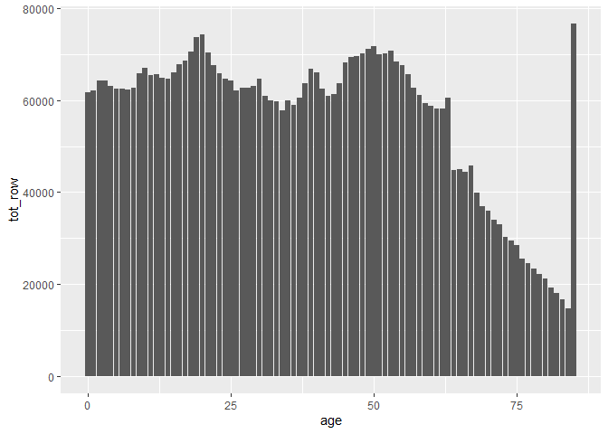

``` r
library(tidyverse)
```

I want to get a handle on wrangling the data, so I’ll only load in one
decade of census bureau data, and only focus on one state for now.

``` r
# read in census bureau data
f_cb2010_2019 <- read_csv("https://www2.census.gov/programs-surveys/popest/tables/2010-2019/state/asrh/sc-est2019-alldata5.csv")

# initial wrangling
f_cb2010_2019 %>%
  filter(NAME == "Alabama") %>%
  select(-SUMLEV, -REGION, -DIVISION, -STATE, -CENSUS2010POP, -ESTIMATESBASE2010)
```

    ## # A tibble: 3,870 x 15
    ##    NAME      SEX ORIGIN  RACE   AGE POPESTIMATE2010 POPESTIMATE2011
    ##    <chr>   <dbl>  <dbl> <dbl> <dbl>           <dbl>           <dbl>
    ##  1 Alabama     0      0     1     0           39992           41121
    ##  2 Alabama     0      0     1     1           40096           39919
    ##  3 Alabama     0      0     1     2           41550           40232
    ##  4 Alabama     0      0     1     3           41716           41702
    ##  5 Alabama     0      0     1     4           41250           41722
    ##  6 Alabama     0      0     1     5           41282           41307
    ##  7 Alabama     0      0     1     6           41461           41435
    ##  8 Alabama     0      0     1     7           41277           41633
    ##  9 Alabama     0      0     1     8           41138           41392
    ## 10 Alabama     0      0     1     9           43072           41176
    ## # ... with 3,860 more rows, and 8 more variables: POPESTIMATE2012 <dbl>,
    ## #   POPESTIMATE2013 <dbl>, POPESTIMATE2014 <dbl>, POPESTIMATE2015 <dbl>,
    ## #   POPESTIMATE2016 <dbl>, POPESTIMATE2017 <dbl>, POPESTIMATE2018 <dbl>,
    ## #   POPESTIMATE2019 <dbl>

I want to have year be a variable as well, so I’ll reformat the table to
collect these into a column, year, and put all the values into a new
column, pop. I’ll also do some quality-of-life column renaming

``` r
f_cb2010_2019 %>%
  filter(NAME == "Alabama") %>%
  select(-SUMLEV, -REGION, -DIVISION, -STATE, -CENSUS2010POP, -ESTIMATESBASE2010) %>%
  pivot_longer(cols = starts_with("POPESTIMATE"),
               names_to = "year",
               names_prefix = "POPESTIMATE",
               values_to = "pop") %>%
  rename(name = NAME,
         sex = SEX,
         origin = ORIGIN,
         race = RACE,
         age = AGE)
```

    ## # A tibble: 38,700 x 7
    ##    name      sex origin  race   age year    pop
    ##    <chr>   <dbl>  <dbl> <dbl> <dbl> <chr> <dbl>
    ##  1 Alabama     0      0     1     0 2010  39992
    ##  2 Alabama     0      0     1     0 2011  41121
    ##  3 Alabama     0      0     1     0 2012  40263
    ##  4 Alabama     0      0     1     0 2013  39189
    ##  5 Alabama     0      0     1     0 2014  40105
    ##  6 Alabama     0      0     1     0 2015  40331
    ##  7 Alabama     0      0     1     0 2016  40231
    ##  8 Alabama     0      0     1     0 2017  40165
    ##  9 Alabama     0      0     1     0 2018  38838
    ## 10 Alabama     0      0     1     0 2019  37673
    ## # ... with 38,690 more rows

Now the fun gets to start - I want the following demographic variables
as their own columns: \* **pct\_male : ** percentage of population that
is male. \* **pct\_hispanic : ** percentage of population that is
hispanic. While the census data is there, I don’t plan on breaking this
down by hispanic race. \* **pct\_white : ** percentage of population
that is non-hispanic white. \* **pct\_black : ** percentage of
population that is non-hispanic black. \* **pct\_nat\_american : **
percentage of population that is non-hispanic native american. \*
**pct\_asian : ** percentage of population that is non-hispanic asian.
\* **pct\_pac\_island : ** percentage of population that is non-hispanic
pacific-islander.

Source for category codes can be found
[here](https://www2.census.gov/programs-surveys/popest/technical-documentation/file-layouts/2010-2019/sc-est2019-alldata6.pdf)

Firstly, let’s check for population totals/errors.

I’ll start by putting gender into columns, and summing the totals to
verify that each year adds up correctly. The genders are denoted by a
numeric indicator, so I’ll change the column titles to strings for
clarity.

``` r
f_cb2010_2019 %>%
  filter(NAME == "Alabama") %>%
  select(-SUMLEV, -REGION, -DIVISION, -STATE, -CENSUS2010POP, -ESTIMATESBASE2010) %>%
  pivot_longer(cols = starts_with("POPESTIMATE"),
               names_to = "year",
               names_prefix = "POPESTIMATE",
               values_to = "pop") %>%
  rename(name = NAME,
         sex = SEX,
         origin = ORIGIN,
         race = RACE,
         age = AGE) %>%
  pivot_wider(names_from = sex,
              values_from = pop) %>%
  rename(total = "0",
         male = "1",
         female = "2")
```

    ## # A tibble: 12,900 x 8
    ##    name    origin  race   age year  total  male female
    ##    <chr>    <dbl> <dbl> <dbl> <chr> <dbl> <dbl>  <dbl>
    ##  1 Alabama      0     1     0 2010  39992 20374  19618
    ##  2 Alabama      0     1     0 2011  41121 21202  19919
    ##  3 Alabama      0     1     0 2012  40263 20567  19696
    ##  4 Alabama      0     1     0 2013  39189 20030  19159
    ##  5 Alabama      0     1     0 2014  40105 20526  19579
    ##  6 Alabama      0     1     0 2015  40331 20556  19775
    ##  7 Alabama      0     1     0 2016  40231 20549  19682
    ##  8 Alabama      0     1     0 2017  40165 20537  19628
    ##  9 Alabama      0     1     0 2018  38838 19866  18972
    ## 10 Alabama      0     1     0 2019  37673 19313  18360
    ## # ... with 12,890 more rows

Firstly, I need to check that the male + female columns equal the total
column for each row.

``` r
f_cb2010_2019 %>%
  filter(NAME == "Alabama") %>%
  select(-SUMLEV, -REGION, -DIVISION, -STATE, -CENSUS2010POP, -ESTIMATESBASE2010) %>%
  pivot_longer(cols = starts_with("POPESTIMATE"),
               names_to = "year",
               names_prefix = "POPESTIMATE",
               values_to = "pop") %>%
  rename(name = NAME,
         sex = SEX,
         origin = ORIGIN,
         race = RACE,
         age = AGE) %>%
  pivot_wider(names_from = sex,
              values_from = pop) %>%
  rename(total = "0",
         male = "1",
         female = "2") %>%
  mutate(check = total - male - female) %>%
  distinct(check, .keep_all = TRUE)
```

    ## # A tibble: 1 x 9
    ##   name    origin  race   age year  total  male female check
    ##   <chr>    <dbl> <dbl> <dbl> <chr> <dbl> <dbl>  <dbl> <dbl>
    ## 1 Alabama      0     1     0 2010  39992 20374  19618     0

Okay, this verifies that all the rows add up correctly. Now I’ll get a
quick check frame with the totals from each year

``` r
f_cb2010_2019 %>%
  filter(NAME == "Alabama") %>%
  select(-SUMLEV, -REGION, -DIVISION, -STATE, -CENSUS2010POP, -ESTIMATESBASE2010) %>%
  pivot_longer(cols = starts_with("POPESTIMATE"),
               names_to = "year",
               names_prefix = "POPESTIMATE",
               values_to = "pop") %>%
  rename(name = NAME,
         sex = SEX,
         origin = ORIGIN,
         race = RACE,
         age = AGE) %>%
  pivot_wider(names_from = sex,
              values_from = pop) %>%
  rename(total = "0",
         male = "1",
         female = "2") %>%
  group_by(year) %>%
  mutate(pop_year = sum(total)) %>%
  arrange(year)
```

    ## # A tibble: 12,900 x 9
    ## # Groups:   year [10]
    ##    name    origin  race   age year  total  male female pop_year
    ##    <chr>    <dbl> <dbl> <dbl> <chr> <dbl> <dbl>  <dbl>    <dbl>
    ##  1 Alabama      0     1     0 2010  39992 20374  19618  9708872
    ##  2 Alabama      0     1     1 2010  40096 20530  19566  9708872
    ##  3 Alabama      0     1     2 2010  41550 21105  20445  9708872
    ##  4 Alabama      0     1     3 2010  41716 21404  20312  9708872
    ##  5 Alabama      0     1     4 2010  41250 21210  20040  9708872
    ##  6 Alabama      0     1     5 2010  41282 21208  20074  9708872
    ##  7 Alabama      0     1     6 2010  41461 21243  20218  9708872
    ##  8 Alabama      0     1     7 2010  41277 21126  20151  9708872
    ##  9 Alabama      0     1     8 2010  41138 20955  20183  9708872
    ## 10 Alabama      0     1     9 2010  43072 22057  21015  9708872
    ## # ... with 12,890 more rows

Ah okay, I just realized something. The “total” rows (0s in sex/origin)
are throwing things off quite a bit (essentially doubling total
population). I need to filter these out first.

``` r
f_cb2010_2019 %>%
  filter(NAME == "Alabama") %>%
  select(-SUMLEV, -REGION, -DIVISION, -STATE, -CENSUS2010POP, -ESTIMATESBASE2010) %>%
  pivot_longer(cols = starts_with("POPESTIMATE"),
               names_to = "year",
               names_prefix = "POPESTIMATE",
               values_to = "pop") %>%
  rename(name = NAME,
         sex = SEX,
         origin = ORIGIN,
         race = RACE,
         age = AGE) %>%
  filter(sex != 0,
         origin != 0)
```

    ## # A tibble: 17,200 x 7
    ##    name      sex origin  race   age year    pop
    ##    <chr>   <dbl>  <dbl> <dbl> <dbl> <chr> <dbl>
    ##  1 Alabama     1      1     1     0 2010  17998
    ##  2 Alabama     1      1     1     0 2011  18552
    ##  3 Alabama     1      1     1     0 2012  18172
    ##  4 Alabama     1      1     1     0 2013  17847
    ##  5 Alabama     1      1     1     0 2014  18282
    ##  6 Alabama     1      1     1     0 2015  18262
    ##  7 Alabama     1      1     1     0 2016  18133
    ##  8 Alabama     1      1     1     0 2017  18163
    ##  9 Alabama     1      1     1     0 2018  17550
    ## 10 Alabama     1      1     1     0 2019  17045
    ## # ... with 17,190 more rows

Now I’ll create the totals frame for checking.

``` r
f_cb2010_2019 %>%
  filter(NAME == "Alabama") %>%
  select(-SUMLEV, -REGION, -DIVISION, -STATE, -CENSUS2010POP, -ESTIMATESBASE2010) %>%
  pivot_longer(cols = starts_with("POPESTIMATE"),
               names_to = "year",
               names_prefix = "POPESTIMATE",
               values_to = "pop") %>%
  rename(name = NAME,
         sex = SEX,
         origin = ORIGIN,
         race = RACE,
         age = AGE) %>%
  filter(sex != 0,
         origin != 0) %>%
  pivot_wider(names_from = sex,
              values_from = pop) %>%
  rename(male = "1",
         female = "2") %>%
  mutate(total = male + female) %>%
  group_by(year) %>%
  mutate(total_yr = sum(total)) %>%
  arrange(year) %>%
  distinct(total_yr, .keep_all = TRUE) %>%
  select(name, year, total_yr)
```

    ## # A tibble: 10 x 3
    ## # Groups:   year [10]
    ##    name    year  total_yr
    ##    <chr>   <chr>    <dbl>
    ##  1 Alabama 2010   4854436
    ##  2 Alabama 2011   4870846
    ##  3 Alabama 2012   4890337
    ##  4 Alabama 2013   4907431
    ##  5 Alabama 2014   4921508
    ##  6 Alabama 2015   4934574
    ##  7 Alabama 2016   4948408
    ##  8 Alabama 2017   4962085
    ##  9 Alabama 2018   4977968
    ## 10 Alabama 2019   4995720

This frame will be what I use to check that the population totals for
other categories add up correctly.

Now to calculate the pct\_male for each year

``` r
f_cb2010_2019 %>%
  filter(NAME == "Alabama") %>%
  select(-SUMLEV, -REGION, -DIVISION, -STATE, -CENSUS2010POP, -ESTIMATESBASE2010) %>%
  pivot_longer(cols = starts_with("POPESTIMATE"),
               names_to = "year",
               names_prefix = "POPESTIMATE",
               values_to = "pop") %>%
  rename(name = NAME,
         sex = SEX,
         origin = ORIGIN,
         race = RACE,
         age = AGE) %>%
  filter(sex != 0,
         origin != 0) %>%
  pivot_wider(names_from = sex,
              values_from = pop) %>%
  rename(male = "1",
         female = "2") %>%
  group_by(year) %>%
  mutate(tot_male = sum(male),
         tot_female = sum(female)) %>%
  ungroup() %>%
  mutate(tot_pop = tot_male + tot_female,
         pct_male = tot_male/tot_pop) %>%
  select(-tot_male, -tot_female, -tot_pop) %>%
  mutate(tot_row = male + female) %>%
  select(-male, -female) %>%
  relocate(tot_row, .after = year) %>%
  arrange(year)
```

    ## # A tibble: 8,600 x 7
    ##    name    origin  race   age year  tot_row pct_male
    ##    <chr>    <dbl> <dbl> <dbl> <chr>   <dbl>    <dbl>
    ##  1 Alabama      1     1     0 2010    35295    0.485
    ##  2 Alabama      1     1     1 2010    35714    0.485
    ##  3 Alabama      1     1     2 2010    37114    0.485
    ##  4 Alabama      1     1     3 2010    37294    0.485
    ##  5 Alabama      1     1     4 2010    37166    0.485
    ##  6 Alabama      1     1     5 2010    37524    0.485
    ##  7 Alabama      1     1     6 2010    37892    0.485
    ##  8 Alabama      1     1     7 2010    37903    0.485
    ##  9 Alabama      1     1     8 2010    37975    0.485
    ## 10 Alabama      1     1     9 2010    39956    0.485
    ## # ... with 8,590 more rows

Cool, one down, several to go. The tot\_row column now shows the total
(male and female) population for each row, given the origin
(hispanic/non-hispanic), race, and age categories.

I can repeate a similar process for the hispanic/non-hispanic
qualifiers, but first I need to verify that the population totals add
up.

``` r
f_cb2010_2019 %>%
  filter(NAME == "Alabama") %>%
  select(-SUMLEV, -REGION, -DIVISION, -STATE, -CENSUS2010POP, -ESTIMATESBASE2010) %>%
  pivot_longer(cols = starts_with("POPESTIMATE"),
               names_to = "year",
               names_prefix = "POPESTIMATE",
               values_to = "pop") %>%
  rename(name = NAME,
         sex = SEX,
         origin = ORIGIN,
         race = RACE,
         age = AGE) %>%
  filter(sex != 0,
         origin != 0) %>%
  pivot_wider(names_from = sex,
              values_from = pop) %>%
  rename(male = "1",
         female = "2") %>%
  group_by(year) %>%
  mutate(tot_male = sum(male),
         tot_female = sum(female)) %>%
  ungroup() %>%
  mutate(tot_pop = tot_male + tot_female,
         pct_male = tot_male/tot_pop) %>%
  select(-tot_male, -tot_female, -tot_pop) %>%
  mutate(tot_row = male + female) %>%
  select(-male, -female) %>%
  relocate(tot_row, .after = year) %>%
  arrange(year) %>%
  pivot_wider(names_from = origin,
              values_from = tot_row) %>%
  rename(non_hispanic = "1",
         hispanic = "2") %>%
  mutate(tot_row = non_hispanic + hispanic) %>%
  group_by(year) %>%
  mutate(check = sum(tot_row)) %>%
  ungroup() %>%
  distinct(year, .keep_all = TRUE) %>%
  select(name, year, check)
```

    ## # A tibble: 10 x 3
    ##    name    year    check
    ##    <chr>   <chr>   <dbl>
    ##  1 Alabama 2010  4854436
    ##  2 Alabama 2011  4870846
    ##  3 Alabama 2012  4890337
    ##  4 Alabama 2013  4907431
    ##  5 Alabama 2014  4921508
    ##  6 Alabama 2015  4934574
    ##  7 Alabama 2016  4948408
    ##  8 Alabama 2017  4962085
    ##  9 Alabama 2018  4977968
    ## 10 Alabama 2019  4995720

Coolio, checks out. I’m going to pivot a bit and do all the races at
once, rather than the one-two step between hispanic/nonhipanic then all
other races. I’ll write over the race column with a “6” for hispanic
where applicable.

``` r
f_cb2010_2019 %>%
  filter(NAME == "Alabama") %>%
  select(-SUMLEV, -REGION, -DIVISION, -STATE, -CENSUS2010POP, -ESTIMATESBASE2010) %>%
  pivot_longer(cols = starts_with("POPESTIMATE"),
               names_to = "year",
               names_prefix = "POPESTIMATE",
               values_to = "pop") %>%
  rename(name = NAME,
         sex = SEX,
         origin = ORIGIN,
         race = RACE,
         age = AGE) %>%
  filter(sex != 0,
         origin != 0) %>%
  pivot_wider(names_from = sex,
              values_from = pop) %>%
  rename(male = "1",
         female = "2") %>%
  group_by(year) %>%
  mutate(tot_male = sum(male),
         tot_female = sum(female)) %>%
  ungroup() %>%
  mutate(tot_pop = tot_male + tot_female,
         pct_male = tot_male/tot_pop) %>%
  select(-tot_male, -tot_female, -tot_pop) %>%
  mutate(tot_row = male + female) %>%
  select(-male, -female) %>%
  relocate(tot_row, .after = year) %>%
  arrange(year) %>%
  mutate(race = if_else(origin == 1, race, 6)) %>%
  select(-origin)
```

    ## # A tibble: 8,600 x 6
    ##    name     race   age year  tot_row pct_male
    ##    <chr>   <dbl> <dbl> <chr>   <dbl>    <dbl>
    ##  1 Alabama     1     0 2010    35295    0.485
    ##  2 Alabama     1     1 2010    35714    0.485
    ##  3 Alabama     1     2 2010    37114    0.485
    ##  4 Alabama     1     3 2010    37294    0.485
    ##  5 Alabama     1     4 2010    37166    0.485
    ##  6 Alabama     1     5 2010    37524    0.485
    ##  7 Alabama     1     6 2010    37892    0.485
    ##  8 Alabama     1     7 2010    37903    0.485
    ##  9 Alabama     1     8 2010    37975    0.485
    ## 10 Alabama     1     9 2010    39956    0.485
    ## # ... with 8,590 more rows

With that cleaned up, I can repeat the steps taken to get the pct\_male
population for each race. Firstly, I’ll rearrange the data frame & check
the population totals.

``` r
f_cb2010_2019 %>%
  filter(NAME == "Alabama") %>%
  select(-SUMLEV, -REGION, -DIVISION, -STATE, -CENSUS2010POP, -ESTIMATESBASE2010) %>%
  pivot_longer(cols = starts_with("POPESTIMATE"),
               names_to = "year",
               names_prefix = "POPESTIMATE",
               values_to = "pop") %>%
  rename(name = NAME,
         sex = SEX,
         origin = ORIGIN,
         race = RACE,
         age = AGE) %>%
  filter(sex != 0,
         origin != 0) %>%
  pivot_wider(names_from = sex,
              values_from = pop) %>%
  rename(male = "1",
         female = "2") %>%
  group_by(year) %>%
  mutate(tot_male = sum(male),
         tot_female = sum(female)) %>%
  ungroup() %>%
  mutate(tot_pop = tot_male + tot_female,
         pct_male = tot_male/tot_pop) %>%
  select(-tot_male, -tot_female, -tot_pop) %>%
  mutate(tot_row = male + female) %>%
  select(-male, -female) %>%
  relocate(tot_row, .after = year) %>%
  arrange(year) %>%
  mutate(race = if_else(origin == 1, race, 6)) %>%
  select(-origin) %>%
  group_by(race, age, year) %>%
  mutate(tot_row = sum(tot_row)) %>%
  distinct(tot_row, .keep_all = TRUE) %>%
  ungroup(race, age, year) %>%
  pivot_wider(names_from = race,
              values_from = tot_row) %>%
  rename(white = "1",
         black = "2",
         nat_american = "3",
         asian = "4",
         pac_island = "5",
         hispanic = "6") %>%
  mutate(tot_row = white + black + nat_american + asian + pac_island + hispanic) %>%
  group_by(year) %>%
  mutate(check = sum(tot_row)) %>%
  ungroup() %>%
  distinct(year, .keep_all = TRUE) %>%
  select(name, year, check)
```

    ## # A tibble: 10 x 3
    ##    name    year    check
    ##    <chr>   <chr>   <dbl>
    ##  1 Alabama 2010  4854436
    ##  2 Alabama 2011  4870846
    ##  3 Alabama 2012  4890337
    ##  4 Alabama 2013  4907431
    ##  5 Alabama 2014  4921508
    ##  6 Alabama 2015  4934574
    ##  7 Alabama 2016  4948408
    ##  8 Alabama 2017  4962085
    ##  9 Alabama 2018  4977968
    ## 10 Alabama 2019  4995720

Awesome, everything here checks out\! I was getting something weird last
night wehre there was a bit of double counting - I think that it was
because hispanic/non-hispanic is its own category.

Now here’s the percentages for each race:

``` r
f_cb2010_2019 %>%
  filter(NAME == "Alabama") %>%
  select(-SUMLEV, -REGION, -DIVISION, -STATE, -CENSUS2010POP, -ESTIMATESBASE2010) %>%
  pivot_longer(cols = starts_with("POPESTIMATE"),
               names_to = "year",
               names_prefix = "POPESTIMATE",
               values_to = "pop") %>%
  rename(name = NAME,
         sex = SEX,
         origin = ORIGIN,
         race = RACE,
         age = AGE) %>%
  filter(sex != 0,
         origin != 0) %>%
  pivot_wider(names_from = sex,
              values_from = pop) %>%
  rename(male = "1",
         female = "2") %>%
  group_by(year) %>%
  mutate(tot_male = sum(male),
         tot_female = sum(female)) %>%
  ungroup() %>%
  mutate(tot_pop = tot_male + tot_female,
         pct_male = tot_male/tot_pop) %>%
  select(-tot_male, -tot_female, -tot_pop) %>%
  mutate(tot_row = male + female) %>%
  select(-male, -female) %>%
  relocate(tot_row, .after = year) %>%
  arrange(year) %>%
  mutate(race = if_else(origin == 1, race, 6)) %>%
  select(-origin) %>%
  group_by(race, age, year) %>%
  mutate(tot_row = sum(tot_row)) %>%
  distinct(tot_row, .keep_all = TRUE) %>%
  ungroup(race, age, year) %>%
  pivot_wider(names_from = race,
              values_from = tot_row) %>%
  rename(white = "1",
         black = "2",
         nat_american = "3",
         asian = "4",
         pac_island = "5",
         hispanic = "6") %>%
  mutate(tot_row = white + black + nat_american + asian + pac_island + hispanic) %>%
  group_by(year) %>%
  mutate(pct_white = sum(white)/sum(tot_row),
         pct_black = sum(black)/sum(tot_row), 
         pct_nat_american = sum(nat_american)/sum(tot_row),
         pct_asian = sum(asian)/sum(tot_row),
         pct_pac_island = sum(pac_island)/sum(tot_row),
         pct_hispanic = sum(hispanic)/sum(tot_row),
         check = pct_white + pct_black + pct_nat_american + pct_asian + pct_pac_island + pct_hispanic) %>%
  distinct(check, .keep_all = TRUE)
```

    ## # A tibble: 10 x 18
    ## # Groups:   year [10]
    ##    name    age year  pct_male white black nat_american asian pac_island hispanic
    ##    <chr> <dbl> <chr>    <dbl> <dbl> <dbl>        <dbl> <dbl>      <dbl>    <dbl>
    ##  1 Alab~     0 2010     0.485 35295 19203          594  1044         84     5487
    ##  2 Alab~     0 2011     0.485 35862 18540          592  1064         88     5749
    ##  3 Alab~     0 2012     0.485 35598 18697          603  1131         86     5127
    ##  4 Alab~     0 2013     0.485 34757 18581          568  1146         87     4914
    ##  5 Alab~     0 2014     0.485 35699 18599          612  1105         90     5040
    ##  6 Alab~     0 2015     0.485 35860 18984          568  1199         87     5365
    ##  7 Alab~     0 2016     0.484 35523 18807          577  1230         93     5516
    ##  8 Alab~     0 2017     0.484 35498 18576          598  1170         97     5472
    ##  9 Alab~     0 2018     0.484 34324 18913          616  1161         94     5509
    ## 10 Alab~     0 2019     0.483 33246 18801          599  1066         91     5427
    ## # ... with 8 more variables: tot_row <dbl>, pct_white <dbl>, pct_black <dbl>,
    ## #   pct_nat_american <dbl>, pct_asian <dbl>, pct_pac_island <dbl>,
    ## #   pct_hispanic <dbl>, check <dbl>

I did a quick check of the totals to ensure they add to one (they do).
With that (finally) checked, I can clean this up and start to look at
age.

``` r
f_cb2010_2019 %>%
  filter(NAME == "Alabama") %>%
  select(-SUMLEV, -REGION, -DIVISION, -STATE, -CENSUS2010POP, -ESTIMATESBASE2010) %>%
  pivot_longer(cols = starts_with("POPESTIMATE"),
               names_to = "year",
               names_prefix = "POPESTIMATE",
               values_to = "pop") %>%
  rename(name = NAME,
         sex = SEX,
         origin = ORIGIN,
         race = RACE,
         age = AGE) %>%
  filter(sex != 0,
         origin != 0) %>%
  pivot_wider(names_from = sex,
              values_from = pop) %>%
  rename(male = "1",
         female = "2") %>%
  group_by(year) %>%
  mutate(tot_male = sum(male),
         tot_female = sum(female)) %>%
  ungroup() %>%
  mutate(tot_pop = tot_male + tot_female,
         pct_male = tot_male/tot_pop) %>%
  select(-tot_male, -tot_female, -tot_pop) %>%
  mutate(tot_row = male + female) %>%
  select(-male, -female) %>%
  relocate(tot_row, .after = year) %>%
  arrange(year) %>%
  mutate(race = if_else(origin == 1, race, 6)) %>%
  select(-origin) %>%
  group_by(race, age, year) %>%
  mutate(tot_row = sum(tot_row)) %>%
  distinct(tot_row, .keep_all = TRUE) %>%
  ungroup(race, age, year) %>%
  pivot_wider(names_from = race,
              values_from = tot_row) %>%
  rename(white = "1",
         black = "2",
         nat_american = "3",
         asian = "4",
         pac_island = "5",
         hispanic = "6") %>%
  mutate(tot_row = white + black + nat_american + asian + pac_island + hispanic) %>%
  group_by(year) %>%
  mutate(pct_white = sum(white)/sum(tot_row),
         pct_black = sum(black)/sum(tot_row), 
         pct_nat_american = sum(nat_american)/sum(tot_row),
         pct_asian = sum(asian)/sum(tot_row),
         pct_pac_island = sum(pac_island)/sum(tot_row),
         pct_hispanic = sum(hispanic)/sum(tot_row)) %>%
  select(-white, -black, -nat_american, -asian, -pac_island, -hispanic)
```

    ## # A tibble: 860 x 11
    ## # Groups:   year [10]
    ##    name      age year  pct_male tot_row pct_white pct_black pct_nat_american
    ##    <chr>   <dbl> <chr>    <dbl>   <dbl>     <dbl>     <dbl>            <dbl>
    ##  1 Alabama     0 2010     0.485   61707     0.672     0.263           0.0110
    ##  2 Alabama     1 2010     0.485   62085     0.672     0.263           0.0110
    ##  3 Alabama     2 2010     0.485   64312     0.672     0.263           0.0110
    ##  4 Alabama     3 2010     0.485   64212     0.672     0.263           0.0110
    ##  5 Alabama     4 2010     0.485   63113     0.672     0.263           0.0110
    ##  6 Alabama     5 2010     0.485   62605     0.672     0.263           0.0110
    ##  7 Alabama     6 2010     0.485   62569     0.672     0.263           0.0110
    ##  8 Alabama     7 2010     0.485   62280     0.672     0.263           0.0110
    ##  9 Alabama     8 2010     0.485   62676     0.672     0.263           0.0110
    ## 10 Alabama     9 2010     0.485   65888     0.672     0.263           0.0110
    ## # ... with 850 more rows, and 3 more variables: pct_asian <dbl>,
    ## #   pct_pac_island <dbl>, pct_hispanic <dbl>

Hmm. I’m noticing that the `pct_pac_island` is pretty small (and I
imagine this will be the case for pretty much everywhere but Hawaii).
I’ll merge this with `pct_asian` to a new col, `pct_aapi` (Asian
American/Pacific Islander).

``` r
f_cb2010_2019 %>%
  filter(NAME == "Alabama") %>%
  select(-SUMLEV, -REGION, -DIVISION, -STATE, -CENSUS2010POP, -ESTIMATESBASE2010) %>%
  pivot_longer(cols = starts_with("POPESTIMATE"),
               names_to = "year",
               names_prefix = "POPESTIMATE",
               values_to = "pop") %>%
  rename(name = NAME,
         sex = SEX,
         origin = ORIGIN,
         race = RACE,
         age = AGE) %>%
  filter(sex != 0,
         origin != 0) %>%
  pivot_wider(names_from = sex,
              values_from = pop) %>%
  rename(male = "1",
         female = "2") %>%
  group_by(year) %>%
  mutate(tot_male = sum(male),
         tot_female = sum(female)) %>%
  ungroup() %>%
  mutate(tot_pop = tot_male + tot_female,
         pct_male = tot_male/tot_pop) %>%
  select(-tot_male, -tot_female, -tot_pop) %>%
  mutate(tot_row = male + female) %>%
  select(-male, -female) %>%
  relocate(tot_row, .after = year) %>%
  arrange(year) %>%
  mutate(race = if_else(origin == 1, race, 6)) %>%
  select(-origin) %>%
  group_by(race, age, year) %>%
  mutate(tot_row = sum(tot_row)) %>%
  distinct(tot_row, .keep_all = TRUE) %>%
  ungroup(race, age, year) %>%
  pivot_wider(names_from = race,
              values_from = tot_row) %>%
  rename(white = "1",
         black = "2",
         nat_american = "3",
         asian = "4",
         pac_island = "5",
         hispanic = "6") %>%
  mutate(tot_row = white + black + nat_american + asian + pac_island + hispanic) %>%
  group_by(year) %>%
  mutate(pct_white = sum(white)/sum(tot_row),
         pct_black = sum(black)/sum(tot_row), 
         pct_nat_american = sum(nat_american)/sum(tot_row),
         pct_asian = sum(asian)/sum(tot_row),
         pct_pac_island = sum(pac_island)/sum(tot_row),
         pct_hispanic = sum(hispanic)/sum(tot_row)) %>%
  ungroup() %>%
  select(-white, -black, -nat_american, -asian, -pac_island, -hispanic) %>%
  mutate(pct_aapi = pct_asian + pct_pac_island) %>%
  select(-pct_asian, -pct_pac_island)
```

    ## # A tibble: 860 x 10
    ##    name      age year  pct_male tot_row pct_white pct_black pct_nat_american
    ##    <chr>   <dbl> <chr>    <dbl>   <dbl>     <dbl>     <dbl>            <dbl>
    ##  1 Alabama     0 2010     0.485   61707     0.672     0.263           0.0110
    ##  2 Alabama     1 2010     0.485   62085     0.672     0.263           0.0110
    ##  3 Alabama     2 2010     0.485   64312     0.672     0.263           0.0110
    ##  4 Alabama     3 2010     0.485   64212     0.672     0.263           0.0110
    ##  5 Alabama     4 2010     0.485   63113     0.672     0.263           0.0110
    ##  6 Alabama     5 2010     0.485   62605     0.672     0.263           0.0110
    ##  7 Alabama     6 2010     0.485   62569     0.672     0.263           0.0110
    ##  8 Alabama     7 2010     0.485   62280     0.672     0.263           0.0110
    ##  9 Alabama     8 2010     0.485   62676     0.672     0.263           0.0110
    ## 10 Alabama     9 2010     0.485   65888     0.672     0.263           0.0110
    ## # ... with 850 more rows, and 2 more variables: pct_hispanic <dbl>,
    ## #   pct_aapi <dbl>

Coolio jones. Now I need to figure out a way to get the population
percentage for age groups. I’m thinking of utilizing the following
groups: \* Under 18 (up to and including 17) \* 18 - 34 \* 35 - 64 \* 65
+

I also want to get the mean age (and maybe mean age of 18+), which I
think will be *slightly* easier, so let’s start with that.

``` r
f_cb2010_2019 %>%
  filter(NAME == "Alabama") %>%
  select(-SUMLEV, -REGION, -DIVISION, -STATE, -CENSUS2010POP, -ESTIMATESBASE2010) %>%
  pivot_longer(cols = starts_with("POPESTIMATE"),
               names_to = "year",
               names_prefix = "POPESTIMATE",
               values_to = "pop") %>%
  rename(name = NAME,
         sex = SEX,
         origin = ORIGIN,
         race = RACE,
         age = AGE) %>%
  filter(sex != 0,
         origin != 0) %>%
  pivot_wider(names_from = sex,
              values_from = pop) %>%
  rename(male = "1",
         female = "2") %>%
  group_by(year) %>%
  mutate(tot_male = sum(male),
         tot_female = sum(female)) %>%
  ungroup() %>%
  mutate(tot_pop = tot_male + tot_female,
         pct_male = tot_male/tot_pop) %>%
  select(-tot_male, -tot_female, -tot_pop) %>%
  mutate(tot_row = male + female) %>%
  select(-male, -female) %>%
  relocate(tot_row, .after = year) %>%
  arrange(year) %>%
  mutate(race = if_else(origin == 1, race, 6)) %>%
  select(-origin) %>%
  group_by(race, age, year) %>%
  mutate(tot_row = sum(tot_row)) %>%
  distinct(tot_row, .keep_all = TRUE) %>%
  ungroup(race, age, year) %>%
  pivot_wider(names_from = race,
              values_from = tot_row) %>%
  rename(white = "1",
         black = "2",
         nat_american = "3",
         asian = "4",
         pac_island = "5",
         hispanic = "6") %>%
  mutate(tot_row = white + black + nat_american + asian + pac_island + hispanic) %>%
  group_by(year) %>%
  mutate(pct_white = sum(white)/sum(tot_row),
         pct_black = sum(black)/sum(tot_row), 
         pct_nat_american = sum(nat_american)/sum(tot_row),
         pct_asian = sum(asian)/sum(tot_row),
         pct_pac_island = sum(pac_island)/sum(tot_row),
         pct_hispanic = sum(hispanic)/sum(tot_row)) %>%
  ungroup() %>%
  select(-white, -black, -nat_american, -asian, -pac_island, -hispanic) %>%
  mutate(pct_aapi = pct_asian + pct_pac_island) %>%
  select(-pct_asian, -pct_pac_island) %>%
  mutate(age_score = age * tot_row) %>%
  group_by(year) %>%
  mutate(avg_age = sum(age_score)/sum(tot_row)) %>%
  distinct(year, .keep_all = TRUE) %>%
  select(name, year, avg_age)
```

    ## # A tibble: 10 x 3
    ## # Groups:   year [10]
    ##    name    year  avg_age
    ##    <chr>   <chr>   <dbl>
    ##  1 Alabama 2010     37.6
    ##  2 Alabama 2011     37.8
    ##  3 Alabama 2012     38.0
    ##  4 Alabama 2013     38.1
    ##  5 Alabama 2014     38.3
    ##  6 Alabama 2015     38.5
    ##  7 Alabama 2016     38.7
    ##  8 Alabama 2017     38.9
    ##  9 Alabama 2018     39.1
    ## 10 Alabama 2019     39.2

I think I did that right, but let me do a quick sanity check w/a
histogram for 2010 just to be sure.

``` r
f_cb2010_2019 %>%
  filter(NAME == "Alabama") %>%
  select(-SUMLEV, -REGION, -DIVISION, -STATE, -CENSUS2010POP, -ESTIMATESBASE2010) %>%
  pivot_longer(cols = starts_with("POPESTIMATE"),
               names_to = "year",
               names_prefix = "POPESTIMATE",
               values_to = "pop") %>%
  rename(name = NAME,
         sex = SEX,
         origin = ORIGIN,
         race = RACE,
         age = AGE) %>%
  filter(sex != 0,
         origin != 0) %>%
  pivot_wider(names_from = sex,
              values_from = pop) %>%
  rename(male = "1",
         female = "2") %>%
  group_by(year) %>%
  mutate(tot_male = sum(male),
         tot_female = sum(female)) %>%
  ungroup() %>%
  mutate(tot_pop = tot_male + tot_female,
         pct_male = tot_male/tot_pop) %>%
  select(-tot_male, -tot_female, -tot_pop) %>%
  mutate(tot_row = male + female) %>%
  select(-male, -female) %>%
  relocate(tot_row, .after = year) %>%
  arrange(year) %>%
  mutate(race = if_else(origin == 1, race, 6)) %>%
  select(-origin) %>%
  group_by(race, age, year) %>%
  mutate(tot_row = sum(tot_row)) %>%
  distinct(tot_row, .keep_all = TRUE) %>%
  ungroup(race, age, year) %>%
  pivot_wider(names_from = race,
              values_from = tot_row) %>%
  rename(white = "1",
         black = "2",
         nat_american = "3",
         asian = "4",
         pac_island = "5",
         hispanic = "6") %>%
  mutate(tot_row = white + black + nat_american + asian + pac_island + hispanic) %>%
  group_by(year) %>%
  mutate(pct_white = sum(white)/sum(tot_row),
         pct_black = sum(black)/sum(tot_row), 
         pct_nat_american = sum(nat_american)/sum(tot_row),
         pct_asian = sum(asian)/sum(tot_row),
         pct_pac_island = sum(pac_island)/sum(tot_row),
         pct_hispanic = sum(hispanic)/sum(tot_row)) %>%
  ungroup() %>%
  select(-white, -black, -nat_american, -asian, -pac_island, -hispanic) %>%
  mutate(pct_aapi = pct_asian + pct_pac_island) %>%
  select(-pct_asian, -pct_pac_island) %>%
  select(age, year, tot_row) %>%
  filter(year == "2010") %>%
  ggplot(aes(x = age,
             y = tot_row)) +
  geom_col()
```

<!-- -->

Okay, I suppose that would check out. I’ll note that the census bins
everyone *over* the age of 85 into one category, 85+, so this may be
*slightly* off, but considering that the population drops off
considerably at this age bracket, I’m okay with just treating it as 85
years old.

Now I got to figure out the mean age 18+, which may be a bit harder.

``` r
f_cb2010_2019 %>%
  filter(NAME == "Alabama") %>%
  select(-SUMLEV, -REGION, -DIVISION, -STATE, -CENSUS2010POP, -ESTIMATESBASE2010) %>%
  pivot_longer(cols = starts_with("POPESTIMATE"),
               names_to = "year",
               names_prefix = "POPESTIMATE",
               values_to = "pop") %>%
  rename(name = NAME,
         sex = SEX,
         origin = ORIGIN,
         race = RACE,
         age = AGE) %>%
  filter(sex != 0,
         origin != 0) %>%
  pivot_wider(names_from = sex,
              values_from = pop) %>%
  rename(male = "1",
         female = "2") %>%
  group_by(year) %>%
  mutate(tot_male = sum(male),
         tot_female = sum(female)) %>%
  ungroup() %>%
  mutate(tot_pop = tot_male + tot_female,
         pct_male = tot_male/tot_pop) %>%
  select(-tot_male, -tot_female, -tot_pop) %>%
  mutate(tot_row = male + female) %>%
  select(-male, -female) %>%
  relocate(tot_row, .after = year) %>%
  arrange(year) %>%
  mutate(race = if_else(origin == 1, race, 6)) %>%
  select(-origin) %>%
  group_by(race, age, year) %>%
  mutate(tot_row = sum(tot_row)) %>%
  distinct(tot_row, .keep_all = TRUE) %>%
  ungroup(race, age, year) %>%
  pivot_wider(names_from = race,
              values_from = tot_row) %>%
  rename(white = "1",
         black = "2",
         nat_american = "3",
         asian = "4",
         pac_island = "5",
         hispanic = "6") %>%
  mutate(tot_row = white + black + nat_american + asian + pac_island + hispanic) %>%
  group_by(year) %>%
  mutate(pct_white = sum(white)/sum(tot_row),
         pct_black = sum(black)/sum(tot_row), 
         pct_nat_american = sum(nat_american)/sum(tot_row),
         pct_asian = sum(asian)/sum(tot_row),
         pct_pac_island = sum(pac_island)/sum(tot_row),
         pct_hispanic = sum(hispanic)/sum(tot_row)) %>%
  ungroup() %>%
  select(-white, -black, -nat_american, -asian, -pac_island, -hispanic) %>%
  mutate(pct_aapi = pct_asian + pct_pac_island) %>%
  select(-pct_asian, -pct_pac_island) %>%
  mutate(age_score = age * tot_row) %>%
  group_by(year) %>%
  mutate(avg_age = sum(age_score)/sum(tot_row)) %>%
  ungroup() %>%
  mutate(age_score = if_else(age < 18, 0, age * tot_row),
         age_total = if_else(age < 18, 0, tot_row)) %>%
  group_by(year) %>%
  mutate(avg_age_adult = sum(age_score)/sum(age_total)) %>%
  ungroup() %>%
  distinct(year, .keep_all = TRUE) %>%
  select(year, avg_age, avg_age_adult)
```

    ## # A tibble: 10 x 3
    ##    year  avg_age avg_age_adult
    ##    <chr>   <dbl>         <dbl>
    ##  1 2010     37.6          46.7
    ##  2 2011     37.8          46.8
    ##  3 2012     38.0          47.0
    ##  4 2013     38.1          47.1
    ##  5 2014     38.3          47.3
    ##  6 2015     38.5          47.5
    ##  7 2016     38.7          47.7
    ##  8 2017     38.9          47.9
    ##  9 2018     39.1          48.0
    ## 10 2019     39.2          48.2

Dope dope, with `avg_age` and `avg_age_adult` done, I can move on to the
age groups.

``` r
f_cb2010_2019 %>%
  filter(NAME == "Alabama") %>%
  select(-SUMLEV, -REGION, -DIVISION, -STATE, -CENSUS2010POP, -ESTIMATESBASE2010) %>%
  pivot_longer(cols = starts_with("POPESTIMATE"),
               names_to = "year",
               names_prefix = "POPESTIMATE",
               values_to = "pop") %>%
  rename(name = NAME,
         sex = SEX,
         origin = ORIGIN,
         race = RACE,
         age = AGE) %>%
  filter(sex != 0,
         origin != 0) %>%
  pivot_wider(names_from = sex,
              values_from = pop) %>%
  rename(male = "1",
         female = "2") %>%
  group_by(year) %>%
  mutate(tot_male = sum(male),
         tot_female = sum(female)) %>%
  ungroup() %>%
  mutate(tot_pop = tot_male + tot_female,
         pct_male = tot_male/tot_pop) %>%
  select(-tot_male, -tot_female, -tot_pop) %>%
  mutate(tot_row = male + female) %>%
  select(-male, -female) %>%
  relocate(tot_row, .after = year) %>%
  arrange(year) %>%
  mutate(race = if_else(origin == 1, race, 6)) %>%
  select(-origin) %>%
  group_by(race, age, year) %>%
  mutate(tot_row = sum(tot_row)) %>%
  distinct(tot_row, .keep_all = TRUE) %>%
  ungroup(race, age, year) %>%
  pivot_wider(names_from = race,
              values_from = tot_row) %>%
  rename(white = "1",
         black = "2",
         nat_american = "3",
         asian = "4",
         pac_island = "5",
         hispanic = "6") %>%
  mutate(tot_row = white + black + nat_american + asian + pac_island + hispanic) %>%
  group_by(year) %>%
  mutate(pct_white = sum(white)/sum(tot_row),
         pct_black = sum(black)/sum(tot_row), 
         pct_nat_american = sum(nat_american)/sum(tot_row),
         pct_asian = sum(asian)/sum(tot_row),
         pct_pac_island = sum(pac_island)/sum(tot_row),
         pct_hispanic = sum(hispanic)/sum(tot_row)) %>%
  ungroup() %>%
  select(-white, -black, -nat_american, -asian, -pac_island, -hispanic) %>%
  mutate(pct_aapi = pct_asian + pct_pac_island) %>%
  select(-pct_asian, -pct_pac_island) %>%
  mutate(age_score = age * tot_row) %>%
  group_by(year) %>%
  mutate(avg_age = sum(age_score)/sum(tot_row)) %>%
  ungroup() %>%
  mutate(age_score = if_else(age < 18, 0, age * tot_row),
         age_total = if_else(age < 18, 0, tot_row)) %>%
  group_by(year) %>%
  mutate(avg_age_adult = sum(age_score)/sum(age_total)) %>%
  ungroup() %>%
  select(-age_score, -age_total) %>%
  mutate(age_00_17 = if_else(age < 18, tot_row, 0),
         age_18_34 = if_else(age >= 18 & age < 35, tot_row, 0),
         age_35_64 = if_else(age >= 35 & age < 65, tot_row, 0),
         age_65_00 = if_else(age >= 65, tot_row, 0)) %>%
  group_by(year) %>%
  mutate(pct_00_17 = sum(age_00_17)/sum(tot_row),
         pct_18_34 = sum(age_18_34)/sum(tot_row),
         pct_35_64 = sum(age_35_64)/sum(tot_row),
         pct_65_00 = sum(age_65_00)/sum(tot_row),
         pop = sum(tot_row)) %>%
  ungroup() %>%
  distinct(year, .keep_all = TRUE) %>%
  select(-age_00_17, -age_18_34, -age_35_64, -age_65_00, -age, -tot_row) %>%
  relocate(pop, .after = year)
```

    ## # A tibble: 10 x 15
    ##    name  year     pop pct_male pct_white pct_black pct_nat_american pct_hispanic
    ##    <chr> <chr>  <dbl>    <dbl>     <dbl>     <dbl>            <dbl>        <dbl>
    ##  1 Alab~ 2010  4.85e6    0.485     0.672     0.263           0.0110       0.0398
    ##  2 Alab~ 2011  4.87e6    0.485     0.670     0.263           0.0110       0.0404
    ##  3 Alab~ 2012  4.89e6    0.485     0.668     0.264           0.0111       0.0405
    ##  4 Alab~ 2013  4.91e6    0.485     0.666     0.265           0.0112       0.0409
    ##  5 Alab~ 2014  4.92e6    0.485     0.664     0.266           0.0113       0.0413
    ##  6 Alab~ 2015  4.93e6    0.485     0.662     0.267           0.0114       0.0420
    ##  7 Alab~ 2016  4.95e6    0.484     0.660     0.267           0.0115       0.0431
    ##  8 Alab~ 2017  4.96e6    0.484     0.658     0.268           0.0115       0.0441
    ##  9 Alab~ 2018  4.98e6    0.484     0.657     0.268           0.0116       0.0454
    ## 10 Alab~ 2019  5.00e6    0.483     0.655     0.268           0.0117       0.0465
    ## # ... with 7 more variables: pct_aapi <dbl>, avg_age <dbl>,
    ## #   avg_age_adult <dbl>, pct_00_17 <dbl>, pct_18_34 <dbl>, pct_35_64 <dbl>,
    ## #   pct_65_00 <dbl>

And with that, a 197,370 row by 21 col data frame was reduced to a much
more useful 10 row by 16 col frame. Now I’ll need to extend this out to
the other states for this decade, then wrangle in other decades worth of
census bureau data (hopefully using the exact same process).
